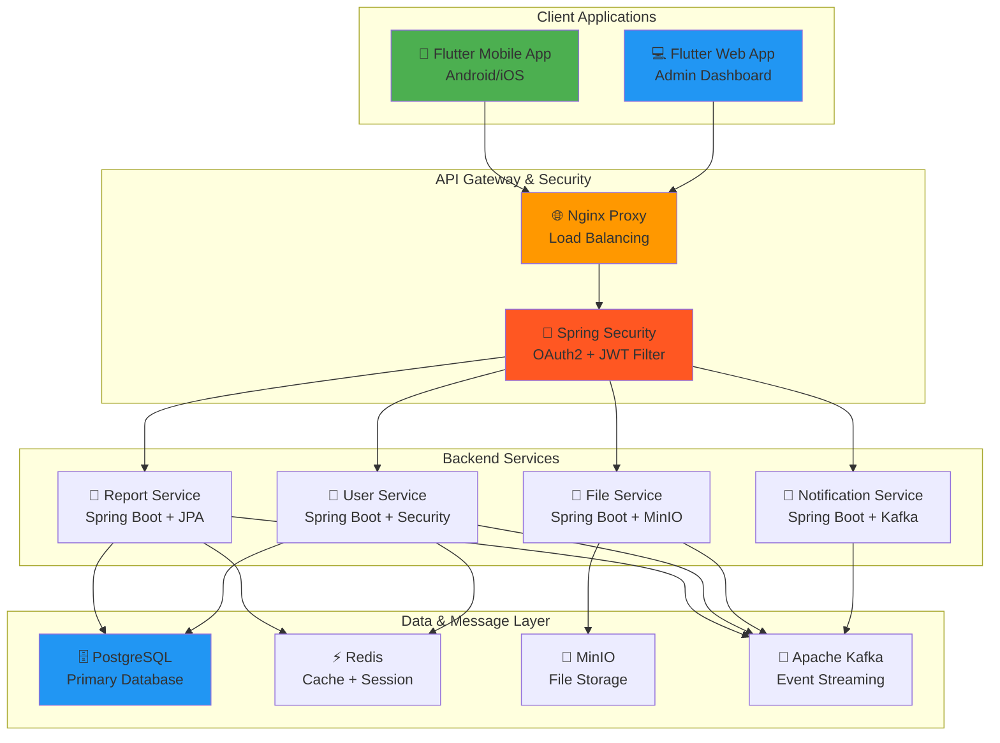
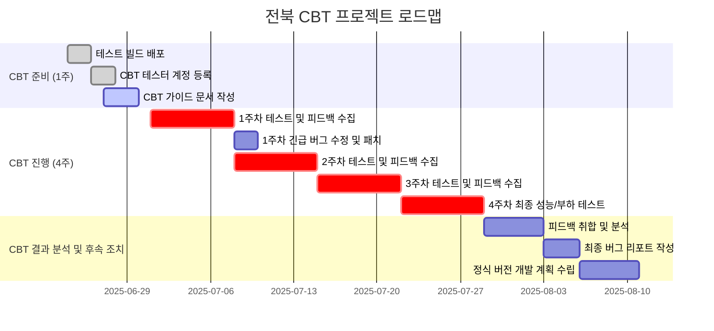

# 📱 전북 현장 보고 및 관리 플랫폼 (CBT): 프로젝트 요구사항 명세서

## 📋 문서 정보

- **버전**: v2.1 (CBT-JB-Rev2)
- **작성일**: 2025년 6월 25일
- **프로젝트 타입**: Flutter 모바일/웹 + Spring Boot 백엔드
- **개발 방식**: 크로스플랫폼 (Flutter) + 마이크로서비스 (Spring Boot)
- **기술 스택**: Spring Boot + Spring Security + JPA + QueryDSL + Kafka + Docker
- **인증 방식**: OAuth2 + JWT
- **배포 방식**: Docker Compose + Nginx Load Balancing

---

## 1. 🎯 프로젝트 개요

| 📋 **항목**         | 📝 **내용**                                                                                                                                                                                                                      |
| ------------------- | -------------------------------------------------------------------------------------------------------------------------------------------------------------------------------------------------------------------------------- |
| **프로젝트명**      | 전북 현장 보고 및 관리 플랫폼 (CBT)                                                                                                                                                                                              |
| **프로젝트 목표**   | 전북 지역 현장 직원이 모바일을 통해 현장 상황(사진, 위치, 특이사항)을 신속하고 정확하게 보고하고, 관리자는 웹 대시보드에서 실시간으로 상황을 확인 및 조치할 수 있는 통합 시스템의 CBT(비공개 베타 테스트)를 성공적으로 수행한다. |
| **CBT 목표**        | 1. **안정성 검증**: 실제 사용 환경에서의 시스템 안정성 및 버그 식별 2. **사용자 피드백 수집**: 현장 직원의 사용성 및 기능 개선 요구사항 수렴 3. **성능 테스트**: 동시 접속 및 데이터 처리 성능 검증                        |
| **개발 프레임워크** | Flutter (Mobile + Web)                                                                                                                                                                                                           |
| **대상 플랫폼**     | Android, iOS, Web (Desktop Browser)                                                                                                                                                                                              |
| **주요 사용자**     | 전북 지역 현장 직원 (모바일), 관리자 (웹 대시보드)                                                                                                                                                                               |
| **CBT 기간**        | 2025년 7월 1일 ~ 2025년 7월 31일 (4주)                                                                                                                                                                                           |

### 🎨 핵심 가치

- **⚡ 신속성**: 현장에서 3분 이내 보고서 작성 및 제출
- **🎯 정확성**: GPS, 사진, 서명을 통한 정확한 현장 상황 기록
- **🔄 실시간성**: 관리자 대시보드에서 5초 이내 실시간 현황 모니터링
- **📱 접근성**: 전북 지역 맞춤형 UI/UX 제공

---

## 2. 🏗️ 시스템 아키텍처

(기존 시스템 아키텍처와 동일)

---

## 3. 📱 기능 요구사항 (CBT 범위)

### 3.1. 👤 사용자 관리 기능 (필수)

- **로그인/로그아웃**: OAuth2 (사전 등록된 테스트 계정) 및 자체 계정 로그인
- **프로필 관리**: 개인정보 수정, 비밀번호 변경

### 3.2. 📝 보고서 작성 및 제출 기능 (핵심)

- **보고서 생성**:
  - **텍스트**: 제목, 내용, 카테고리(안전, 품질, 진행상황)
  - **사진**: 카메라 촬영 및 갤러리 선택 (최대 5장)
  - **위치**: GPS 자동 획득
  - **서명**: 터치스크린 서명
- **저장 및 제출**:
  - **임시 저장**: 오프라인 상태에서 로컬 저장
  - **제출**: 온라인 상태에서 서버로 즉시 전송 (오프라인 시 큐잉)

### 3.3. 📊 보고서 조회 및 관리 기능

- **모바일 앱**:
  - 내가 작성한 보고서 목록 조회 (상태별 필터링: 임시저장, 제출완료, 반려)
  - 보고서 상세 내용 확인
- **웹 대시보드**:
  - 접수된 보고서 실시간 목록 조회
  - 보고서 상태 변경 (승인, 반려)
  - 보고서별 피드백(댓글) 작성

### 3.4. 🔔 알림 기능

- **푸시 알림**: 보고서 반려 시 작성자에게 알림
- **웹 알림**: 새로운 보고서 접수 시 관리자에게 알림

---

## 4. 📅 CBT 개발 및 운영 로드맵

---

## 5. 🧪 CBT 테스트 계획

- **주요 테스트 항목**:
  - 보고서 작성 ~ 제출 전체 플로우
  - 오프라인 데이터 저장 및 온라인 자동 동기화
  - 사진 첨부 및 보기 기능
  - 실시간 알림 수신
  - 동시 접속자 50명 기준 API 응답 속도
- **버그 리포트**: 앱 내 '피드백/버그 신고' 메뉴 또는 Jira를 통해 수집

---

## 6. 📊 CBT 성공 지표 (KPI)

| 📊 **메트릭**             | 🎯 **목표값** | 📈 **측정 방법**     |
| ------------------------- | ------------- | -------------------- |
| **Critical 버그 발생 수** | 3건 이하      | Jira 버그 리포트     |
| **보고서 제출 성공률**    | 99% 이상      | 서버 로그 분석       |
| **API 평균 응답 시간**    | < 300ms       | Spring Boot Actuator |
| **사용자 만족도**         | 3.5/5 이상    | CBT 종료 후 설문조사 |
