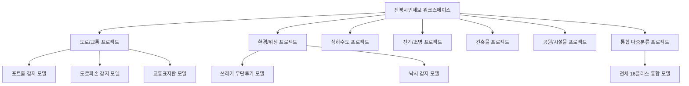
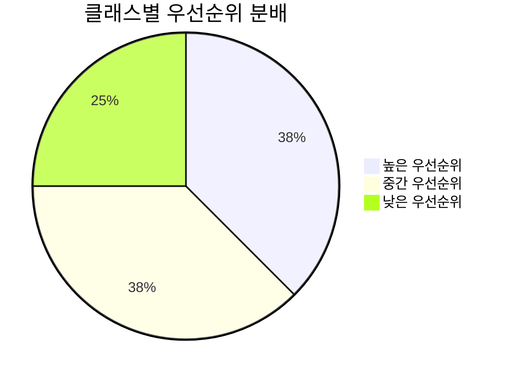
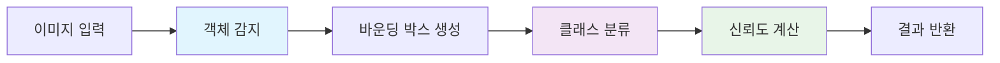
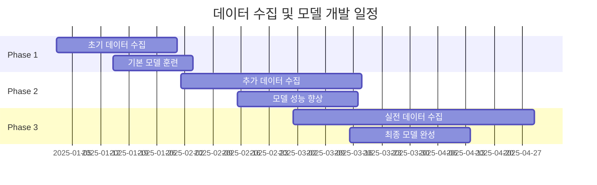
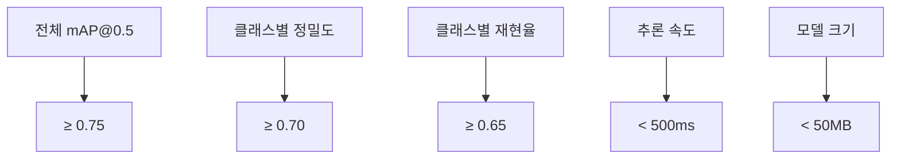

# 🏗️ 전북 현장 보고 시스템 - Roboflow 워크스페이스 설계 가이드

## 📋 목차
- [1. 워크스페이스 구조 설계](#1-워크스페이스-구조-설계)
- [2. 데이터셋 구성](#2-데이터셋-구성)
- [3. 모델 클래스 정의](#3-모델-클래스-정의)
- [4. 학습 데이터 수집 전략](#4-학습-데이터-수집-전략)
- [5. 모델 성능 최적화](#5-모델-성능-최적화)
- [6. 배포 및 버전 관리](#6-배포-및-버전-관리)

---

## 1. 워크스페이스 구조 설계

### 🏢 워크스페이스 설정


### 📊 권장 워크스페이스 구조
```
전북시민제보-workspace/
├── jeonbuk-road-issues/           # 도로 관련 문제
├── jeonbuk-environment-issues/    # 환경 관련 문제  
├── jeonbuk-facility-issues/       # 시설물 관련 문제
└── jeonbuk-integrated-detection/  # 통합 감지 모델 (권장)
```

---

## 2. 데이터셋 구성

### 🎯 핵심 감지 클래스 (16개)

#### 📊 우선순위별 클래스 분류


#### 🔥 높은 우선순위 (긴급 대응 필요)
| 클래스명  | 영문 ID              | 예상 빈도 | 특징                 |
| --------- | -------------------- | --------- | -------------------- |
| 전기 위험 | `electrical_hazard`  | 5%        | 감전 위험, 즉시 처리 |
| 누수      | `water_leak`         | 8%        | 수질 오염, 구조 손상 |
| 공사 문제 | `construction_issue` | 12%       | 안전사고 위험        |
| 도로 파손 | `road_damage`        | 15%       | 차량 사고 위험       |
| 포트홀    | `pothole`            | 20%       | 교통사고 위험        |
| 맨홀 손상 | `manhole_damage`     | 6%        | 추락 위험            |

#### ⚡ 중간 우선순위 (일반 처리)
| 클래스명        | 영문 ID               | 예상 빈도 | 특징           |
| --------------- | --------------------- | --------- | -------------- |
| 가로등 고장     | `street_light_out`    | 10%       | 야간 안전 문제 |
| 교통표지판 손상 | `traffic_sign_damage` | 8%        | 교통 혼란      |
| 건물 손상       | `building_damage`     | 7%        | 구조적 안전    |
| 간판 파손       | `broken_sign`         | 12%       | 미관 및 안전   |
| 펜스 파손       | `broken_fence`        | 9%        | 경계 침입      |
| 인도 균열       | `sidewalk_crack`      | 11%       | 보행자 안전    |

#### 📝 낮은 우선순위 (정기 처리)
| 클래스명       | 영문 ID              | 예상 빈도 | 특징        |
| -------------- | -------------------- | --------- | ----------- |
| 무단 투기      | `illegal_dumping`    | 15%       | 환경 미관   |
| 낙서           | `graffiti`           | 8%        | 미관 문제   |
| 나무 손상      | `tree_damage`        | 6%        | 환경 관리   |
| 기타 공공 문제 | `other_public_issue` | 5%        | 일반적 문제 |

---

## 3. 모델 클래스 정의

### 🏷️ 라벨링 가이드라인

#### Class Configuration (`classes.yaml`)
```yaml
names:
  0: road_damage
  1: pothole  
  2: illegal_dumping
  3: graffiti
  4: broken_sign
  5: broken_fence
  6: street_light_out
  7: manhole_damage
  8: sidewalk_crack
  9: tree_damage
  10: construction_issue
  11: traffic_sign_damage
  12: building_damage
  13: water_leak
  14: electrical_hazard
  15: other_public_issue

priority_mapping:
  high: [4, 12, 13, 14]      # electrical_hazard, water_leak, building_damage, electrical_hazard
  medium: [0, 1, 6, 7, 8, 11] # road_damage, pothole, street_light_out, etc.
  low: [2, 3, 9, 15]         # illegal_dumping, graffiti, tree_damage, other

category_mapping:
  "도로/교통": [0, 1, 11]    # road_damage, pothole, traffic_sign_damage
  "환경/위생": [2, 3]        # illegal_dumping, graffiti  
  "상하수도": [13]           # water_leak
  "전기/조명": [6, 14]       # street_light_out, electrical_hazard
  "건축물": [4, 12]          # broken_sign, building_damage
  "공원/시설물": [5, 7, 8, 9] # broken_fence, manhole_damage, sidewalk_crack, tree_damage
  "공사/안전": [10]          # construction_issue
```

### 🎨 바운딩 박스 가이드라인



#### 바운딩 박스 품질 기준
- **정확도**: 객체의 95% 이상 포함
- **최소 크기**: 32x32 픽셀 이상
- **최대 크기**: 이미지의 80% 이하
- **겹침**: 동일 클래스 객체 간 IoU < 0.5

---

## 4. 학습 데이터 수집 전략

### 📸 데이터 수집 계획

#### 4.1 단계별 수집 전략


#### 4.2 권장 데이터셋 크기
| 단계                | 총 이미지 수 | 클래스당 평균 | 품질 기준     |
| ------------------- | ------------ | ------------- | ------------- |
| **MVP (최소 기능)** | 1,600장      | 100장         | 기본 감지     |
| **베타 버전**       | 4,800장      | 300장         | 실용적 정확도 |
| **프로덕션**        | 8,000장+     | 500장+        | 상용 서비스   |

#### 4.3 데이터 다양성 확보
```yaml
환경적 다양성:
  - 시간대: 아침, 낮, 저녁, 밤
  - 날씨: 맑음, 흐림, 비, 눈
  - 계절: 봄, 여름, 가을, 겨울
  
촬영 다양성:
  - 각도: 정면, 측면, 위, 아래
  - 거리: 근거리, 중거리, 원거리
  - 해상도: 다양한 카메라 품질
  
상황적 다양성:
  - 도시/농촌 지역
  - 신축/노후 시설
  - 경미/심각한 손상
```

---

## 5. 모델 성능 최적화

### 🎯 성능 목표 설정

#### 5.1 정확도 기준


#### 5.2 클래스별 성능 목표
| 클래스        | 정밀도 목표 | 재현율 목표 | 비고      |
| ------------- | ----------- | ----------- | --------- |
| 높은 우선순위 | ≥ 80%       | ≥ 75%       | 안전 관련 |
| 중간 우선순위 | ≥ 75%       | ≥ 70%       | 일반 시설 |
| 낮은 우선순위 | ≥ 70%       | ≥ 65%       | 미관 관련 |

### 🔧 모델 튜닝 전략

#### 5.3 Hyperparameter 최적화
```python
# Roboflow 훈련 설정 예시
training_config = {
    "epochs": 100,
    "batch_size": 16,
    "learning_rate": 0.001,
    "img_size": 640,
    "augmentations": {
        "rotation": 15,
        "brightness": 0.2,
        "contrast": 0.2,
        "saturation": 0.2,
        "hue": 0.1,
        "flip": "horizontal"
    }
}
```

---

## 6. 배포 및 버전 관리

### 🚀 배포 전략

#### 6.1 모델 버전 관리
```mermaid
gitgraph
    commit id: "v1.0-mvp"
    commit id: "v1.1-bug-fix"
    branch feature-improvement
    commit id: "v1.2-accuracy"
    commit id: "v1.3-speed"
    checkout main
    merge feature-improvement
    commit id: "v2.0-production"
    branch hotfix
    commit id: "v2.0.1-urgent"
    checkout main
    merge hotfix
```

#### 6.2 A/B 테스트 계획
| 버전 | 대상 사용자       | 테스트 기간 | 핵심 메트릭   |
| ---- | ----------------- | ----------- | ------------- |
| v1.0 | 내부 테스터 20명  | 2주         | 기본 감지율   |
| v1.1 | 베타 사용자 100명 | 4주         | 정확도, 속도  |
| v2.0 | 전체 사용자       | 상시        | 사용자 만족도 |

### 📊 성능 모니터링

#### 6.3 실시간 모니터링 지표
```yaml
기술적 지표:
  - 추론 성공률: > 98%
  - 평균 응답 시간: < 500ms
  - API 가용률: > 99.5%
  
비즈니스 지표:
  - 사용자 만족도: > 4.0/5.0
  - 자동 분류 정확도: > 75%
  - 담당부서 배정 정확도: > 80%
```

---

## 🎯 실행 체크리스트

### ✅ 1단계: 워크스페이스 설정
- [ ] Roboflow 계정 생성 및 워크스페이스 설정
- [ ] 프로젝트 생성 (`jeonbuk-integrated-detection`)
- [ ] 클래스 정의 및 라벨링 가이드라인 작성
- [ ] 팀 멤버 초대 및 권한 설정

### ✅ 2단계: 초기 데이터셋 구축
- [ ] 각 클래스당 최소 100장 이미지 수집
- [ ] 라벨링 작업 (바운딩 박스 + 클래스 분류)
- [ ] 데이터셋 품질 검증
- [ ] Train/Validation/Test 분할 (70/20/10)

### ✅ 3단계: 모델 훈련 및 최적화
- [ ] 기본 YOLOv8 모델로 초기 훈련
- [ ] 성능 평가 및 문제점 식별
- [ ] 하이퍼파라미터 튜닝
- [ ] 데이터 증강 적용

### ✅ 4단계: 앱 연동 및 테스트
- [ ] Flutter 앱에 API 연동
- [ ] 실제 이미지로 테스트
- [ ] 성능 최적화 (속도, 정확도)
- [ ] 에러 처리 및 예외 상황 대응

### ✅ 5단계: 프로덕션 배포
- [ ] 모델 성능 최종 검증
- [ ] API 안정성 테스트
- [ ] 사용자 교육 및 가이드 제공
- [ ] 모니터링 시스템 구축

---

## 🔗 참고 자료

### 📚 추가 학습 자료
- [Roboflow 공식 문서](https://docs.roboflow.com/)
- [YOLOv8 가이드](https://docs.ultralytics.com/)
- [컴퓨터 비전 모범 사례](https://blog.roboflow.com/computer-vision-best-practices/)

### 🎓 권장 학습 순서
1. **기초**: 객체 감지 기본 개념 학습
2. **실습**: 소규모 데이터셋으로 모델 훈련
3. **최적화**: 성능 튜닝 및 데이터 증강
4. **배포**: 실제 서비스 환경 적용
5. **운영**: 지속적인 모델 개선

---

이 가이드를 따라 단계적으로 진행하면, 전북 현장 보고 시스템에 최적화된 AI 모델을 구축할 수 있습니다. 🚀
