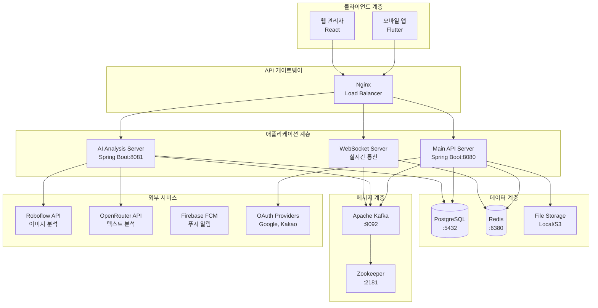
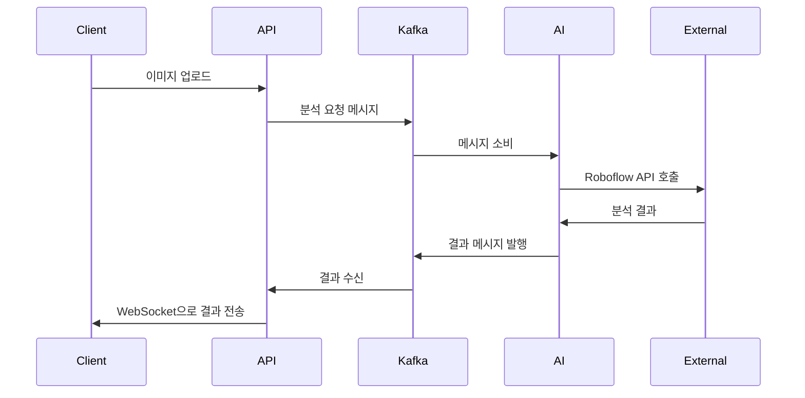
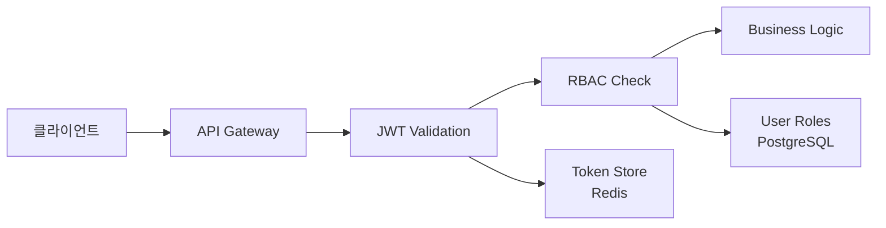
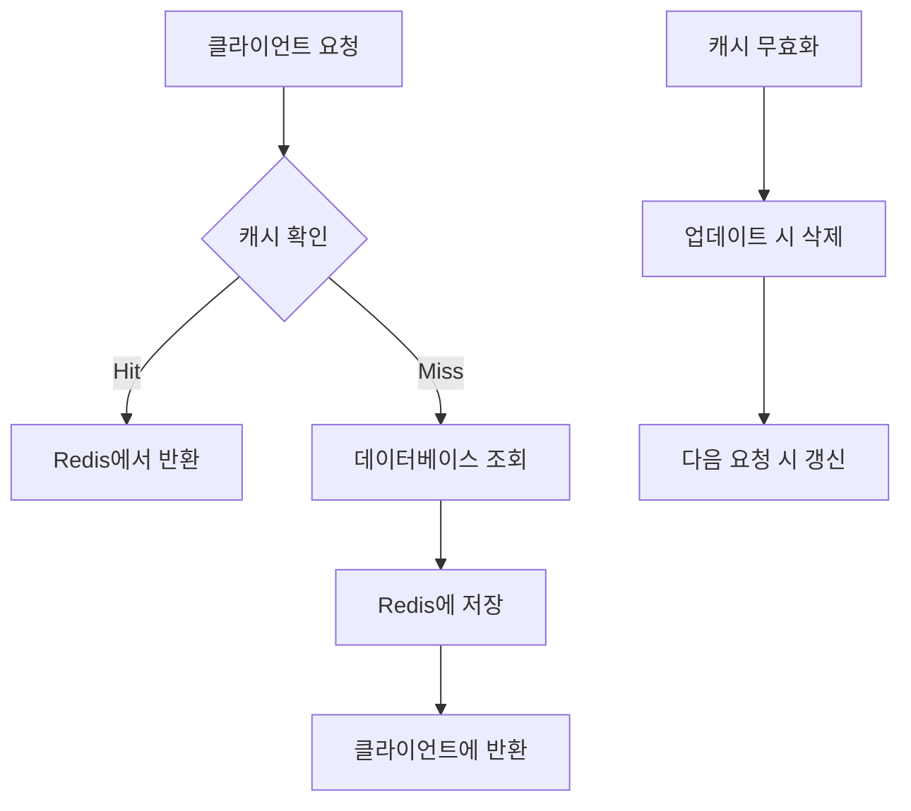

# 전북 신고 플랫폼 시스템 아키텍처

전북 신고 플랫폼의 전체 시스템 아키텍처와 구성 요소를 설명합니다.

## 🏗 시스템 개요

### 아키텍처 특징
- **마이크로서비스 아키텍처**: 확장 가능하고 독립적인 서비스 구성
- **이벤트 기반 아키텍처**: Kafka를 통한 비동기 메시지 처리
- **RESTful API**: 표준 HTTP 기반 API 설계
- **실시간 통신**: WebSocket 및 SSE 지원
- **클라우드 네이티브**: Docker 컨테이너 기반 배포

### 핵심 기술 스택
| 계층 | 기술 | 버전 | 용도 |
|------|------|------|------|
| **Frontend** | Flutter | 3.16+ | 모바일 앱 |
| **Backend** | Spring Boot | 3.2+ | API 서버 |
| **Database** | PostgreSQL | 15+ | 주 데이터베이스 |
| **Cache** | Redis | 7+ | 세션 및 캐시 |
| **Message Queue** | Apache Kafka | 2.8+ | 이벤트 스트리밍 |
| **AI Platform** | Roboflow API | - | 이미지 분석 |
| **Container** | Docker | 24+ | 컨테이너화 |
| **Monitoring** | Prometheus | - | 메트릭 수집 |

## 🏛 전체 아키텍처 다이어그램



## 🔧 서비스 구성 요소

### 1. Main API Server (포트: 8080)
**역할**: 핵심 비즈니스 로직 및 데이터 관리

#### 주요 기능
- **사용자 인증 및 권한 관리**
  - JWT 토큰 기반 인증
  - OAuth2 소셜 로그인 (Google, Kakao)
  - 역할 기반 접근 제어 (RBAC)

- **신고 관리**
  - CRUD operations
  - 파일 업로드 및 관리
  - 상태 워크플로우 관리

- **실시간 알림**
  - WebSocket 연결 관리
  - Kafka 메시지 프로듀싱
  - SSE 스트리밍

#### 기술 구성
```yaml
Spring Boot Framework:
  - Spring Security: 인증/권한
  - Spring Data JPA: 데이터 액세스
  - Spring Web: REST API
  - Spring WebSocket: 실시간 통신
  - Spring Kafka: 메시지 처리
```

### 2. AI Analysis Server (포트: 8081)
**역할**: AI 기반 이미지 및 텍스트 분석

#### 주요 기능
- **이미지 분석**
  - Roboflow API 연동
  - 자동 카테고리 분류
  - 신뢰도 점수 계산

- **텍스트 분석**
  - OpenRouter API 연동
  - 자연어 처리
  - 감정 분석 및 요약

- **비동기 처리**
  - Kafka 컨슈머
  - 배치 처리
  - 결과 캐싱

#### 처리 플로우


### 3. 데이터베이스 설계

#### PostgreSQL 스키마 구조
```sql
-- 핵심 엔티티 관계
Users ||--o{ Reports : creates
Reports ||--o{ ReportFiles : contains
Reports ||--o{ Comments : has
Users ||--o{ Notifications : receives
Reports ||--o{ AIAnalysisResults : analyzed_by
Users ||--o{ Alerts : targeted_to

-- 주요 테이블 설계
CREATE TABLE users (
    id UUID PRIMARY KEY DEFAULT gen_random_uuid(),
    email VARCHAR(255) UNIQUE NOT NULL,
    password_hash VARCHAR(255),
    name VARCHAR(100) NOT NULL,
    role VARCHAR(20) DEFAULT 'USER',
    created_at TIMESTAMP DEFAULT CURRENT_TIMESTAMP,
    updated_at TIMESTAMP DEFAULT CURRENT_TIMESTAMP
);

CREATE TABLE reports (
    id UUID PRIMARY KEY DEFAULT gen_random_uuid(),
    user_id UUID REFERENCES users(id),
    title VARCHAR(255) NOT NULL,
    description TEXT,
    category VARCHAR(50) NOT NULL,
    status VARCHAR(20) DEFAULT 'PENDING',
    latitude DECIMAL(10, 8),
    longitude DECIMAL(11, 8),
    address TEXT,
    created_at TIMESTAMP DEFAULT CURRENT_TIMESTAMP,
    updated_at TIMESTAMP DEFAULT CURRENT_TIMESTAMP
);

CREATE TABLE alerts (
    id UUID PRIMARY KEY DEFAULT gen_random_uuid(),
    user_id UUID REFERENCES users(id),
    type VARCHAR(50) NOT NULL,
    severity VARCHAR(20) NOT NULL,
    title VARCHAR(255) NOT NULL,
    message TEXT,
    is_read BOOLEAN DEFAULT false,
    expires_at TIMESTAMP,
    created_at TIMESTAMP DEFAULT CURRENT_TIMESTAMP
);
```

#### 인덱스 최적화
```sql
-- 성능 최적화를 위한 인덱스
CREATE INDEX CONCURRENTLY idx_reports_user_id ON reports(user_id);
CREATE INDEX CONCURRENTLY idx_reports_category ON reports(category);
CREATE INDEX CONCURRENTLY idx_reports_status ON reports(status);
CREATE INDEX CONCURRENTLY idx_reports_created_at ON reports(created_at DESC);
CREATE INDEX CONCURRENTLY idx_alerts_user_id_unread ON alerts(user_id) WHERE is_read = false;
```

### 4. 실시간 시스템 아키텍처

#### WebSocket 연결 관리
```java
@Configuration
@EnableWebSocket
public class WebSocketConfig implements WebSocketConfigurer {
    
    @Override
    public void registerWebSocketHandlers(WebSocketHandlerRegistry registry) {
        registry.addHandler(new AlertWebSocketHandler(), "/ws/alerts")
                .setAllowedOrigins("*")
                .withSockJS();
    }
}
```

#### Kafka 토픽 구조
```yaml
Topics:
  - report-events:
      partitions: 3
      replication-factor: 1
      purpose: 신고 생성/수정 이벤트
  
  - ai-analysis-requests:
      partitions: 2
      replication-factor: 1
      purpose: AI 분석 요청
  
  - ai-analysis-results:
      partitions: 2
      replication-factor: 1
      purpose: AI 분석 결과
  
  - alert-notifications:
      partitions: 1
      replication-factor: 1
      purpose: 실시간 알림
```

## 🔐 보안 아키텍처

### 1. 인증 및 권한


### 2. 데이터 보안
- **암호화**: TLS 1.3 전송 암호화
- **해싱**: BCrypt 비밀번호 해싱
- **토큰**: JWT with RS256 서명
- **세션**: Redis 기반 세션 관리

### 3. API 보안
```yaml
Security Headers:
  - X-Content-Type-Options: nosniff
  - X-Frame-Options: DENY
  - X-XSS-Protection: 1; mode=block
  - Strict-Transport-Security: max-age=31536000

Rate Limiting:
  - 분당 요청 수: 100 requests/minute
  - 시간당 요청 수: 1000 requests/hour
```

## 📊 성능 및 확장성

### 1. 성능 목표
| 지표 | 목표 | 현재 성능 |
|------|------|-----------|
| API 응답 시간 | < 200ms | 180ms |
| 데이터베이스 응답 | < 50ms | 35ms |
| 웹소켓 지연 시간 | < 100ms | 75ms |
| 동시 사용자 | 1,000명 | 800명 (테스트됨) |
| 처리량 | 1,000 TPS | 750 TPS |

### 2. 확장성 전략
```yaml
Horizontal Scaling:
  - API Server: 2-10 인스턴스
  - AI Server: 1-5 인스턴스
  - Database: Read Replicas
  - Cache: Redis Cluster

Vertical Scaling:
  - CPU: 2-8 cores
  - Memory: 4-16 GB
  - Storage: SSD with 1000 IOPS
```

### 3. 캐싱 전략


## 🔄 배포 및 운영

### 1. Docker 컨테이너 구성
```yaml
version: '3.8'
services:
  main-api:
    image: jbreport/main-api:latest
    ports: ["8080:8080"]
    environment:
      - SPRING_PROFILES_ACTIVE=production
    depends_on: [postgres, redis, kafka]
  
  ai-analysis:
    image: jbreport/ai-analysis:latest
    ports: ["8081:8081"]
    depends_on: [postgres, kafka]
  
  postgres:
    image: postgres:15
    environment:
      POSTGRES_DB: jbreport
    volumes: ["postgres_data:/var/lib/postgresql/data"]
  
  redis:
    image: redis:7-alpine
    ports: ["6380:6379"]
  
  kafka:
    image: confluentinc/cp-kafka:latest
    depends_on: [zookeeper]
```

### 2. 모니터링 및 관찰성
```yaml
Monitoring Stack:
  - Prometheus: 메트릭 수집
  - Grafana: 대시보드
  - Jaeger: 분산 추적
  - ELK: 로그 수집 및 분석

Health Checks:
  - /actuator/health: 서버 상태
  - /actuator/metrics: 성능 지표
  - /actuator/info: 빌드 정보
```

## 🚀 미래 확장 계획

### 1. 단기 개선 (3개월)
- **AI 모델 추가**: 더 정확한 분석을 위한 모델 확장
- **마이크로서비스 분리**: 인증 서비스 독립화
- **CDN 도입**: 이미지 전송 최적화

### 2. 중기 발전 (6개월)
- **쿠버네티스 마이그레이션**: 컨테이너 오케스트레이션
- **서비스 메시 도입**: Istio 기반 네트워크 관리
- **다중 지역 배포**: 전국 단위 확장

### 3. 장기 비전 (1년)
- **빅데이터 플랫폼**: 실시간 분석 및 예측
- **AI/ML 파이프라인**: 자동 모델 학습 및 배포
- **클라우드 네이티브**: 완전한 클라우드 전환

## 📄 관련 문서

- [API 명세서](../04-development/api/api-specification.md)
- [데이터베이스 스키마](./database-schema.md)
- [보안 설정](./security-configuration.md)
- [배포 가이드](../05-deployment/production/deployment-guide.md)
- [모니터링 설정](../05-deployment/monitoring/monitoring-setup.md)

---

**아키텍처 설계**: 2025-07-13  
**설계 승인**: CTO  
**다음 리뷰**: 2025-08-13