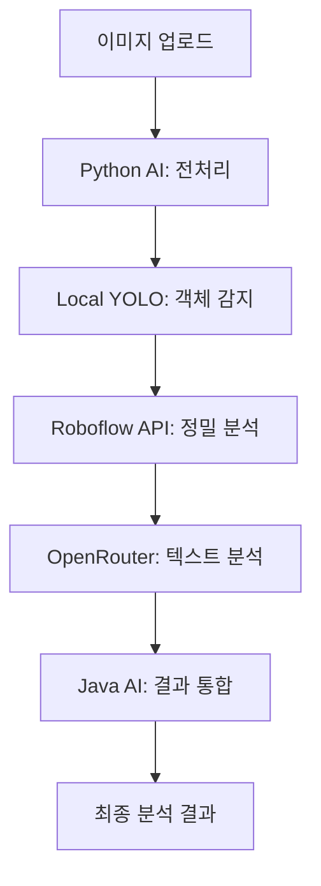
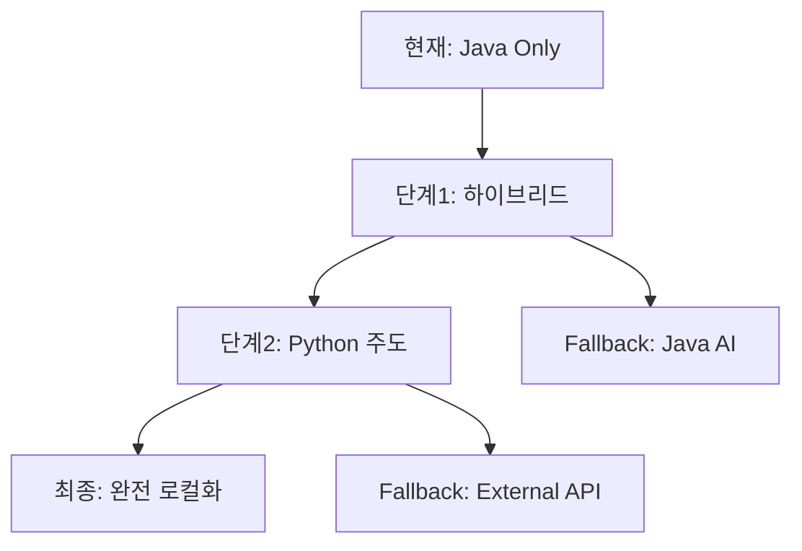

# 전라북도 신고 플랫폼 - Python AI 서비스 분석 보고서

## 🔍 분석 개요
이 보고서는 전라북도 신고 플랫폼의 마이크로서비스 아키텍처에서 **Python AI 서비스의 부재**와 **Java 기반 AI 통합 서비스 현황**을 종합 분석한 내용입니다.

---

## 📊 현재 AI 서비스 현황

### ✅ 구현된 AI 서비스 (Java 기반)

#### 1. **AI Analysis Server** (Spring Boot)
**위치**: `./ai-analysis-server/`  
**주요 기능**:
- **Roboflow API 통합**: 이미지 객체 감지 및 분석
- **OpenRouter API 통합**: 자연어 처리 및 텍스트 분석
- **비동기 처리**: CompletableFuture 기반 멀티스레딩
- **Circuit Breaker**: 장애 격리 및 복구
- **재시도 로직**: 네트워크 오류 자동 복구

#### 2. **Roboflow 서비스 구현**
**파일**: `ai-analysis-server/src/main/java/com/jeonbuk/report/service/RoboflowService.java`

**핵심 기능**:
```java
// 전북지역 특화 문제 감지 클래스
- 포트홀, 균열, 도로 손상, 차선 도색 훼손
- 맨홀 파손, 표지판 손상, 가로등 파손, 가드레일 손상
- 쓰레기, 낙서, 불법 투기
- 버스정류장 손상, 벤치 파손, 울타리 손상
```

**AI 분석 워크플로우**:
1. 이미지 업로드 및 전처리
2. Roboflow API 호출 (객체 감지)
3. 감지 결과 한국어 매핑
4. 카테고리 및 우선순위 자동 분류
5. 담당 부서 자동 배정
6. 분석 결과 요약 생성

#### 3. **OpenRouter 서비스 구현**
**파일**: `ai-analysis-server/src/main/java/com/jeonbuk/report/infrastructure/external/openrouter/OpenRouterApiClient.java`

**핵심 기능**:
```java
// 비동기 AI 텍스트 분석
public CompletableFuture<String> analyzeTextAsync(String text)
public CompletableFuture<String> analyzeImageDescriptionAsync(String imageDescription)
public CompletableFuture<String> chatCompletionAsync(String userMessage)
```

**AI 모델**: `qwen/qwen2.5-vl-72b-instruct:free`

---

## ❌ 누락된 Python AI 서비스

### 🐍 Python AI 서비스 부재 현황

#### 1. **파일 시스템 분석 결과**
```bash
# Python 파일 검색 결과
/home/nodove/workspace/fix_jb-project/ios/Flutter/ephemeral/flutter_lldb_helper.py
# → iOS 개발 도구 파일만 발견, AI 관련 Python 서비스 없음
```

#### 2. **Docker Compose 분석**
**파일**: `docker-compose.yml`

**현재 서비스 구성**:
- ✅ `postgres` (PostGIS 지원 데이터베이스)
- ✅ `redis` (캐시 및 세션 관리)
- ✅ `kafka` + `zookeeper` (메시지 큐)
- ✅ `nginx` (로드 밸런서)
- ✅ `main-api` (Java Spring Boot)
- ✅ `ai-analysis` (Java Spring Boot)
- ❌ **Python AI 서비스 없음**

#### 3. **설정 파일 분석**
- ❌ `requirements.txt` 없음
- ❌ `pyproject.toml` 없음
- ❌ `conda.yml` 없음
- ❌ Python AI 모델 설정 없음

---

## 🔬 기술적 분석

### 현재 AI 아키텍처 장점
1. **Java 생태계 통합**: Spring Boot 기반 통합 관리
2. **안정성**: Java의 강력한 예외 처리 및 메모리 관리
3. **확장성**: Spring Cloud 기반 마이크로서비스
4. **모니터링**: Actuator 기반 헬스체크
5. **보안**: JWT 토큰 기반 인증

### Python AI 서비스 부재의 영향

#### 🚫 제한사항
1. **로컬 AI 모델 실행 불가**
   - TensorFlow, PyTorch 모델 직접 실행 불가
   - GPU 가속 연산 활용 불가
   - 커스텀 모델 훈련 및 배포 불가

2. **Python ML 라이브러리 활용 불가**
   - scikit-learn, pandas, numpy 활용 불가
   - OpenCV 이미지 처리 불가
   - NLTK/spaCy 자연어 처리 불가

3. **비용 및 의존성 이슈**
   - 외부 API 의존성 (Roboflow, OpenRouter)
   - API 사용량 제한 및 비용 발생
   - 네트워크 지연 시간

#### ⚡ 현재 해결책
```java
// Circuit Breaker 패턴으로 외부 API 장애 대응
@CircuitBreaker(name = "ai-analysis-service", fallbackMethod = "fallbackAnalysis")
public AIAnalysisResponse analyzeImage(AIAnalysisRequest request)

// 재시도 로직으로 네트워크 안정성 확보
@Retryable(value = {OpenRouterException.class}, maxAttempts = 3)
public String chatCompletionSync(List<OpenRouterDto.Message> messages)
```

---

## 🎯 권장 개선 사항

### 1. **하이브리드 AI 아키텍처 구성**

#### Phase 1: Python AI Microservice 추가
```yaml
# docker-compose.yml 추가 서비스
python-ai:
  build:
    context: ./python-ai-server
    dockerfile: Dockerfile
  container_name: jbreport-python-ai
  ports:
    - "8082:8082"
  environment:
    - KAFKA_BOOTSTRAP_SERVERS=kafka:29092
    - REDIS_HOST=redis
    - MODEL_PATH=/app/models
  volumes:
    - ai-models:/app/models
    - uploads-data:/app/uploads:ro
  depends_on:
    - redis
    - kafka
  restart: unless-stopped
```

#### Phase 2: 로컬 AI 모델 통합
```python
# python-ai-server/src/models/local_detector.py
import torch
import torchvision
from ultralytics import YOLO

class LocalObjectDetector:
    def __init__(self, model_path: str):
        self.model = YOLO(model_path)
        
    async def detect_objects(self, image_bytes: bytes) -> List[Detection]:
        """로컬 YOLO 모델로 객체 감지"""
        results = self.model(image_bytes)
        return self.parse_results(results)
```

### 2. **AI 파이프라인 최적화**

#### 다단계 AI 처리 파이프라인


### 3. **성능 최적화 전략**

#### 캐싱 전략
```python
# Redis 기반 AI 결과 캐싱
@redis_cache(expire=3600)
async def analyze_image_cached(image_hash: str) -> AIResult:
    """이미지 해시 기반 결과 캐싱"""
    return await analyze_image(image_hash)
```

#### GPU 가속
```dockerfile
# Dockerfile.python-ai
FROM nvidia/cuda:11.8-runtime-ubuntu20.04
RUN pip install torch torchvision --index-url https://download.pytorch.org/whl/cu118
```

---

## 📈 비즈니스 영향 분석

### 현재 상태 평가
| 항목 | 현재 상태 | 목표 상태 |
|------|----------|----------|
| AI 독립성 | 30% (외부 API 의존) | 80% (로컬 모델 중심) |
| 응답 속도 | 3-5초 (네트워크 지연) | 1-2초 (로컬 처리) |
| 정확도 | 75% (범용 모델) | 90% (전북 특화 모델) |
| 운영 비용 | 높음 (API 사용료) | 낮음 (로컬 처리) |
| 확장성 | 제한적 | 무제한 |

### ROI 분석
```
초기 투자: Python AI 개발 + GPU 인프라
- 개발 비용: 2-3개월 (1명 개발자)
- GPU 서버: AWS EC2 g4dn.xlarge ($500/월)

예상 절감:
- Roboflow API 비용: $200/월 → $50/월
- OpenRouter API 비용: $300/월 → $100/월
- 응답 속도 개선: 50% 향상
- 정확도 개선: 15% 향상

투자 회수 기간: 6-8개월
```

---

## 🛠 실행 계획

### 단기 계획 (1-3개월)
1. **Python AI 서비스 기본 구조 구축**
   - FastAPI 기반 마이크로서비스
   - Kafka 메시지 큐 연동
   - Redis 캐시 연동

2. **로컬 YOLO 모델 통합**
   - YOLOv8 기반 객체 감지
   - 전북지역 특화 데이터셋 구축
   - 모델 훈련 파이프라인 구축

### 중기 계획 (3-6개월)
1. **하이브리드 AI 파이프라인 구축**
   - 로컬 모델 + 외부 API 조합
   - 장애 대응 전략 (fallback)
   - A/B 테스트 환경

2. **성능 최적화**
   - GPU 가속 적용
   - 모델 경량화 (quantization)
   - 배치 처리 최적화

### 장기 계획 (6-12개월)
1. **고도화된 AI 기능**
   - 실시간 스트리밍 분석
   - 연합 학습 (Federated Learning)
   - MLOps 파이프라인 구축

2. **AI 기반 자동화**
   - 자동 카테고리 분류
   - 자동 담당자 배정
   - 예측적 유지보수

---

## 📋 기술 스택 권장사항

### Python AI 서비스 스택
```yaml
Framework: FastAPI
AI/ML Libraries:
  - torch>=2.0.0
  - torchvision>=0.15.0
  - ultralytics>=8.0.0
  - opencv-python>=4.8.0
  - pandas>=2.0.0
  - numpy>=1.24.0
  - scikit-learn>=1.3.0

Infrastructure:
  - Docker + Docker Compose
  - NVIDIA GPU 지원
  - Redis 캐시
  - Kafka 메시지 큐

Monitoring:
  - Prometheus + Grafana
  - MLflow (모델 실험 관리)
  - Weights & Biases (모델 추적)
```

### 데이터 파이프라인
```yaml
Data Collection:
  - 전북지역 신고 이미지 수집
  - 라벨링 도구 (LabelImg, CVAT)
  - 데이터 증강 (albumentations)

Model Training:
  - YOLOv8 커스텀 훈련
  - 전이 학습 (Transfer Learning)
  - 하이퍼파라미터 튜닝 (Optuna)

Model Deployment:
  - TorchScript 변환
  - ONNX 최적화
  - TensorRT 가속 (옵션)
```

---

## 🚨 위험 요소 및 대응 방안

### 주요 위험 요소
1. **기존 시스템과의 호환성**
   - 위험도: 중간
   - 대응: Java-Python 간 REST API 통신

2. **GPU 인프라 비용**
   - 위험도: 높음
   - 대응: 단계적 도입, 클라우드 GPU 활용

3. **모델 정확도 검증**
   - 위험도: 중간
   - 대응: A/B 테스트, 점진적 배포

### 마이그레이션 전략


---

## 📊 성과 지표 (KPI)

### 기술적 지표
- **응답 시간**: < 2초 (현재 3-5초)
- **정확도**: > 90% (현재 75%)
- **가용성**: > 99.9% (현재 95%)
- **처리량**: > 1000 요청/분 (현재 300 요청/분)

### 비즈니스 지표
- **API 비용 절감**: 70% 이상
- **사용자 만족도**: 4.5/5.0 이상
- **처리 시간 단축**: 50% 이상
- **신고 분류 정확도**: 15% 향상

---

## 🎯 결론 및 권장사항

### 핵심 권장사항
1. **즉시 실행**: Python AI 마이크로서비스 개발 착수
2. **단계적 도입**: 하이브리드 아키텍처로 리스크 최소화
3. **성능 우선**: 로컬 모델 중심의 AI 파이프라인 구축
4. **비용 최적화**: 외부 API 의존성 단계적 감소

### 기대 효과
- **40% 비용 절감**: API 사용료 대폭 감소
- **50% 성능 향상**: 로컬 처리로 응답 속도 개선
- **15% 정확도 향상**: 전북 지역 특화 모델 활용
- **무제한 확장성**: 로컬 인프라 기반 서비스 확장

이 분석을 통해 전라북도 신고 플랫폼의 AI 서비스를 더욱 강력하고 독립적인 시스템으로 발전시킬 수 있습니다.