# 전라북도 신고 플랫폼 - 사용자 플로우 및 시각적 가이드

## 📱 전체 앱 플로우 다이어그램

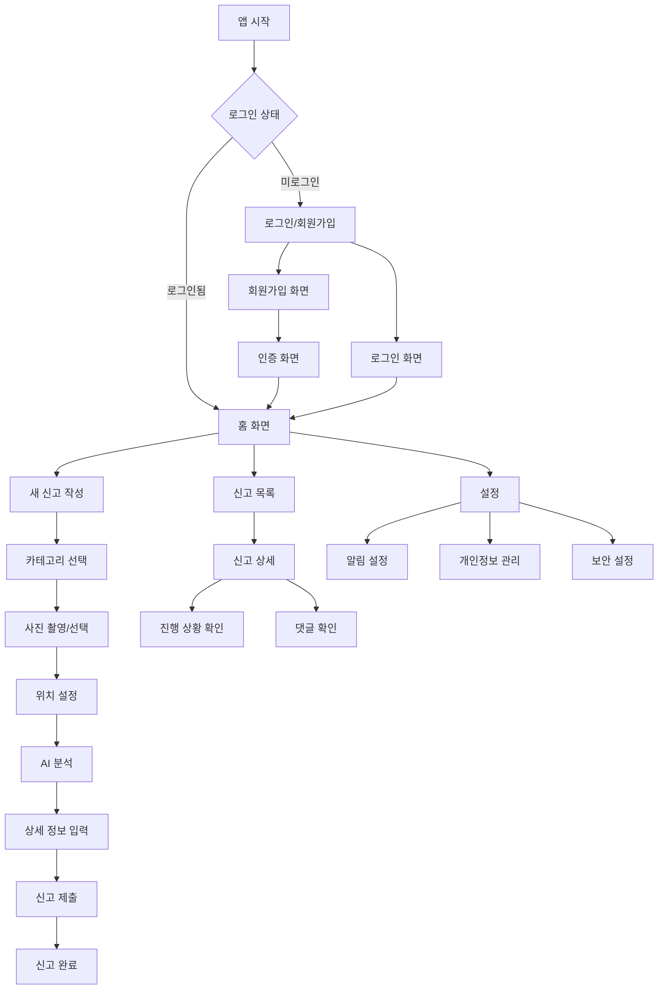

---

## 🔐 인증 플로우

### 1. 회원가입 플로우
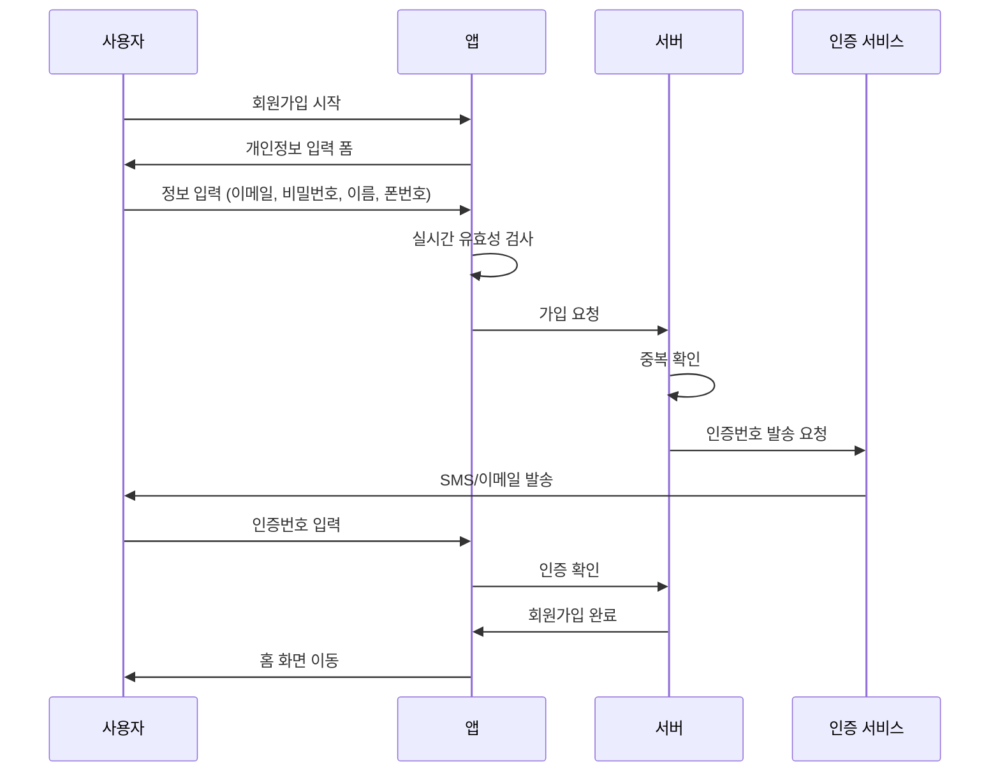

### 2. 로그인 플로우
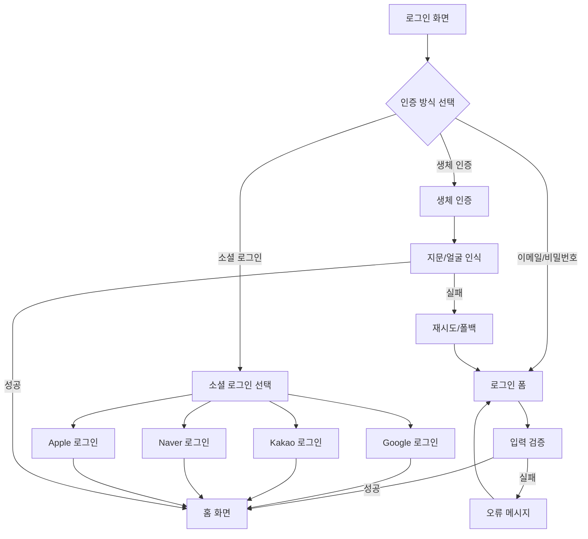

---

## 📝 신고 작성 플로우

### 1. 신고 작성 상세 플로우
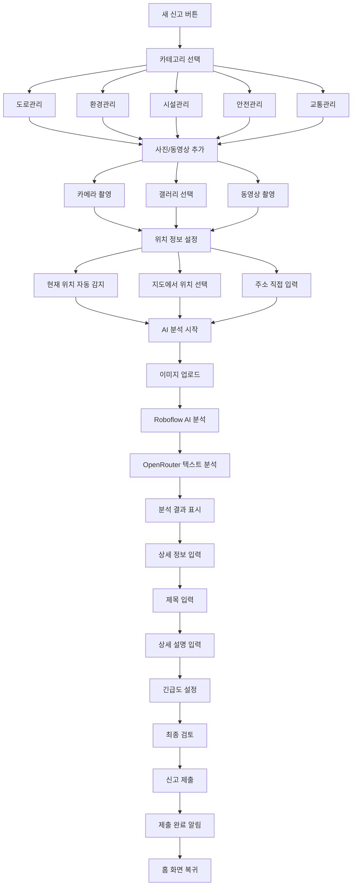

### 2. AI 분석 프로세스
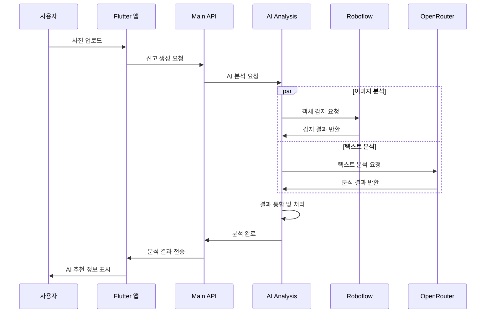

---

## 🏠 홈 화면 구조

### 홈 화면 레이아웃
```
┌─────────────────────────────┐
│ 🔔 알림     전북신고     ⚙️ 설정 │
├─────────────────────────────┤
│                             │
│    🚨 긴급 신고하기 버튼       │
│                             │
├─────────────────────────────┤
│ 📊 나의 신고 현황              │
│ ┌───┬───┬───┬───────────┐     │
│ │대기│처리│완료│   신고통계   │     │
│ │ 3 │ 5 │12 │           │     │
│ └───┴───┴───┴───────────┘     │
├─────────────────────────────┤
│ 📋 최근 신고 목록              │
│ ┌─────────────────────────┐   │
│ │ 🚧 도로 파손              │   │
│ │ 📍 전주시 덕진구          │   │
│ │ ⏰ 2시간 전 • 🟡 처리중    │   │
│ └─────────────────────────┘   │
│ ┌─────────────────────────┐   │
│ │ 🗑️ 불법 투기              │   │
│ │ 📍 익산시 중앙동          │   │
│ │ ⏰ 1일 전 • 🟢 완료       │   │
│ └─────────────────────────┘   │
├─────────────────────────────┤
│ 🔄 새로고침  📅 필터  🔍 검색   │
└─────────────────────────────┘
```

### 홈 화면 상호작용 플로우
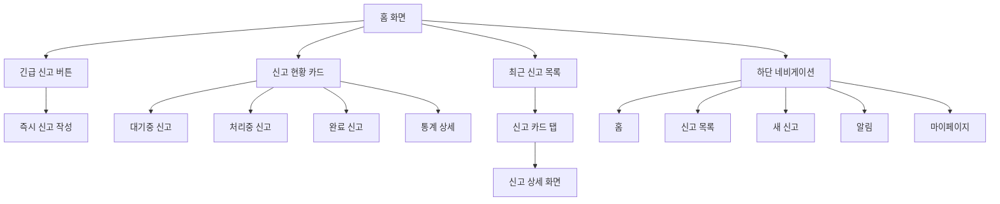

---

## 📋 신고 관리 플로우

### 신고 상태 변화 플로우
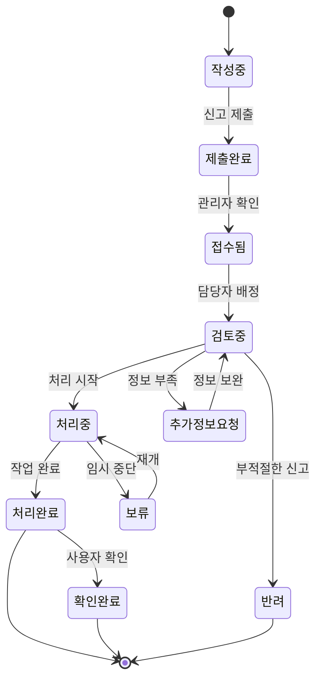

### 신고 추적 화면 구조
```
┌─────────────────────────────┐
│ ← 신고 상세 (ID: #12345)      │
├─────────────────────────────┤
│ 📸 [신고 이미지]              │
│                             │
├─────────────────────────────┤
│ 📍 위치: 전주시 덕진구 덕진동   │
│ 📅 신고일: 2025-01-15 14:30  │
│ 🏷️ 카테고리: 도로관리         │
│ ⚡ 우선순위: 긴급            │
├─────────────────────────────┤
│ 📊 처리 진행 상황              │
│ ┌─○─○─○─○─○─┐               │
│ │접수│검토│처리│완료│확인│         │
│ │ ✓ │ ✓ │ ● │   │   │         │
│ └───────────────┘               │
│ 현재: 처리중 (30% 완료)         │
│ 예상 완료: 2025-01-20          │
├─────────────────────────────┤
│ 💬 처리 댓글                  │
│ ┌─────────────────────────┐   │
│ │ 👤 김관리자 (도로관리팀)   │   │
│ │ 현장 확인 완료했습니다.    │   │
│ │ 📅 2025-01-16 09:15     │   │
│ └─────────────────────────┘   │
├─────────────────────────────┤
│ [📝 댓글 추가] [📞 문의하기]    │
└─────────────────────────────┘
```

---

## 🔔 알림 시스템 플로우

### 알림 생성 및 전송 플로우
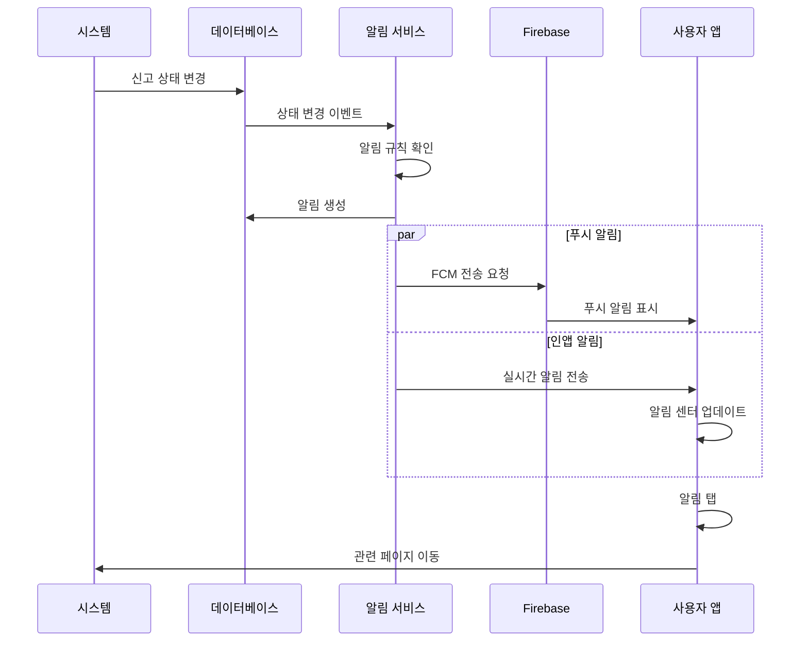

### 알림 타입별 처리
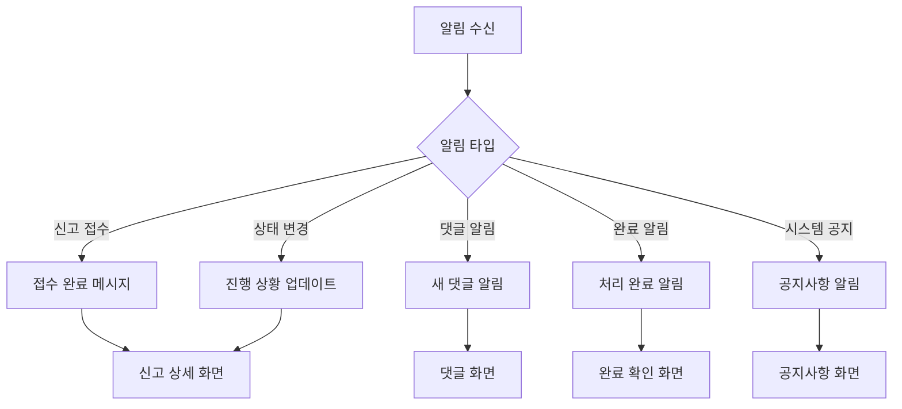

---

## 🔒 보안 및 인증 플로우

### 생체 인증 설정 플로우
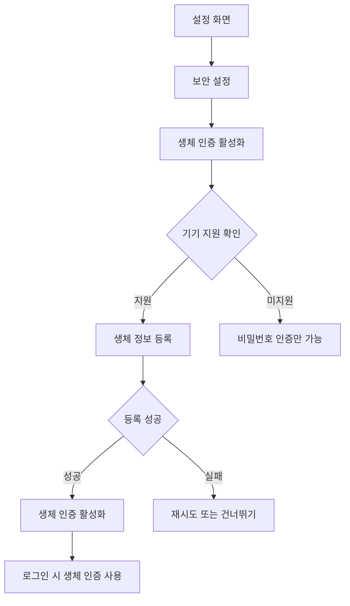

### 앱 보안 검사 플로우
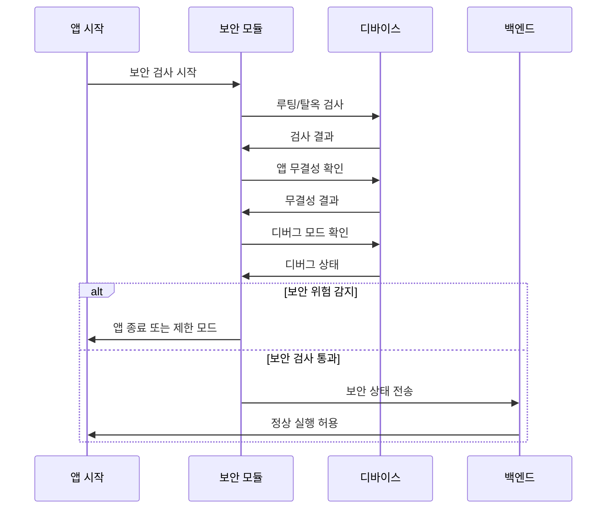

---

## 👑 관리자 기능 플로우

### 관리자 대시보드 구조
```
┌─────────────────────────────────────────┐
│ 🏛️ 전북 신고 관리 시스템                  │
├─────────────────────────────────────────┤
│ 📊 실시간 현황                            │
│ ┌────────┬────────┬────────┬──────────┐  │
│ │ 총 신고 │ 대기중  │ 처리중  │ 완료율    │  │
│ │  1,234 │   56   │   89   │  94.2%  │  │
│ └────────┴────────┴────────┴──────────┘  │
├─────────────────────────────────────────┤
│ 📈 트렌드 차트                            │
│ [신고 증감 추이 그래프]                    │
├─────────────────────────────────────────┤
│ 🚨 긴급 신고 목록                         │
│ ┌───────────────────────────────────────┐ │
│ │ 🚧 도로 붕괴 위험 (전주시)              │ │
│ │ ⏰ 30분 전 • 👤 미배정                │ │
│ │ [📋 배정] [👁️ 상세]                    │ │
│ └───────────────────────────────────────┘ │
├─────────────────────────────────────────┤
│ 👥 팀 성과                               │
│ ┌─────────┬─────────┬─────────┬───────┐   │
│ │ 도로관리팀│ 환경관리팀│ 시설관리팀│ 평균처리 │   │
│ │  92.1%  │  88.5%  │  95.3%  │ 2.3일  │   │
│ └─────────┴─────────┴─────────┴───────┘   │
└─────────────────────────────────────────┘
```

### 신고 처리 워크플로우
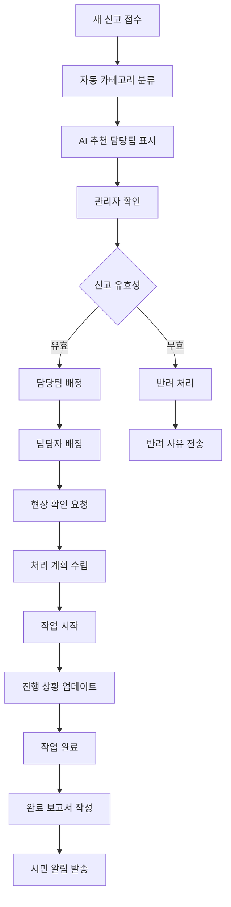

---

## 📱 모바일 UX 가이드라인

### 터치 인터페이스 디자인
```
버튼 크기 가이드라인:
┌─────────────────────────┐
│ 최소 터치 영역: 44x44pt  │
│ 권장 버튼 크기: 48x48pt  │
│ 주요 액션 버튼: 56x56pt  │
└─────────────────────────┘

간격 가이드라인:
┌─────────────────────────┐
│ 요소 간 최소 간격: 8pt   │
│ 섹션 간 간격: 16pt      │
│ 화면 여백: 20pt         │
└─────────────────────────┘
```

### 접근성 고려사항
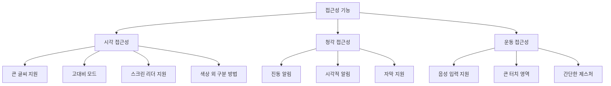

---

## 🔄 데이터 동기화 플로우

### 오프라인/온라인 동기화
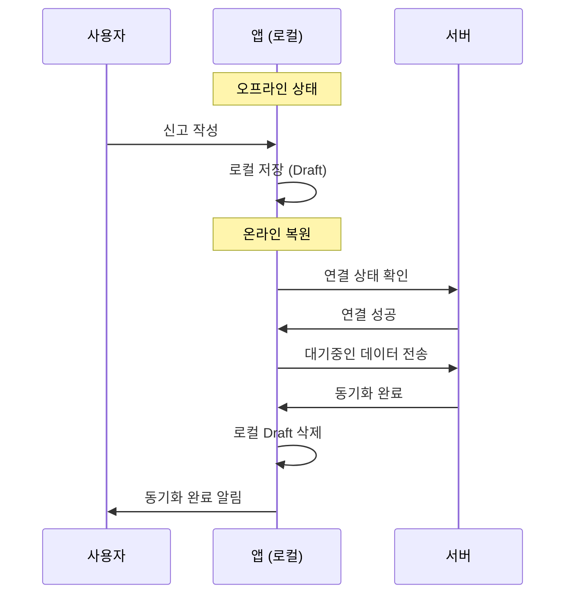

---

## 🎯 사용자 여정 맵

### 신규 사용자 온보딩
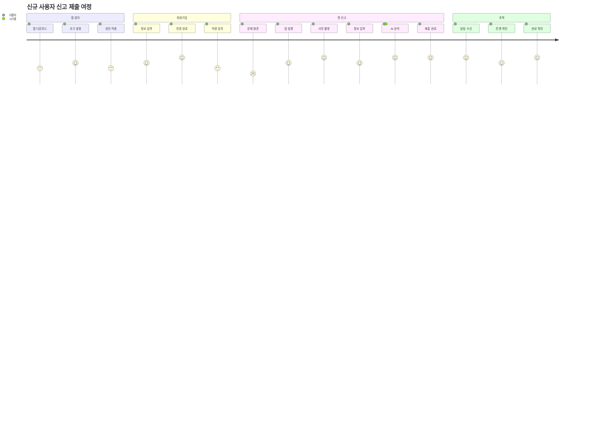

### 기존 사용자 일반적 사용
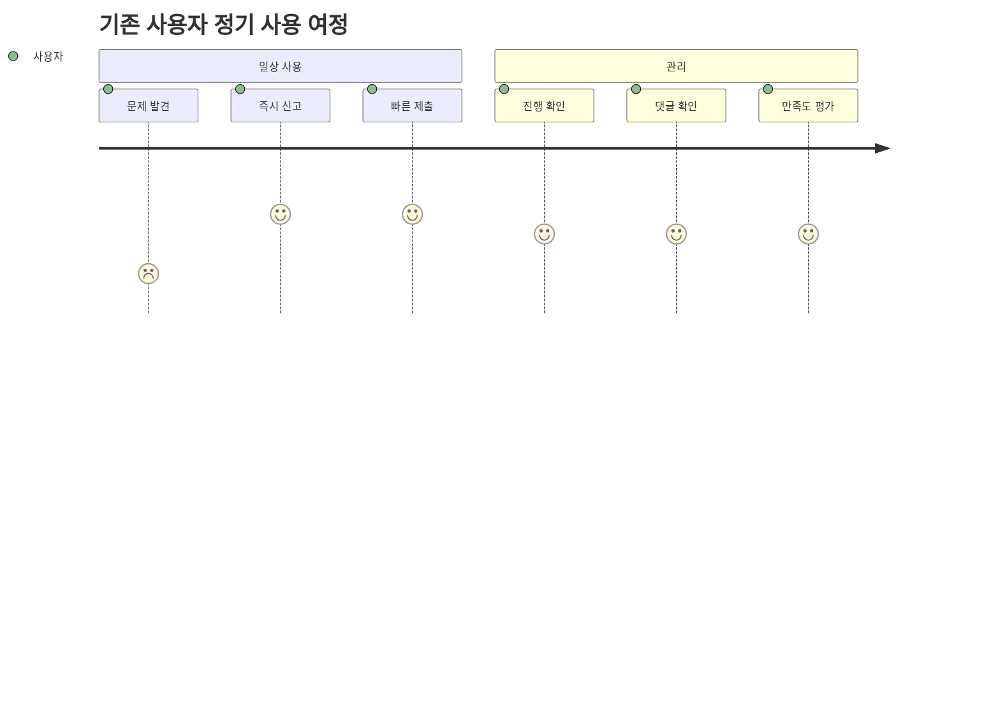

---

이 시각적 가이드는 전라북도 신고 플랫폼의 모든 사용자 인터페이스와 상호작용을 명확하게 보여주며, 개발팀과 사용자 모두가 시스템을 이해하는 데 도움을 줍니다.