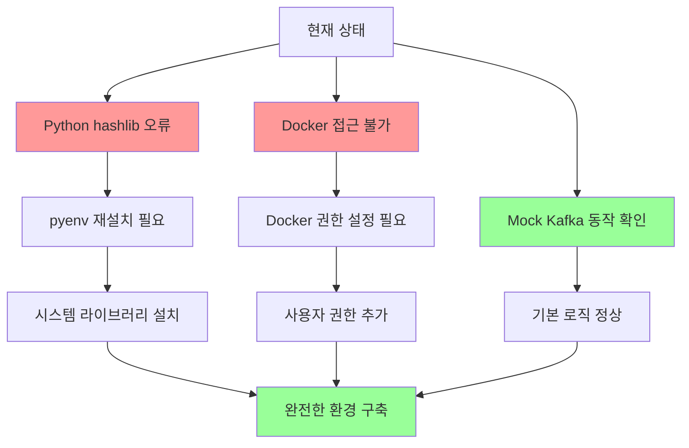

# 🔧 시스템 환경 문제 해결 가이드

## 📊 현재 상황 분석



## 🚨 식별된 문제들

### 1. ⚡ 최우선 문제: Python hashlib 오류

```
ERROR:root:code for hash blake2b was not found.
ValueError: unsupported hash type blake2b
```

**원인**: pyenv로 Python 3.12.4를 설치할 때 필요한 시스템 라이브러리가 없어서 해시 알고리즘이 제대로 컴파일되지 않음

**영향**: 
- pip install 시 반복적인 오류 발생
- 암호화 관련 기능 불안정
- 향후 보안 관련 패키지 설치 문제 가능성

### 2. 🐳 Docker 접근 문제

```
bash: docker: 명령어를 찾을 수 없음
bash: sudo: 명령어를 찾을 수 없음
```

**원인**: 
- Docker가 설치되지 않았거나 PATH에 없음
- sudo 명령어 없음
- 사용자 권한 부족

**영향**:
- 실제 Kafka 컨테이너 실행 불가
- 시스템 관리 작업 제한

## 🛠️ 단계별 해결 방안

### 🔥 1단계: Python 환경 완전 재구축

#### 1.1 시스템 의존성 설치

```bash
# root 권한으로 실행 (시스템 관리자에게 요청)
sudo apt-get update && sudo apt-get install -y \
    build-essential \
    libssl-dev \
    zlib1g-dev \
    libbz2-dev \
    libreadline-dev \
    libsqlite3-dev \
    wget \
    curl \
    llvm \
    libncurses5-dev \
    libncursesw5-dev \
    xz-utils \
    tk-dev \
    libffi-dev \
    liblzma-dev \
    python3-openssl \
    git
```

#### 1.2 Python 재설치

```bash
# 현재 Python 버전 확인
pyenv versions

# 문제있는 버전 제거
pyenv uninstall 3.12.4

# 올바른 의존성으로 재설치
CONFIGURE_OPTS="--enable-shared" pyenv install 3.12.4

# 전역 버전 설정
pyenv global 3.12.4

# 설치 확인
python -c "import hashlib; print('hashlib OK:', hashlib.blake2b)"
```

#### 1.3 가상환경 재생성

```bash
# 기존 가상환경 제거 (필요시)
rm -rf /home/nodove/workspace/fix_jeonbuk/venv

# 새 가상환경 생성
cd /home/nodove/workspace/fix_jeonbuk
python -m venv venv
source venv/bin/activate

# 필수 패키지 재설치
pip install --upgrade pip
pip install confluent-kafka requests
```

### 🐳 2단계: Docker 환경 구축

#### 2.1 Docker 설치 (시스템 관리자 권한 필요)

```bash
# Docker 공식 설치 스크립트
curl -fsSL https://get.docker.com -o get-docker.sh
sudo sh get-docker.sh

# Docker Compose 설치
sudo curl -L "https://github.com/docker/compose/releases/download/v2.24.0/docker-compose-$(uname -s)-$(uname -m)" \
    -o /usr/local/bin/docker-compose
sudo chmod +x /usr/local/bin/docker-compose
```

#### 2.2 사용자 권한 설정

```bash
# nodove 사용자를 docker 그룹에 추가
sudo usermod -aG docker nodove

# 권한 적용 확인 (재로그인 후)
groups $USER
docker --version
docker-compose --version
```

#### 2.3 Docker 서비스 시작

```bash
# Docker 서비스 시작 및 자동 시작 설정
sudo systemctl start docker
sudo systemctl enable docker

# 상태 확인
sudo systemctl status docker
```

### 🚀 3단계: Kafka 환경 구축

#### 3.1 기존 컨테이너 정리

```bash
# 실행 중인 컨테이너 확인
docker ps -a

# Kafka 관련 컨테이너가 있다면 정리
docker stop kafka zookeeper 2>/dev/null || true
docker rm kafka zookeeper 2>/dev/null || true
```

#### 3.2 Kafka 컨테이너 시작

```bash
cd /home/nodove/workspace/fix_jeonbuk

# Docker Compose로 Kafka 시작
docker-compose up -d

# 컨테이너 상태 확인
docker ps | grep -E "(kafka|zookeeper)"

# 로그 확인
docker logs kafka
docker logs zookeeper
```

### ✅ 4단계: 통합 테스트

#### 4.1 Python 환경 테스트

```python
# 간단한 테스트 스크립트
python -c "
import hashlib
import json
import sys

try:
    # hashlib 테스트
    h = hashlib.blake2b()
    print('✅ hashlib blake2b: OK')
    
    # 모듈 import 테스트
    import confluent_kafka
    import requests
    print('✅ 필수 모듈: OK')
    
    print('🎉 Python 환경 완전 정상!')
except Exception as e:
    print(f'❌ 오류: {e}')
    sys.exit(1)
"
```

#### 4.2 Kafka 연결 테스트

```bash
# 연결 테스트 실행
python test_kafka_connection.py

# 실제 Kafka로 워커 테스트
python kafka_worker_enhanced.py test

# Mock 모드와 비교
USE_MOCK_KAFKA=true python kafka_worker_enhanced.py test
```

## 🔄 진행 상황 체크리스트

### Python 환경
- [ ] 시스템 의존성 패키지 설치 완료
- [ ] Python 3.12.4 재설치 완료
- [ ] hashlib 오류 해결 확인
- [ ] 가상환경 재생성 완료
- [ ] 필수 패키지 설치 완료

### Docker 환경
- [ ] Docker 설치 완료
- [ ] Docker Compose 설치 완료
- [ ] 사용자 권한 설정 완료
- [ ] Docker 서비스 시작 완료

### Kafka 환경
- [ ] 기존 컨테이너 정리 완료
- [ ] Kafka/Zookeeper 컨테이너 시작 완료
- [ ] 컨테이너 상태 정상 확인
- [ ] 연결 테스트 성공

### 통합 테스트
- [ ] Python 환경 테스트 통과
- [ ] Kafka 연결 테스트 통과
- [ ] 실제 워커 동작 확인
- [ ] Mock/실제 환경 전환 테스트

## 🚨 문제 해결 FAQ

### Q1: 시스템 관리자 권한이 없다면?

**A**: Mock Kafka 서비스를 계속 사용하면서 개발을 진행할 수 있습니다:

```bash
# 현재 작동하는 Mock 환경으로 개발 계속
USE_MOCK_KAFKA=true python kafka_worker_enhanced.py
```

### Q2: Python 재설치가 안 된다면?

**A**: 다른 Python 버전을 시도해보세요:

```bash
# 안정적인 다른 버전 설치
pyenv install 3.11.8
pyenv global 3.11.8
```

### Q3: Docker 설치 권한이 없다면?

**A**: 
1. Podman 사용 고려
2. 시스템 관리자에게 요청
3. Mock 서비스로 개발 완료 후 배포 환경에서 테스트

## 📈 예상 효과

```mermaid
gantt
    title 해결 프로세스 타임라인
    dateFormat HH:mm
    axisFormat %H:%M
    
    section Python 환경
    의존성 설치      :done, deps, 09:00, 09:30
    Python 재설치    :done, python, 09:30, 10:00
    패키지 설치      :done, packages, 10:00, 10:15
    
    section Docker 환경
    Docker 설치      :active, docker, 10:15, 10:45
    권한 설정        :권한, 10:45, 11:00
    서비스 시작      :서비스, 11:00, 11:15
    
    section Kafka 테스트
    컨테이너 시작    :kafka, 11:15, 11:30
    연결 테스트      :test, 11:30, 11:45
    통합 확인        :final, 11:45, 12:00
```



## 🎯 최종 목표

1. **안정적인 개발 환경**: hashlib 오류 없는 Python 환경
2. **완전한 Kafka 연동**: 실제 컨테이너와 정상 통신
3. **유연한 개발 모드**: Mock/실제 환경 자유 전환
4. **프로덕션 준비**: 실제 배포 환경과 동일한 설정

---

## 🤝 지원 요청

시스템 관리자가 필요한 작업들:
1. `sudo apt-get install` 명령어 실행
2. Docker 설치 및 사용자 권한 부여
3. 방화벽 설정 (필요시)

개발자가 직접 할 수 있는 작업들:
1. pyenv를 통한 Python 재설치
2. 가상환경 재생성
3. Mock 서비스를 활용한 개발 진행
