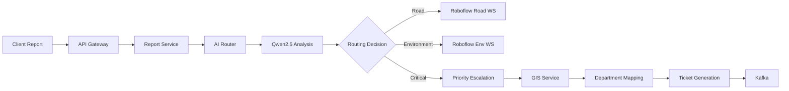
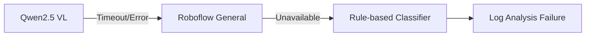

# AI Router System Technical Specification

## 1. System Overview
The AI Router System dynamically routes infrastructure reports to specialized processing workspaces based on AI analysis of submitted images and contextual data. Key capabilities:

- **Multimodal Analysis**: Combines Qwen2.5 VL vision capabilities with textual reports
- **Dynamic Routing**: Routes to specialized Roboflow workspaces
- **Priority Handling**: Auto-escalates critical infrastructure issues
- **GIS Integration**: Location-based department assignment
- **Ticket Automation**: Generates structured tickets for department workflows



## 2. Core Components

### 2.1 Qwen2.5 VL Integration
- **Model**: Qwen2.5-72B Vision-Language model
- **Input Processing**:
  ```java
  public AnalysisInput preprocessInput(MultipartFile image, String description) {
      return new AnalysisInput(
          ImageUtils.resize(image, 1024, 1024),
          TextUtils.sanitize(description),
          LocalDateTime.now()
      );
  }
  ```
- **Output Structure**:
  ```json
  {
    "objects": [
      {"name": "pothole", "confidence": 0.92, "bbox": [x,y,w,h]},
      {"name": "crack", "confidence": 0.87, "bbox": [x,y,w,h]}
    ],
    "scene_context": "urban_road",
    "hazard_level": "HIGH"
  }
  ```

### 2.2 Dynamic Routing Engine
**Routing Logic**:
```java
public class RoutingService {
    private static final double CRITICAL_THRESHOLD = 0.9;
    
    public Workspace route(AnalysisResult result) {
        if (isCritical(result)) {
            return priorityService.handleCritical(result);
        }
        
        return switch (result.getDominantCategory()) {
            case ROAD -> roboflowClient.getWorkspace("jeonbuk-road");
            case ENVIRONMENT -> roboflowClient.getWorkspace("jeonbuk-env");
            case FACILITY -> roboflowClient.getWorkspace("jeonbuk-facility");
            default -> roboflowClient.getWorkspace("integrated-detection");
        };
    }
    
    private boolean isCritical(AnalysisResult result) {
        return result.getHazardLevel() == HazardLevel.HIGH || 
               result.getMaxConfidence() > CRITICAL_THRESHOLD;
    }
}
```

### 2.3 Priority Escalation System
**Escalation Workflow**:
1. Detection of critical objects:
   - Electrical hazards
   - Structural collapses
   - Major water leaks
   - Emergency vehicles
   
2. Escalation path:
   ```mermaid
   graph TB
       A[Critical Detection] --> B[GIS Location Analysis]
       B --> C[Nearest Response Team]
       C --> D[Immediate SMS Alert]
       D --> E[High-priority Ticket]
       E --> F[Manager Dashboard]
   ```

### 2.4 GIS Integration
- **Data Sources**:
  - Naver Map API (primary)
  - OpenStreetMap (fallback)
  - Municipal boundary datasets
  
- **Department Mapping**:
  ```python
  def assign_department(lat, lng):
      zone = gis_service.get_management_zone(lat, lng)
      return DEPARTMENT_MAPPING.get(zone, "GENERAL_SERVICES")
  ```

### 2.5 Ticket Generation
**Avro Schema**:
```avro
{
  "type": "record",
  "name": "AITicket",
  "fields": [
    {"name": "id", "type": "string"},
    {"name": "priority", "type": {"type": "enum", "name": "Priority", "symbols": ["CRITICAL", "HIGH", "MEDIUM", "LOW"]}},
    {"name": "location", "type": {"type": "record", "name": "GeoPoint", "fields": [
      {"name": "lat", "type": "float"},
      {"name": "lng", "type": "float"}
    ]}},
    {"name": "assignedDept", "type": "string"},
    {"name": "detections", "type": {"type": "array", "items": "Detection"}}
  ]
}
```

### 2.6 Kafka Integration
**Topic Configuration**:
| Topic | Partitions | Retention | Description |
|-------|------------|-----------|-------------|
| ai-detection-requests | 6 | 7 days | Incoming analysis requests |
| priority-tickets | 3 | 14 days | Critical issue tickets |
| standard-tickets | 9 | 3 days | Regular processing tickets |

## 3. Failure Handling

### 3.1 Fallback Mechanisms
**Model Degradation Workflow**:


### 3.2 Circuit Breaker Pattern
Configuration:
```yaml
resilience4j:
  circuitbreaker:
    instances:
      aiRouter:
        failureRateThreshold: 50
        waitDurationInOpenState: 5000
        slidingWindowSize: 10
```

## 4. Deployment Architecture
**Kubernetes Setup**:
```yaml
apiVersion: apps/v1
kind: Deployment
metadata:
  name: ai-router
spec:
  replicas: 3
  template:
    spec:
      containers:
      - name: router
        image: registry.jeonbuk.gov/ai-router:1.2.0
        env:
        - name: ROBOWORKSPACES
          value: "road=jeonbuk-road,env=jeonbuk-env"
        resources:
          limits:
            memory: 4Gi
            cpu: 2
```

## 5. Security Measures
- **Data Protection**:
  - Image anonymization (blur faces/license plates)
  - AES-256 encryption at rest
  - TLS 1.3 for all communications
- **Access Control**:
  - OAuth2 with Jeonbuk SSO
  - API key rotation every 7 days

## 6. Performance Targets
| Metric | Target | Alert Threshold |
|--------|--------|-----------------|
| P99 Latency | 1200ms | >2000ms |
| Error Rate | <0.5% | >2% |
| Throughput | 100 rps | <20 rps |
| Availability | 99.95% | <99% |