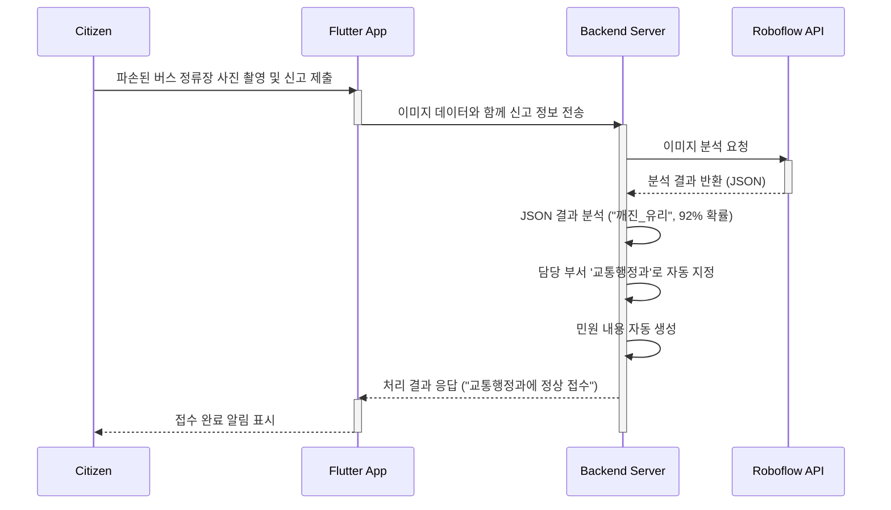

# 🤖 AI 기반 시민 제보 분석 시스템 도입 제안서

## 1. 문서 정보

| 📋 **항목** | 📝 **내용** |
| --- | --- |
| **문서 버전** | v1.0 |
| **작성일** | 2025년 6월 28일 |
| **관련 모듈** | `report-service` (백엔드), `flutter-app` (클라이언트) |
| **핵심 기술** | Roboflow (객체 탐지 API), Spring Boot, Flutter |

---

## 2. 개요

본 문서는 '전북 시민제보' 앱의 핵심 기능 강화를 위해 **AI 이미지 분석 시스템**을 도입하는 방안을 제안합니다. 사용자가 제보 사진을 업로드하면, 외부 AI 서비스(Roboflow)를 통해 이미지를 분석하여 **신고 유형을 자동으로 분류**하고 **담당 부서를 지정**하며, **민원 내용을 초안으로 작성**하는 것을 목표로 합니다. 이를 통해 민원 처리의 효율성과 신속성을 획기적으로 개선할 수 있습니다.

---

## 3. 사용자 시나리오

> **시민:** 전주시 길을 가다가 파손된 버스 정류장을 발견하고, '전북 시민제보' 앱을 켜서 사진을 찍고 '신고' 버튼을 누릅니다.



> **시민:** 앱 화면에 "버스 정류장 파손 신고가 정상적으로 **교통행정과**에 접수되었습니다." 라는 알림을 받습니다.

---

## 4. 시스템 아키텍처 및 데이터 흐름

### 4.1. 아키텍처 다이어그램

```mermaid
graph TD
    subgraph "사용자 영역"
        A[📱 Flutter App]
    end
    
    subgraph "백엔드 시스템 (Spring Boot)"
        B[API Gateway]
        C[Report Service]
        D[Database (PostgreSQL)]
        E[Roboflow Client]
    end
    
    subgraph "외부 서비스"
        F[👁️ Roboflow API]
    end
    
    A -- "1. 신고 요청 (이미지 포함)" --> B
    B --> C
    C -- "2. 이미지 분석 요청" --> E
    E -- "3. API 호출" --> F
    F -- "4. 분석 결과 (JSON)" --> E
    E --> C
    C -- "5. 결과 분석 및 정보 가공" --> C
    C -- "6. 신고 정보 저장" --> D
    C -- "7. 처리 결과 반환" --> A
```

### 4.2. 데이터 흐름 상세

1.  **신고 접수**: 클라이언트(앱)는 사용자가 촬영한 이미지와 기본 텍스트를 `report-service`로 전송합니다.
2.  **AI 분석 요청**: `report-service`는 이미지가 첨부된 경우, `Roboflow Client`를 통해 이미지를 Roboflow API 서버로 보냅니다. 이 과정은 **비동기**로 처리하여 사용자 대기 시간을 최소화하는 것을 권장합니다.
3.  **결과 수신 및 분석**: Roboflow API는 이미지 분석 후 탐지된 객체, 신뢰도 등을 JSON 형태로 반환합니다.
    ```json
    {
      "predictions": [
        {
          "x": 150.5, "y": 250.0,
          "width": 80.0, "height": 120.0,
          "class": "깨진_유리",
          "confidence": 0.92
        },
        {
          "class": "버스_정류장",
          "confidence": 0.85
        }
      ]
    }
    ```
4.  **정보 가공 및 저장**: `report-service`는 수신한 JSON을 파싱합니다.
    *   `깨진_유리`, `버스_정류장` 등의 클래스 정보를 조합하여 상황을 유추합니다.
    *   미리 정의된 **규칙 기반 매핑 테이블**을 참조하여 담당 부서(`교통행정과`)와 신고 유형(`공공시설 파손`)을 결정합니다.
    *   "신고 유형: 공공시설 파손, 내용: 버스 정류장 유리 파손으로 추정됨" 과 같이 민원 내용을 자동으로 생성합니다.
    *   가공된 모든 정보를 `reports` 테이블에 저장합니다.
5.  **결과 반환**: 처리 결과를 클라이언트에 반환하여 사용자에게 접수 완료 사실과 담당 부서를 즉시 알려줍니다.

---

## 5. 기술 요구사항 및 구현 방안

### 5.1. Roboflow

*   **모델 훈련**: 도로 파손, 불법 주정차, 쓰레기 무단 투기, 시설물 파손 등 주요 민원 유형에 대한 이미지 데이터를 수집하고, 각 객체에 대한 라벨링 작업을 진행하여 모델을 훈련시켜야 합니다.
*   **API 연동**: 발급받은 API Key와 Project ID는 Spring Boot의 `application.yml` 또는 외부 설정 서버를 통해 안전하게 관리합니다.

### 5.2. 백엔드 (Report Service)

*   **`RoboflowClient` 구현**:
    *   Spring의 `WebClient` (비동기) 또는 `RestTemplate`을 사용하여 Roboflow API와 통신하는 클라이언트 모듈을 구현합니다.
    *   API 요청 시 필요한 `api_key`와 이미지 데이터를 `multipart/form-data` 형식으로 전송합니다.

*   **담당 부서 매핑 로직**:
    *   AI 분석 결과를 담당 부서로 연결하는 규칙을 데이터베이스 테이블 또는 Enum 클래스로 관리합니다.

    #### `department_mapping` 테이블 예시
    | `ai_class` (탐지 객체) | `priority` (우선순위) | `department_code` (담당부서 코드) | `report_category_id` (신고 카테고리) |
    | :--- | :--- | :--- | :--- |
    | `깨진_유리` | 1 | `TRF-01` (교통행정과) | 10 (공공시설) |
    | `도로_파손` | 1 | `RDS-01` (도로과) | 12 (도로/교통) |
    | `쓰레기_무단투기` | 2 | `ENV-01` (환경과) | 20 (환경/위생) |

*   **`ReportService` 수정**:
    *   신고 생성 로직(`createReport`) 내부에 AI 분석 및 정보 가공 플로우를 추가합니다.
    *   AI 분석 신뢰도(`confidence`)가 특정 임계값(예: 70%) 미만일 경우, 자동 배정을 보류하고 관리자가 수동으로 확인하도록 '미분류' 상태로 저장하는 예외 처리가 필요합니다.

### 5.3. API 명세 변경

*   신고 생성 API (`POST /api/v1/reports`)의 응답(Response)에 AI 분석으로 자동 배정된 정보를 포함하여 클라이언트가 활용할 수 있도록 합니다.

**`201 Created` 응답 Body 예시**
```json
{
  "reportId": 12345,
  "title": "버스 정류장 파손 신고",
  "status": "SUBMITTED",
  "assignedDepartment": {
    "code": "TRF-01",
    "name": "교통행정과"
  },
  "message": "신고가 교통행정과에 정상적으로 접수되었습니다."
}
```

---

## 6. 리스크 및 고려사항

*   **AI 모델의 정확도**: 모델이 잘못된 예측을 할 경우 민원이 잘못된 부서로 배정될 수 있습니다. 신뢰도가 낮은 예측은 관리자가 개입하는 `Human-in-the-loop` 프로세스 도입을 고려해야 합니다.
*   **API 비용**: Roboflow API는 호출 당 비용이 발생할 수 있으므로, 서비스 규모에 맞는 요금제를 검토해야 합니다.
*   **응답 지연**: 외부 API 호출로 인해 신고 제출까지의 시간이 길어질 수 있습니다. 사용자에게 '분석 중'이라는 중간 상태를 보여주고, 실제 접수 완료는 백그라운드에서 처리 후 푸시 알림으로 알려주는 비동기 처리 방식이 이상적입니다.

---

## 7. 결론

AI 기반 분석 시스템 도입은 단순 민원 접수를 넘어, 행정 처리의 자동화와 효율화를 이끌어내는 핵심 기능이 될 것입니다. 제안된 아키텍처와 구현 방안을 바탕으로 개발을 진행하면, 시민들에게 더욱 빠르고 정확한 서비스를 제공하는 스마트 행정 플랫폼으로 거듭날 수 있을 것입니다.