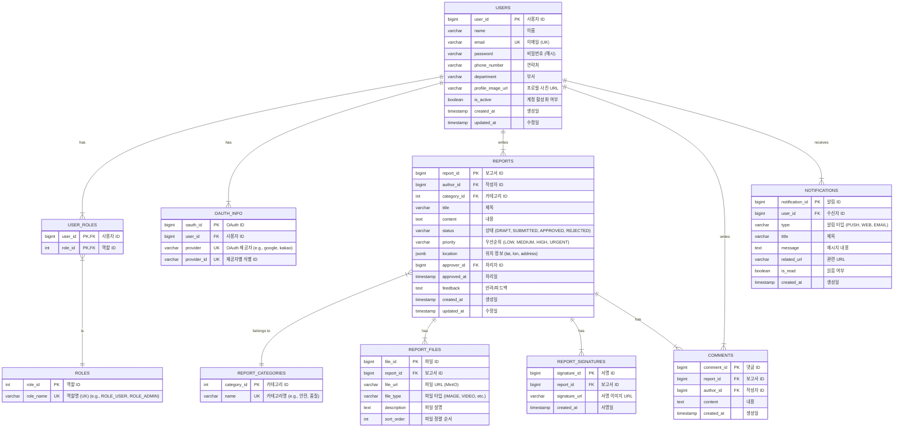

# 현장 보고 앱: 데이터베이스 설계 및 SQL 가이드

## 1. 개요

본 문서는 Flutter 현장 보고 앱의 백엔드 시스템을 위한 최적의 데이터베이스 아키텍처를 제안합니다. 요구사항 명세서에 따라 관계형 데이터의 정합성을 보장하는 **PostgreSQL**을 주 데이터베이스로, 실시간 성능 및 확장성을 위해 **Redis**와 **MongoDB**를 보조적으로 사용하는 3-Tier 구조를 채택합니다.

-   **PostgreSQL (Primary Database):** 사용자, 보고서, 권한 등 데이터 무결성이 중요한 핵심 정형 데이터를 저장합니다.
-   **Redis (Cache & Session Store):** JWT 토큰, 세션, 자주 사용하는 데이터를 캐싱하여 시스템 응답 속도를 향상시킵니다.
-   **MongoDB (Logging & Analytics - 향후 확장):** 유연한 스키마가 필요한 대용량 로그, 알림 기록, 비정형 데이터 저장을 위해 도입을 고려합니다.

---

## 2. PostgreSQL: 주 데이터베이스 설계

PostgreSQL은 데이터의 무결성과 정합성이 중요한 핵심 비즈니스 로직을 처리합니다. Spring Data JPA와 QueryDSL 환경에 최적화된 ERD와 DDL(Data Definition Language)은 다음과 같습니다.

### 2.1. ERD (Entity-Relationship Diagram)



### 2.2. 테이블 생성 SQL (DDL)

#### 2.2.1. `users` 테이블
앱의 사용자 정보를 저장하는 핵심 테이블입니다.
```sql
CREATE TABLE users (
    user_id BIGSERIAL PRIMARY KEY,
    name VARCHAR(50) NOT NULL,
    email VARCHAR(100) UNIQUE NOT NULL,
    password VARCHAR(255),
    phone_number VARCHAR(20),
    department VARCHAR(100),
    profile_image_url VARCHAR(512),
    is_active BOOLEAN DEFAULT TRUE,
    created_at TIMESTAMPTZ DEFAULT CURRENT_TIMESTAMP,
    updated_at TIMESTAMPTZ DEFAULT CURRENT_TIMESTAMP
);
CREATE INDEX idx_users_email ON users(email);
```

#### 2.2.2. `roles` 테이블
사용자 권한(예: 일반 사용자, 관리자)을 정의합니다.
```sql
CREATE TABLE roles (
    role_id SERIAL PRIMARY KEY,
    role_name VARCHAR(50) UNIQUE NOT NULL -- e.g., 'ROLE_USER', 'ROLE_ADMIN'
);
```

#### 2.2.3. `user_roles` 테이블
사용자와 역할을 연결하는 다대다 관계의 매핑 테이블입니다.
```sql
CREATE TABLE user_roles (
    user_id BIGINT NOT NULL REFERENCES users(user_id) ON DELETE CASCADE,
    role_id INT NOT NULL REFERENCES roles(role_id) ON DELETE CASCADE,
    PRIMARY KEY (user_id, role_id)
);
```

#### 2.2.4. `oauth_info` 테이블
Google, Kakao 등 소셜 로그인을 위한 OAuth 인증 정보를 저장합니다.
```sql
CREATE TABLE oauth_info (
    oauth_id BIGSERIAL PRIMARY KEY,
    user_id BIGINT NOT NULL REFERENCES users(user_id) ON DELETE CASCADE,
    provider VARCHAR(50) NOT NULL,
    provider_id VARCHAR(255) NOT NULL,
    UNIQUE (provider, provider_id)
);
CREATE INDEX idx_oauth_info_user_id ON oauth_info(user_id);
```

#### 2.2.5. `report_categories` 테이블
보고서의 종류(예: 안전, 품질, 시설)를 정의하는 마스터 테이블입니다.
```sql
CREATE TABLE report_categories (
    category_id SERIAL PRIMARY KEY,
    name VARCHAR(100) UNIQUE NOT NULL
);
```

#### 2.2.6. `reports` 테이블
사용자가 작성한 현장 보고서의 핵심 정보를 저장합니다.
```sql
CREATE TABLE reports (
    report_id BIGSERIAL PRIMARY KEY,
    author_id BIGINT NOT NULL REFERENCES users(user_id),
    category_id INT REFERENCES report_categories(category_id),
    title VARCHAR(255) NOT NULL,
    content TEXT,
    status VARCHAR(50) NOT NULL DEFAULT 'DRAFT', -- DRAFT, SUBMITTED, APPROVED, REJECTED
    priority VARCHAR(50) NOT NULL DEFAULT 'MEDIUM', -- LOW, MEDIUM, HIGH, URGENT
    location JSONB, -- { "latitude": 35.8, "longitude": 127.1, "address": "..." }
    approver_id BIGINT REFERENCES users(user_id),
    approved_at TIMESTAMPTZ,
    feedback TEXT,
    created_at TIMESTAMPTZ DEFAULT CURRENT_TIMESTAMP,
    updated_at TIMESTAMPTZ DEFAULT CURRENT_TIMESTAMP
);
CREATE INDEX idx_reports_author_id ON reports(author_id);
CREATE INDEX idx_reports_status ON reports(status);
```

#### 2.2.7. `report_files` 테이블
보고서에 첨부된 이미지, 비디오 등 파일 정보를 관리합니다.
```sql
CREATE TABLE report_files (
    file_id BIGSERIAL PRIMARY KEY,
    report_id BIGINT NOT NULL REFERENCES reports(report_id) ON DELETE CASCADE,
    file_url VARCHAR(512) NOT NULL,
    file_type VARCHAR(50) NOT NULL DEFAULT 'IMAGE',
    description TEXT,
    sort_order INT DEFAULT 0
);
CREATE INDEX idx_report_files_report_id ON report_files(report_id);
```

#### 2.2.8. `report_signatures` 테이블
보고서에 포함된 전자 서명 정보를 저장합니다.
```sql
CREATE TABLE report_signatures (
    signature_id BIGSERIAL PRIMARY KEY,
    report_id BIGINT NOT NULL REFERENCES reports(report_id) ON DELETE CASCADE,
    signature_url VARCHAR(512) NOT NULL,
    created_at TIMESTAMPTZ DEFAULT CURRENT_TIMESTAMP
);
```

#### 2.2.9. `comments` 테이블
보고서에 대한 댓글 정보를 저장합니다.
```sql
CREATE TABLE comments (
    comment_id BIGSERIAL PRIMARY KEY,
    report_id BIGINT NOT NULL REFERENCES reports(report_id) ON DELETE CASCADE,
    author_id BIGINT NOT NULL REFERENCES users(user_id),
    content TEXT NOT NULL,
    created_at TIMESTAMPTZ DEFAULT CURRENT_TIMESTAMP
);
CREATE INDEX idx_comments_report_id ON comments(report_id);
```

#### 2.2.10. `notifications` 테이블
사용자에게 발송되는 PUSH, 이메일 등 알림 정보를 관리합니다.
```sql
CREATE TABLE notifications (
    notification_id BIGSERIAL PRIMARY KEY,
    user_id BIGINT NOT NULL REFERENCES users(user_id) ON DELETE CASCADE,
    type VARCHAR(50) NOT NULL, -- e.g., 'PUSH', 'WEB', 'EMAIL'
    title VARCHAR(255) NOT NULL,
    message TEXT NOT NULL,
    related_url VARCHAR(512),
    is_read BOOLEAN DEFAULT FALSE,
    created_at TIMESTAMPTZ DEFAULT CURRENT_TIMESTAMP
);
CREATE INDEX idx_notifications_user_id_is_read ON notifications(user_id, is_read);
```

### 2.3. 주요 데이터 조작 (DML) 및 QueryDSL 예시

요구사항에 명시된 Spring Data JPA + QueryDSL 환경을 고려한 쿼리 예시입니다.

#### 2.3.1. 보고서 목록 조회 (무한 스크롤, 필터링, 검색)
최신순, 특정 상태, 특정 키워드를 포함하는 보고서를 페이지네이션으로 조회합니다.

```java
// QueryDSL 사용 예시 (ReportRepositoryCustomImpl.java)
public Page<ReportDto> findReports(ReportSearchCondition condition, Pageable pageable) {
    QReport report = QReport.report;
    QUser user = QUser.user;

    var query = queryFactory
        .select(new QReportDto(
            report.reportId,
            report.title,
            user.name,
            report.status,
            report.createdAt
        ))
        .from(report)
        .join(report.author, user)
        .where(
            statusEq(condition.getStatus()),
            keywordContains(condition.getKeyword())
        )
        .orderBy(report.createdAt.desc())
        .offset(pageable.getOffset())
        .limit(pageable.getPageSize());

    List<ReportDto> content = query.fetch();

    JPAQuery<Long> countQuery = queryFactory
        .select(report.count())
        .from(report)
        .where(
            statusEq(condition.getStatus()),
            keywordContains(condition.getKeyword())
        );

    return PageableExecutionUtils.getPage(content, pageable, countQuery::fetchOne);
}

private BooleanExpression statusEq(String status) {
    return hasText(status) ? report.status.eq(status) : null;
}

private BooleanExpression keywordContains(String keyword) {
    return hasText(keyword) ? report.title.containsIgnoreCase(keyword).or(report.content.containsIgnoreCase(keyword)) : null;
}
```

#### 2.3.2. 보고서 상세 조회 (N+1 문제 방지)
특정 보고서의 모든 관련 정보(작성자, 파일, 서명, 댓글)를 한 번의 쿼리로 조회하여 N+1 문제를 방지합니다.

```java
// JPQL 사용 예시 (ReportRepository.java)
@Query("""
    SELECT r FROM Report r
    JOIN FETCH r.author
    LEFT JOIN FETCH r.reportFiles
    LEFT JOIN FETCH r.reportSignatures
    WHERE r.reportId = :reportId
""")
Optional<Report> findReportDetailsById(@Param("reportId") Long reportId);
```

#### 2.3.3. 보고서 생성 (트랜잭션 관리)
트랜잭션 내에서 보고서 기본 정보, 파일 정보, 서명 정보를 순차적으로 저장합니다.

```java
// Service Layer 예시 (@Transactional)
@Transactional
public Report createReport(ReportCreateRequest request, Long authorId) {
    User author = userRepository.findById(authorId).orElseThrow();
    Report report = reportRepository.save(request.toReportEntity(author));
    
    // 파일 정보 저장
    if (request.getFiles() != null) {
        request.getFiles().forEach(file -> reportFileRepository.save(file.toEntity(report)));
    }
    
    // 서명 정보 저장
    if (request.getSignatureUrl() != null) {
        reportSignatureRepository.save(new ReportSignature(report, request.getSignatureUrl()));
    }
    
    return report;
}
```

#### 2.3.4. 통계 데이터 조회
월별 보고서 상태 통계, 카테고리별 보고서 수 등 집계 데이터를 조회합니다.

```sql
-- 월별 보고서 상태 통계
SELECT
    status,
    COUNT(report_id) AS count
FROM reports
WHERE created_at >= '2025-06-01' AND created_at < '2025-07-01'
GROUP BY status;

-- 카테고리별 보고서 수
SELECT
    rc.name AS category_name,
    COUNT(r.report_id) AS count
FROM reports r
JOIN report_categories rc ON r.category_id = rc.category_id
GROUP BY rc.name;
```

---

## 3. Redis: 캐시 및 세션 저장소

Redis는 인-메모리 데이터 저장소로서, 시스템의 응답 속도를 향상시키고 데이터베이스 부하를 줄이는 데 핵심적인 역할을 합니다.

### 3.1. 주요 활용 사례

-   **JWT 리프레시 토큰 저장:** 보안을 위해 리프레시 토큰을 서버 측 Redis에 저장하고 관리합니다.
-   **로그아웃 처리 (토큰 블랙리스트):** 로그아웃된 액세스 토큰을 만료 시간까지 Redis에 저장하여 재사용을 방지합니다.
-   **API 호출 제한 (Rate Limiting):** 사용자별/IP별 API 호출 횟수를 추적하여 과도한 요청을 제어합니다.
-   **자주 조회되는 데이터 캐싱:** 사용자 프로필, 공지사항 등 변경 빈도가 낮은 데이터를 캐싱하여 DB 조회를 최소화합니다.

### 3.2. 명령어 예시

```bash
# JWT 리프레시 토큰 저장 (유효기간 7일)
SET jwt:refresh:123 "your-refresh-token-string" EX 604800

# 로그아웃 토큰 블랙리스트 추가 (유효기간 30분)
SET jwt:blacklist:your-access-token "logout" EX 1800

# API 호출 횟수 증가 (1분마다 초기화)
INCR rate-limit:123:/api/reports
EXPIRE rate-limit:123:/api/reports 60

# 사용자 프로필 캐싱 (JSON 문자열 형태)
SET cache:user:profile:123 '{"name":"홍길동", "email":"gildong@example.com", "role":"ROLE_USER"}'

# 캐시에서 사용자 프로필 조회
GET cache:user:profile:123
```

---

## 4. MongoDB: 로그 및 비정형 데이터 저장 (향후 확장)

프로젝트 초기에는 PostgreSQL로 충분하지만, 서비스가 성장하여 로그, 통계, 알림 데이터가 대량으로 쌓일 경우 MongoDB 도입을 고려할 수 있습니다. MongoDB는 스키마가 유연하고 수평적 확장이 용이하여 비정형 데이터 처리에 강점이 있습니다.

### 4.1. 데이터 구조 (Collection & Document)

**`api_access_logs` Collection**
API 호출 기록을 저장하여 사용자 행위 분석 및 에러 추적에 사용합니다.

```json
{
  "_id": ObjectId("649c0a1234567890abcdef"),
  "timestamp": ISODate("2025-06-28T10:00:00Z"),
  "userId": 123,
  "ipAddress": "203.0.113.1",
  "httpMethod": "POST",
  "apiPath": "/api/reports",
  "request": {
    "headers": { "...": "..." },
    "body": { "title": "긴급 안전 점검 보고", "..." }
  },
  "response": {
    "statusCode": 201,
    "durationMs": 150
  }
}
```

**`notification_history` Collection**
모든 사용자에게 발송된 알림의 전체 이력을 저장하여 통계 및 분석에 활용합니다.

```json
{
  "_id": ObjectId("649c0b1234567890fedcba"),
  "timestamp": ISODate("2025-06-28T10:05:00Z"),
  "userId": 456,
  "type": "PUSH",
  "channel": "FCM", // Firebase Cloud Messaging
  "content": {
    "title": "새로운 보고서가 등록되었습니다.",
    "body": "'긴급 안전 점검 보고' 확인 필요"
  },
  "status": "SUCCESS",
  "providerResponse": { "messageId": "fcm-message-id-123" }
}
```

### 4.2. 쿼리 예시

```javascript
// MongoDB Query Language

// 최근 24시간 동안 특정 사용자의 API 호출 로그 조회
db.api_access_logs.find({
  "userId": 123,
  "timestamp": {
    "$gte": new Date(new Date().getTime() - 24 * 60 * 60 * 1000)
  }
}).sort({ "timestamp": -1 });

// 가장 많이 호출된 API 상위 5개 집계
db.api_access_logs.aggregate([
  { "$group": { "_id": "$apiPath", "count": { "$sum": 1 } } },
  { "$sort": { "count": -1 } },
  { "$limit": 5 }
]);
```

---

## 5. 결론

제안된 3-Tier 데이터베이스 아키텍처는 **안정성**, **성능**, **확장성**을 모두 고려한 설계입니다.

-   **PostgreSQL**로 핵심 데이터의 정합성을 확보하고,
-   **Redis**를 통해 시스템의 반응 속도를 극대화하며,
-   향후 **MongoDB** 도입으로 대용량 비정형 데이터 처리까지 대비할 수 있습니다.

이 설계안을 기반으로 개발을 진행하면 견고하고 확장 가능한 백엔드 시스템을 구축할 수 있을 것입니다.