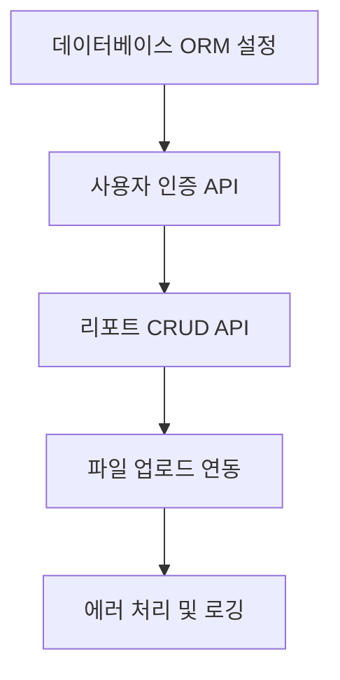

# 전북 신고 플랫폼 프로젝트 현황 요약

## 📊 전체 진행 상황
- **완료율**: 47% (17개 작업 중 8개 완료)
- **완료된 작업**: 8개
- **진행 중인 작업**: 1개  
- **대기 중인 작업**: 8개

## ✅ 완료된 핵심 기능들

### 1. 인프라 및 서비스 아키텍처 (Task 1)
- Docker Compose로 Kafka, Zookeeper, PostgreSQL, Redis 구성 완료
- 마이크로서비스 아키텍처 기반 설정

### 2. AI 분석 파이프라인 (Tasks 6, 7, 8, 9)
- **Kafka Producer**: FastAPI에서 이미지 분석 요청 발행
- **AI Worker**: Roboflow API를 통한 이미지 분석 처리
- **Kafka Consumer**: 분석 결과 수신 및 처리
- **WebSocket**: 실시간 분석 결과 알림

### 3. Flutter 앱 핵심 기능 (Tasks 11, 12)
- **리포트 생성**: 다중 이미지 지원, 기본 이미지 선택, 복합 주제 감지
- **AI 자동 입력**: 분석 결과를 기반으로 한 폼 자동 완성
- **프로필 설정**: 다크모드, 폰트 크기, 언어 설정, 알림 설정
- **위치 서비스**: GPS 위치 정보 통합

### 4. 데이터베이스 스키마 (Task 13)
- 사용자, 리포트, 파일, 댓글, 카테고리, 상태 테이블
- OAuth 지원 및 관계형 데이터베이스 설계 완료

## 🔄 진행 중인 작업

### FastAPI 게이트웨이 개선 (Task 14)
- **현재 상태**: Kafka 통합 및 기본 라우팅 완료
- **남은 작업**:
  - 데이터베이스 연결 및 ORM 설정
  - 사용자 인증 엔드포인트 구현
  - 리포트 CRUD 작업 구현
  - 파일 업로드와 데이터베이스 연동

## 📋 다음 우선순위 작업들

### 1. 백엔드 개발 완료 (Task 14)


### 2. Flutter-백엔드 통합 (Task 16)


### 3. 통합 테스트 및 배포 (Task 15)
- 전체 파이프라인 테스트
- 성능 및 보안 테스트
- 프로덕션 환경 설정

## 🎯 주요 기술 스택

### Backend
- **FastAPI**: REST API 및 WebSocket 서버
- **Kafka**: 비동기 메시지 처리
- **PostgreSQL**: 관계형 데이터베이스
- **Redis**: 캐시 및 세션 관리

### Frontend  
- **Flutter**: 크로스 플랫폼 모바일 앱
- **Provider**: 상태 관리
- **SharedPreferences**: 로컬 저장소

### AI/ML
- **Roboflow**: 이미지 분석 API
- **Computer Vision**: 쓰레기, 불법 주정차 등 감지

## 📁 현재 프로젝트 구조

```
fix_jeonbuk/
├── 🐳 docker-compose.yml          # 서비스 오케스트레이션
├── 🔧 router_service.py           # FastAPI 게이트웨이
├── 🤖 kafka_worker.py             # AI 분석 워커
├── 📊 database/schema.sql         # DB 스키마
├── 📱 flutter-app/                # Flutter 모바일 앱
│   ├── lib/features/reports/      # 리포트 기능
│   ├── lib/features/profile/      # 프로필 기능
│   └── lib/core/theme/           # 테마 관리
├── 📋 .taskmaster/tasks/         # 작업 관리
└── 🧪 test files                 # 테스트/개발 파일들
```

## 🚀 즉시 실행 가능한 기능들

### 1. AI 분석 파이프라인 테스트
```bash
# Kafka 서비스 시작
docker-compose up -d

# AI Worker 실행
python kafka_worker.py

# FastAPI 서버 실행  
python router_service.py

# 이미지 분석 요청 테스트
python integration_test.py
```

### 2. Flutter 앱 실행
```bash
cd flutter-app
flutter pub get
flutter run
```

## ⚠️ 정리 필요한 파일들
- `test_api_key.py` - API 키 테스트
- `roboflow_test.py` - Roboflow 연결 테스트  
- `simple_test.py` - 간단한 테스트
- `download_test_images.py` - 테스트 이미지 다운로드
- `setup_and_test.py` - 설정 및 테스트

## 🎯 완료까지 예상 작업량
- **백엔드 통합**: 2-3일
- **Flutter 연동**: 1-2일  
- **통합 테스트**: 1일
- **코드 정리**: 0.5일
- **총 예상**: 4.5-6.5일

## 📈 성과 지표
- ✅ 마이크로서비스 아키텍처 구축
- ✅ AI/ML 파이프라인 구현  
- ✅ 실시간 알림 시스템
- ✅ 현대적 UI/UX Flutter 앱
- ✅ 확장 가능한 데이터베이스 설계

프로젝트는 핵심 기능들이 대부분 완성되어 있으며, 백엔드와 프론트엔드의 통합 작업만 남아있는 상태입니다.
