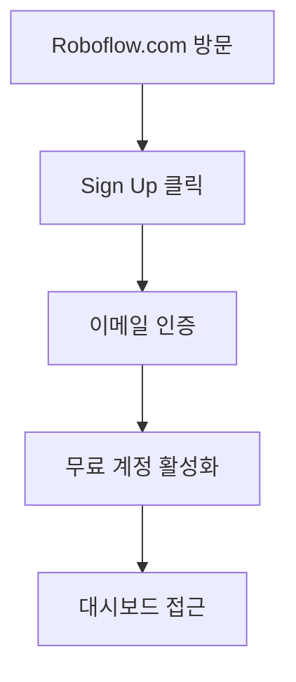
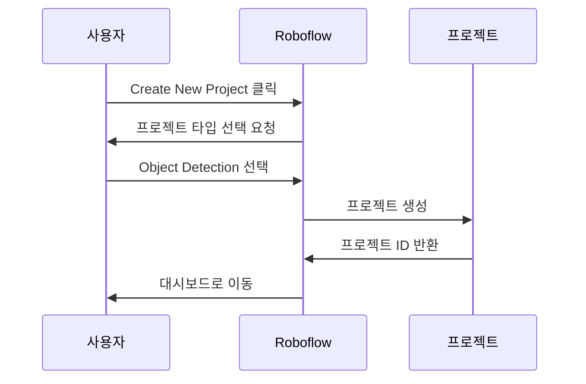
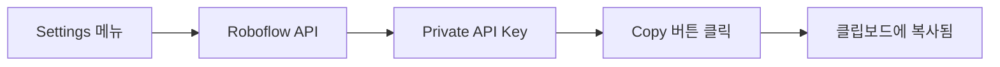

# 🚨 Roboflow API 연결 실패 문제 해결 가이드

## 📋 **현재 문제 상황**
Flutter 앱에서 "API 연결 실패" 메시지가 계속 나타나고 있습니다.

## 🔍 **주요 원인들**

### 1. ⚠️ **API 키 문제**
- **가장 흔한 원인**: 유효하지 않은 API 키
- **해결방법**: 실제 Roboflow 계정에서 발급받은 API 키 사용

### 2. 🏢 **Workspace/Project 설정 오류**
- **문제**: 존재하지 않는 workspace나 project 참조
- **해결방법**: 실제 생성한 workspace와 project 이름 사용

### 3. 🌐 **네트워크 문제**
- **문제**: 인터넷 연결 또는 방화벽 차단
- **해결방법**: 인터넹 연결 확인

## ✅ **단계별 해결 방법**

### **1단계: 무료 Roboflow 계정 생성**



1. **웹사이트 접속**: https://roboflow.com
2. **계정 생성**: "Sign Up" 클릭 → 이메일 또는 구글 계정 사용
3. **이메일 인증**: 받은 메일에서 인증 링크 클릭
4. **플랜 선택**: "Free" 플랜 선택 (월 1,000회 API 호출 무료)

### **2단계: 프로젝트 생성**



1. **프로젝트 생성**: "Create New Project" 클릭
2. **타입 선택**: "Object Detection" 선택
3. **프로젝트 정보**:
   - **이름**: `field-reports` (또는 원하는 이름)
   - **설명**: `전북 현장 보고 시스템용`
4. **클래스 추가**: `damage`, `pothole`, `graffiti` 등

### **3단계: API 키 발급**



1. **설정 접근**: 좌측 메뉴에서 "Settings" 클릭
2. **API 섹션**: "Roboflow API" 클릭
3. **키 복사**: "Private API Key" 옆의 복사 버튼 클릭

### **4단계: Flutter 앱 설정**

#### **방법 A: 앱 내 설정 (권장)**
1. Flutter 앱 실행
2. 현장 보고 작성 페이지 진입
3. "사진 첨부 (AI 분석)" 섹션에서 "API 키 설정" 클릭
4. 정보 입력:
   ```
   API 키: [복사한 Private API Key]
   Workspace: [계정명 또는 workspace ID]
   Project: field-reports
   ```

#### **방법 B: 설정 파일 수정**
```bash
# .env 파일 편집
nano /home/nodove/workspace/fix_jb-project/.env

# 다음 값들 수정:
ROBOFLOW_API_KEY=실제_복사한_API_키
ROBOFLOW_WORKSPACE=실제_workspace_이름
ROBOFLOW_PROJECT=field-reports
```

## 🧪 **테스트 및 검증**

### **Python으로 먼저 테스트**
```bash
# 설정 확인
python3 roboflow_test.py --check-config

# 실제 연결 테스트
python3 simple_test.py
```

### **Flutter 앱에서 연결 테스트**
1. 설정 저장 후 "연결 테스트" 버튼 클릭
2. 성공 시: ✅ "API 연결 성공" 메시지
3. 실패 시: 오류 메시지와 원인 표시

## 🎯 **일반적인 오류와 해결책**

| 오류 코드            | 원인                   | 해결방법                    |
| -------------------- | ---------------------- | --------------------------- |
| **403 Forbidden**    | 잘못된 API 키          | API 키 재확인 및 재입력     |
| **404 Not Found**    | 존재하지 않는 프로젝트 | Workspace/Project 이름 확인 |
| **401 Unauthorized** | API 키 권한 없음       | 새 API 키 발급              |
| **500 Server Error** | Roboflow 서버 문제     | 잠시 후 재시도              |

## 💡 **임시 해결책**

API 키가 없거나 연결이 안 될 때도 **목업 모드**로 전체 기능을 체험할 수 있습니다:

```dart
// 목업 모드에서 제공되는 기능:
✅ 이미지 업로드
✅ AI 분석 결과 (시뮬레이션)
✅ 객체 감지 표시
✅ 카테고리 자동 분류
✅ 우선순위 추천
```

## 🔧 **고급 디버깅**

### **로그 확인**
```bash
# Flutter 로그 실시간 확인
flutter logs

# 특정 키워드 필터링
flutter logs | grep -i roboflow
```

### **네트워크 진단**
```bash
# Roboflow API 서버 연결 확인
curl -I https://detect.roboflow.com

# DNS 확인
nslookup detect.roboflow.com
```

## 📞 **추가 도움**

### **공식 문서**
- [Roboflow API 문서](https://docs.roboflow.com/api-reference/authentication)
- [Flutter HTTP 클라이언트 가이드](https://docs.flutter.dev/cookbook/networking/fetch-data)

### **프로젝트 내 리소스**
- 📋 `API_ERROR_SOLUTION.md` - 상세 오류 해결
- 🚀 `RUN_INSTRUCTIONS.md` - 실행 가이드
- 🔧 `ROBOFLOW_SETUP_STEP_BY_STEP.md` - 설정 가이드

## 🎉 **성공 확인**

올바르게 설정되면 다음과 같은 결과를 볼 수 있습니다:

```
🔍 API 연결 테스트 시작...
🔑 API 키: rf_abcd1234...
🏢 Workspace: my-workspace
📁 Project: field-reports
🔢 Version: 1
🌐 테스트 URL: https://detect.roboflow.com/my-workspace/field-reports/1?api_key=...
✅ API 연결 성공!
```

**핵심 포인트**: 무료 계정으로도 충분히 테스트할 수 있으며, 설정만 올바르게 하면 즉시 작동합니다!
