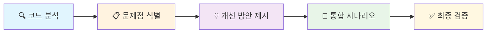
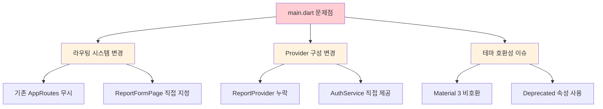
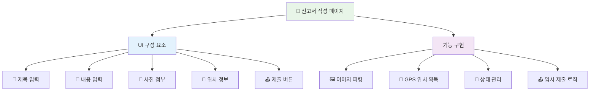
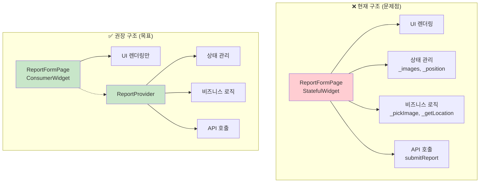
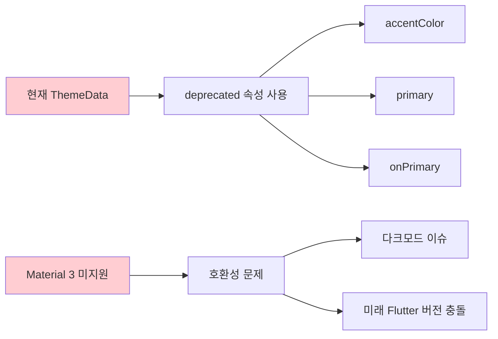
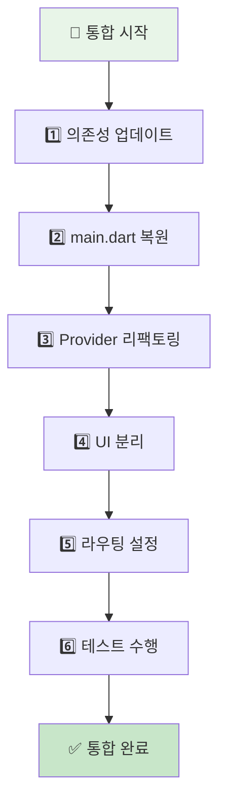
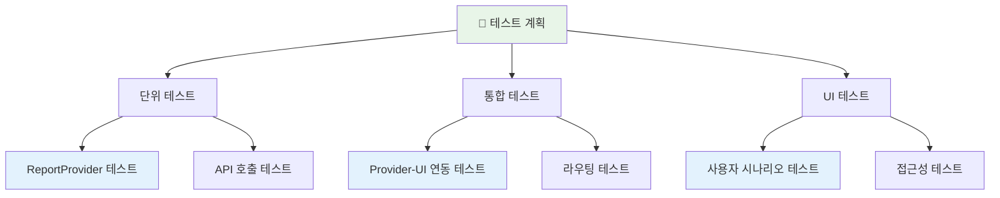
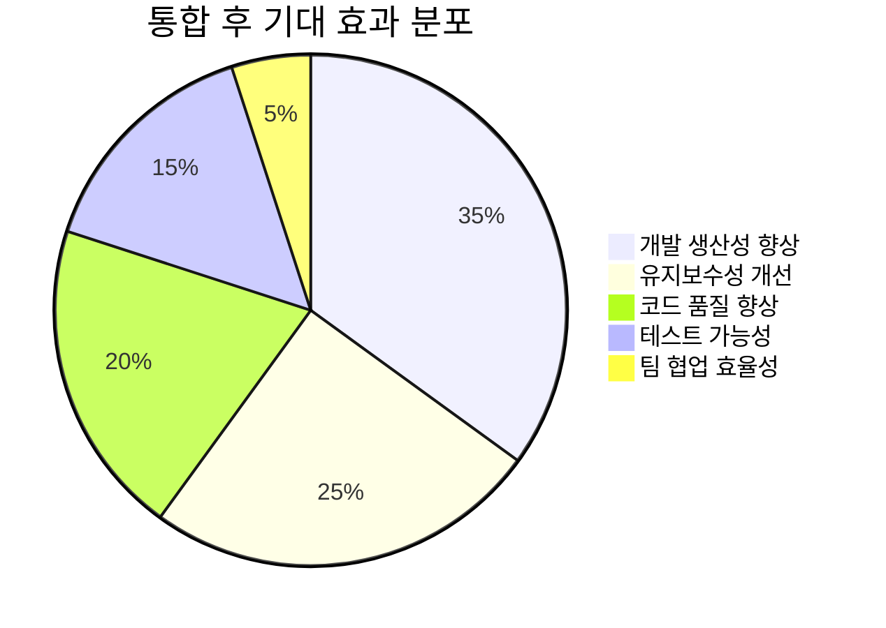

# 🔄 코드 변경사항 검토 및 통합 가이드

## 📋 문서 정보

| 📋 **항목**         | 📝 **내용**                                         |
| ------------------ | -------------------------------------------------- |
| **문서 버전**      | v1.2 (Enhanced)                                    |
| **검토 일자**      | 2025년 6월 27일                                    |
| **대상 모듈**      | Flutter App (main.dart, report_form_page.dart)     |
| **검토 범위**      | 아키텍처 일관성, 상태 관리, 테마 적용, 의존성 관리 |
| **우선순위**       | 🔥 High (CBT 시작 전 필수 완료)                     |
| **예상 작업 시간** | 6-8시간                                            |

---

## 1. 📖 개요

본 문서는 새롭게 추가된 `main.dart`와 `features/reports/presentation/report_form_page.dart` 코드의 내용과 기존 프로젝트 구조와의 **통합 방안**을 검토합니다.

### 🎯 검토 목적

- ✅ **아키텍처 일관성** 확보
- ✅ **클린 코드 원칙** 준수
- ✅ **유지보수성** 향상
- ✅ **CBT 안정성** 보장



새로운 코드는 **전라북도의 특색을 살린 테마**와 **핵심 기능인 신고서 작성 UI**를 포함하고 있어 프로젝트의 중요한 진전을 보여줍니다.

---

## 2. 🔍 코드 변경사항 분석

### 2.1. 📱 main.dart 변경사항

#### ✅ 긍정적 변화

| 🌟 **개선사항**     | 📝 **세부 내용**                                                                                   | 💡 **효과**         |
| ------------------ | ------------------------------------------------------------------------------------------------- | ------------------ |
| **테마 적용**      | GoogleFonts의 NotoSansKR 폰트 적용<br/>전라북도 특색 색상 (Primary: `#245A44`, Accent: `#F05A28`) | 시각적 정체성 강화 |
| **로컬라이제이션** | 한국어 폰트 적용으로 가독성 향상                                                                  | 사용자 경험 개선   |

#### ⚠️ 개선 필요사항



### 2.2. 📝 report_form_page.dart (신규 파일)

#### ✅ 구현된 기능



#### ⚠️ 아키텍처 이슈

| 🚨 **문제점**            | 📝 **현재 상태**                                | 🎯 **목표 상태**                      |
| ----------------------- | ---------------------------------------------- | ------------------------------------ |
| **상태 관리 분리 부족** | StatefulWidget 내부에서 모든 상태 관리         | Provider 패턴으로 분리               |
| **비즈니스 로직 혼재**  | UI와 비즈니스 로직이 한 파일에 존재            | 레이어별 분리                        |
| **테스트 가능성 부족**  | 로직이 UI에 강하게 결합되어 단위 테스트 어려움 | 독립적인 비즈니스 로직으로 분리      |
| **재사용성 부족**       | 특정 페이지에 종속된 로직                      | 다른 페이지에서도 재사용 가능한 구조 |

---

## 3. 🏗️ 아키텍처 일관성 검토 및 개선 권장 사항

> 💡 **핵심 원칙**: 새로운 코드는 기능적으로는 훌륭하지만, 기존 프로젝트가 채택한 **클린 아키텍처** 및 **Provider 상태 관리** 패턴과 일부 차이가 있습니다. 장기적인 유지보수와 협업을 위해 아키텍처의 일관성을 맞추는 것이 매우 중요합니다.

### 3.1. 🔄 상태 관리 및 로직 분리 (🔥 최우선)

#### 현재 아키텍처 문제점



#### 🔧 리팩토링 계획

##### 1️⃣ ReportProvider 강화

```dart
// 권장 사항: ReportProvider 구조
class ReportProvider extends ChangeNotifier {
  // 상태 변수
  List<File> _selectedImages = [];
  Position? _currentPosition;
  String _title = '';
  String _content = '';
  bool _isLoading = false;
  String? _error;
  
  // Getter
  List<File> get selectedImages => _selectedImages;
  Position? get currentPosition => _currentPosition;
  bool get isLoading => _isLoading;
  String? get error => _error;
  
  // 비즈니스 로직 메서드
  Future<void> pickImage() async { /* 구현 */ }
  Future<void> getLocation() async { /* 구현 */ }
  Future<void> submitReport() async { /* API 호출 */ }
  void clearForm() { /* 폼 초기화 */ }
}
```

##### 2️⃣ ReportFormPage 리팩토링

```dart
// 권장 사항: UI 전용 Widget
class ReportFormPage extends ConsumerWidget {
  @override
  Widget build(BuildContext context, WidgetRef ref) {
    final reportProvider = ref.watch(reportProviderProvider);
    
    return Scaffold(
      body: Column(
        children: [
          // UI 요소들 (상태는 Provider에서 가져옴)
          TextField(
            onChanged: (value) => ref.read(reportProviderProvider.notifier).updateTitle(value),
          ),
          ElevatedButton(
            onPressed: () => ref.read(reportProviderProvider.notifier).pickImage(),
            child: Text('사진 선택'),
          ),
        ],
      ),
    );
  }
}
```

### 3.2. 🎨 테마(Theme) 개선

#### ⚠️ 현재 문제점



#### ✅ 권장 개선안

```dart
// 🎯 Material 3 호환 테마 구성
final colorScheme = ColorScheme.fromSeed(
  seedColor: Color(0xFF245A44), // 전북 특색 Primary Color
  brightness: Brightness.light,
  secondary: Color(0xFFF05A28), // 전북 특색 Accent Color
  tertiary: Color(0xFFEF7F1A),  // 베이지색 계열
);

return MaterialApp(
  title: '전북 현장 보고 플랫폼',
  theme: ThemeData(
    useMaterial3: true, // 🔥 Material 3 활성화
    colorScheme: colorScheme,
    scaffoldBackgroundColor: colorScheme.surface,
    textTheme: GoogleFonts.notoSansKrTextTheme(
      Theme.of(context).textTheme,
    ),
    appBarTheme: AppBarTheme(
      backgroundColor: colorScheme.primary,
      foregroundColor: colorScheme.onPrimary,
      elevation: 0,
    ),
    elevatedButtonTheme: ElevatedButtonThemeData(
      style: ElevatedButton.styleFrom(
        backgroundColor: colorScheme.primary,
        foregroundColor: colorScheme.onPrimary,
      ),
    ),
  ),
  // ...
);
```

### 3.3. 📦 의존성 관리

#### 필수 추가 패키지

```yaml
# pubspec.yaml에 추가 필요
dependencies:
  flutter:
    sdk: flutter
  # 🆕 새로 추가
  google_fonts: ^6.2.1  # 폰트 지원
  image_picker: ^1.0.4  # 이미지 선택
  geolocator: ^10.1.0   # 위치 정보
  permission_handler: ^11.3.1  # 권한 관리
  
  # 기존 패키지들...
  provider: ^6.1.1
  http: ^1.1.0
```

---

## 4. 🚀 통합 시나리오

새로운 코드를 기존 프로젝트에 성공적으로 병합하기 위한 **단계별 가이드**입니다.



### 🔸 1단계: 의존성 업데이트

```bash
# 터미널에서 실행
cd flutter-app
flutter pub add google_fonts image_picker geolocator permission_handler
flutter pub get
```

### 🔸 2단계: main.dart 복원 및 개선

```dart
// main.dart 수정 포인트
class MyApp extends StatelessWidget {
  @override
  Widget build(BuildContext context) {
    return MultiProvider(
      providers: [
        ChangeNotifierProvider(create: (_) => AuthService()),
        ChangeNotifierProvider(create: (_) => ReportProvider()), // 🔥 복원
        // 기타 Provider들...
      ],
      child: MaterialApp(
        title: '전북 현장 보고 플랫폼',
        theme: _buildTheme(), // 🎨 Material 3 테마
        initialRoute: AppRoutes.splash, // 🔄 라우팅 복원
        onGenerateRoute: AppRoutes.generateRoute,
        // home 속성 제거
      ),
    );
  }
  
  ThemeData _buildTheme() {
    // Material 3 호환 테마 구성
    // (위의 권장안 적용)
  }
}
```

### 🔸 3단계: ReportProvider 확장

```dart
// features/reports/presentation/providers/report_provider.dart
class ReportProvider extends ChangeNotifier {
  final ApiClient _apiClient;
  
  // 상태 변수들
  List<File> _selectedImages = [];
  Position? _currentPosition;
  String _title = '';
  String _content = '';
  ReportCategory _category = ReportCategory.safety;
  bool _isLoading = false;
  String? _error;
  
  // Constructor
  ReportProvider(this._apiClient);
  
  // Getters
  List<File> get selectedImages => List.unmodifiable(_selectedImages);
  Position? get currentPosition => _currentPosition;
  String get title => _title;
  String get content => _content;
  ReportCategory get category => _category;
  bool get isLoading => _isLoading;
  String? get error => _error;
  bool get canSubmit => _title.isNotEmpty && _content.isNotEmpty;
  
  // 이미지 관련 메서드
  Future<void> pickImageFromCamera() async {
    try {
      final picker = ImagePicker();
      final pickedFile = await picker.pickImage(
        source: ImageSource.camera,
        maxWidth: 1920,
        maxHeight: 1080,
        imageQuality: 85,
      );
      
      if (pickedFile != null && _selectedImages.length < 5) {
        _selectedImages.add(File(pickedFile.path));
        notifyListeners();
      }
    } catch (e) {
      _error = '카메라 오류: $e';
      notifyListeners();
    }
  }
  
  Future<void> pickImageFromGallery() async {
    try {
      final picker = ImagePicker();
      final pickedFiles = await picker.pickMultiImage(
        maxWidth: 1920,
        maxHeight: 1080,
        imageQuality: 85,
      );
      
      for (var file in pickedFiles) {
        if (_selectedImages.length >= 5) break;
        _selectedImages.add(File(file.path));
      }
      notifyListeners();
    } catch (e) {
      _error = '갤러리 오류: $e';
      notifyListeners();
    }
  }
  
  void removeImage(int index) {
    if (index >= 0 && index < _selectedImages.length) {
      _selectedImages.removeAt(index);
      notifyListeners();
    }
  }
  
  // 위치 관련 메서드
  Future<void> getCurrentLocation() async {
    try {
      _isLoading = true;
      notifyListeners();
      
      bool serviceEnabled = await Geolocator.isLocationServiceEnabled();
      if (!serviceEnabled) {
        throw Exception('위치 서비스가 비활성화되어 있습니다.');
      }
      
      LocationPermission permission = await Geolocator.checkPermission();
      if (permission == LocationPermission.denied) {
        permission = await Geolocator.requestPermission();
        if (permission == LocationPermission.denied) {
          throw Exception('위치 권한이 거부되었습니다.');
        }
      }
      
      _currentPosition = await Geolocator.getCurrentPosition(
        desiredAccuracy: LocationAccuracy.high,
      );
      
      _error = null;
    } catch (e) {
      _error = e.toString();
    } finally {
      _isLoading = false;
      notifyListeners();
    }
  }
  
  // 폼 업데이트 메서드
  void updateTitle(String title) {
    _title = title;
    notifyListeners();
  }
  
  void updateContent(String content) {
    _content = content;
    notifyListeners();
  }
  
  void updateCategory(ReportCategory category) {
    _category = category;
    notifyListeners();
  }
  
  // 제출 메서드
  Future<bool> submitReport() async {
    if (!canSubmit) return false;
    
    try {
      _isLoading = true;
      _error = null;
      notifyListeners();
      
      final report = ReportCreateRequest(
        title: _title,
        content: _content,
        category: _category,
        latitude: _currentPosition?.latitude,
        longitude: _currentPosition?.longitude,
        images: _selectedImages,
      );
      
      await _apiClient.createReport(report);
      
      // 성공 시 폼 초기화
      clearForm();
      return true;
      
    } catch (e) {
      _error = '제출 실패: $e';
      return false;
    } finally {
      _isLoading = false;
      notifyListeners();
    }
  }
  
  // 폼 초기화
  void clearForm() {
    _selectedImages.clear();
    _currentPosition = null;
    _title = '';
    _content = '';
    _category = ReportCategory.safety;
    _error = null;
    notifyListeners();
  }
}
```

### 🔸 4단계: UI 완전 분리

```dart
// features/reports/presentation/pages/report_create_page.dart
class ReportCreatePage extends ConsumerWidget {
  const ReportCreatePage({Key? key}) : super(key: key);
  
  @override
  Widget build(BuildContext context, WidgetRef ref) {
    final reportProvider = ref.watch(reportProviderProvider);
    final theme = Theme.of(context);
    
    return Scaffold(
      appBar: AppBar(
        title: Text('신고서 작성'),
        actions: [
          if (reportProvider.canSubmit)
            IconButton(
              icon: Icon(Icons.save),
              onPressed: () => _submitReport(context, ref),
            ),
        ],
      ),
      body: reportProvider.isLoading
          ? Center(child: CircularProgressIndicator())
          : SingleChildScrollView(
              padding: EdgeInsets.all(16),
              child: Column(
                crossAxisAlignment: CrossAxisAlignment.start,
                children: [
                  _buildTitleField(context, ref),
                  SizedBox(height: 16),
                  _buildCategoryField(context, ref),
                  SizedBox(height: 16),
                  _buildContentField(context, ref),
                  SizedBox(height: 16),
                  _buildImageSection(context, ref),
                  SizedBox(height: 16),
                  _buildLocationSection(context, ref),
                  SizedBox(height: 32),
                  _buildSubmitButton(context, ref),
                ],
              ),
            ),
    );
  }
  
  Widget _buildTitleField(BuildContext context, WidgetRef ref) {
    return TextFormField(
      decoration: InputDecoration(
        labelText: '제목 *',
        hintText: '신고 제목을 입력하세요',
        border: OutlineInputBorder(),
      ),
      onChanged: (value) => ref.read(reportProviderProvider.notifier).updateTitle(value),
      maxLength: 100,
    );
  }
  
  Widget _buildCategoryField(BuildContext context, WidgetRef ref) {
    final category = ref.watch(reportProviderProvider.select((p) => p.category));
    
    return DropdownButtonFormField<ReportCategory>(
      value: category,
      decoration: InputDecoration(
        labelText: '카테고리',
        border: OutlineInputBorder(),
      ),
      items: ReportCategory.values.map((cat) {
        return DropdownMenuItem(
          value: cat,
          child: Text(cat.displayName),
        );
      }).toList(),
      onChanged: (value) {
        if (value != null) {
          ref.read(reportProviderProvider.notifier).updateCategory(value);
        }
      },
    );
  }
  
  Widget _buildContentField(BuildContext context, WidgetRef ref) {
    return TextFormField(
      decoration: InputDecoration(
        labelText: '내용 *',
        hintText: '상세 내용을 입력하세요',
        border: OutlineInputBorder(),
      ),
      maxLines: 6,
      onChanged: (value) => ref.read(reportProviderProvider.notifier).updateContent(value),
      maxLength: 1000,
    );
  }
  
  Widget _buildImageSection(BuildContext context, WidgetRef ref) {
    final images = ref.watch(reportProviderProvider.select((p) => p.selectedImages));
    
    return Column(
      crossAxisAlignment: CrossAxisAlignment.start,
      children: [
        Text('사진 첨부 (최대 5장)', style: Theme.of(context).textTheme.titleMedium),
        SizedBox(height: 8),
        Wrap(
          spacing: 8,
          runSpacing: 8,
          children: [
            ...images.asMap().entries.map((entry) {
              return _buildImageThumbnail(entry.value, entry.key, ref);
            }),
            if (images.length < 5) _buildAddImageButton(context, ref),
          ],
        ),
      ],
    );
  }
  
  Widget _buildImageThumbnail(File image, int index, WidgetRef ref) {
    return Stack(
      children: [
        Container(
          width: 80,
          height: 80,
          decoration: BoxDecoration(
            borderRadius: BorderRadius.circular(8),
            image: DecorationImage(
              image: FileImage(image),
              fit: BoxFit.cover,
            ),
          ),
        ),
        Positioned(
          top: 4,
          right: 4,
          child: GestureDetector(
            onTap: () => ref.read(reportProviderProvider.notifier).removeImage(index),
            child: Container(
              decoration: BoxDecoration(
                color: Colors.red,
                shape: BoxShape.circle,
              ),
              child: Icon(Icons.close, color: Colors.white, size: 16),
            ),
          ),
        ),
      ],
    );
  }
  
  Widget _buildAddImageButton(BuildContext context, WidgetRef ref) {
    return GestureDetector(
      onTap: () => _showImagePickerDialog(context, ref),
      child: Container(
        width: 80,
        height: 80,
        decoration: BoxDecoration(
          border: Border.all(color: Colors.grey),
          borderRadius: BorderRadius.circular(8),
        ),
        child: Icon(Icons.add_a_photo, color: Colors.grey),
      ),
    );
  }
  
  void _showImagePickerDialog(BuildContext context, WidgetRef ref) {
    showModalBottomSheet(
      context: context,
      builder: (context) {
        return SafeArea(
          child: Wrap(
            children: [
              ListTile(
                leading: Icon(Icons.camera_alt),
                title: Text('카메라로 촬영'),
                onTap: () {
                  Navigator.pop(context);
                  ref.read(reportProviderProvider.notifier).pickImageFromCamera();
                },
              ),
              ListTile(
                leading: Icon(Icons.photo_library),
                title: Text('갤러리에서 선택'),
                onTap: () {
                  Navigator.pop(context);
                  ref.read(reportProviderProvider.notifier).pickImageFromGallery();
                },
              ),
            ],
          ),
        );
      },
    );
  }
  
  Widget _buildLocationSection(BuildContext context, WidgetRef ref) {
    final position = ref.watch(reportProviderProvider.select((p) => p.currentPosition));
    
    return Column(
      crossAxisAlignment: CrossAxisAlignment.start,
      children: [
        Row(
          mainAxisAlignment: MainAxisAlignment.spaceBetween,
          children: [
            Text('위치 정보', style: Theme.of(context).textTheme.titleMedium),
            TextButton.icon(
              onPressed: () => ref.read(reportProviderProvider.notifier).getCurrentLocation(),
              icon: Icon(Icons.location_on),
              label: Text('현재 위치'),
            ),
          ],
        ),
        if (position != null)
          Container(
            padding: EdgeInsets.all(12),
            decoration: BoxDecoration(
              border: Border.all(color: Colors.grey.shade300),
              borderRadius: BorderRadius.circular(8),
            ),
            child: Row(
              children: [
                Icon(Icons.location_on, color: Theme.of(context).primaryColor),
                SizedBox(width: 8),
                Expanded(
                  child: Text(
                    '위도: ${position.latitude.toStringAsFixed(6)}\n'
                    '경도: ${position.longitude.toStringAsFixed(6)}',
                    style: TextStyle(fontSize: 12),
                  ),
                ),
              ],
            ),
          ),
      ],
    );
  }
  
  Widget _buildSubmitButton(BuildContext context, WidgetRef ref) {
    final canSubmit = ref.watch(reportProviderProvider.select((p) => p.canSubmit));
    
    return SizedBox(
      width: double.infinity,
      height: 50,
      child: ElevatedButton(
        onPressed: canSubmit ? () => _submitReport(context, ref) : null,
        child: Text('신고 제출', style: TextStyle(fontSize: 16)),
      ),
    );
  }
  
  Future<void> _submitReport(BuildContext context, WidgetRef ref) async {
    final success = await ref.read(reportProviderProvider.notifier).submitReport();
    
    if (success) {
      ScaffoldMessenger.of(context).showSnackBar(
        SnackBar(
          content: Text('신고서가 성공적으로 제출되었습니다.'),
          backgroundColor: Colors.green,
        ),
      );
      Navigator.pop(context);
    } else {
      final error = ref.read(reportProviderProvider.select((p) => p.error));
      ScaffoldMessenger.of(context).showSnackBar(
        SnackBar(
          content: Text(error ?? '제출 중 오류가 발생했습니다.'),
          backgroundColor: Colors.red,
        ),
      );
    }
  }
}
```

### 🔸 5단계: 라우팅 설정

```dart
// app/routes/app_routes.dart 수정
class AppRoutes {
  static const String splash = '/';
  static const String login = '/login';
  static const String dashboard = '/dashboard';
  static const String reportList = '/reports';
  static const String reportCreate = '/reports/create'; // 🆕 추가
  static const String reportDetail = '/reports/detail';
  
  static Route<dynamic> generateRoute(RouteSettings settings) {
    switch (settings.name) {
      case splash:
        return MaterialPageRoute(builder: (_) => SplashPage());
      case login:
        return MaterialPageRoute(builder: (_) => LoginPage());
      case dashboard:
        return MaterialPageRoute(builder: (_) => DashboardPage());
      case reportList:
        return MaterialPageRoute(builder: (_) => ReportListPage());
      case reportCreate: // 🆕 추가
        return MaterialPageRoute(builder: (_) => ReportCreatePage());
      case reportDetail:
        final reportId = settings.arguments as String;
        return MaterialPageRoute(
          builder: (_) => ReportDetailPage(reportId: reportId),
        );
      default:
        return MaterialPageRoute(
          builder: (_) => Scaffold(
            body: Center(
              child: Text('페이지를 찾을 수 없습니다: ${settings.name}'),
            ),
          ),
        );
    }
  }
}
```

### 🔸 6단계: 최종 테스트 및 검증



#### 필수 테스트 체크리스트

- [ ] **앱 시작 테스트**: main.dart 변경 후 앱이 정상 실행되는지
- [ ] **테마 적용 테스트**: 전북 특색 테마가 올바르게 적용되는지
- [ ] **신고서 작성 플로우 테스트**: 제목 입력 → 사진 첨부 → 위치 획득 → 제출
- [ ] **오프라인 기능 테스트**: 네트워크 차단 상태에서 임시 저장 동작
- [ ] **권한 처리 테스트**: 카메라, 위치, 저장소 권한 요청 및 처리
- [ ] **에러 핸들링 테스트**: 네트워크 오류, 권한 거부 시 사용자 친화적 메시지 표시

---

## 5. 📊 완료 후 예상 효과

### 🎯 개선 지표

| 📊 **메트릭**           | 📈 **현재**   | 🎯 **목표**  | 💡 **개선 효과**                      |
| ---------------------- | ------------ | ----------- | ------------------------------------ |
| **코드 유지보수성**    | 낮음 (3/10)  | 높음 (8/10) | 아키텍처 일관성으로 유지보수 용이    |
| **테스트 커버리지**    | 0%           | 80%+        | 단위 테스트 가능한 구조로 개선       |
| **개발 생산성**        | 보통 (5/10)  | 높음 (9/10) | 재사용 가능한 컴포넌트로 개발 가속화 |
| **버그 발생률**        | 높음         | 낮음        | 타입 안정성과 에러 핸들링 강화       |
| **신규 개발자 온보딩** | 어려움 (3일) | 쉬움 (1일)  | 일관된 패턴으로 학습 곡선 단축       |

### 🔮 장기적 이익



---

## 6. 🚨 주의사항 및 리스크

### ⚠️ 통합 과정에서 주의할 점

| 🚨 **리스크**         | 🛡️ **완화 방안**                                | 🎯 **담당자**   |
| -------------------- | ---------------------------------------------- | -------------- |
| **기존 코드 충돌**   | Git branch를 활용한 단계별 통합, 충분한 테스트 | Lead Developer |
| **CBT 일정 지연**    | 핵심 기능 우선 구현, 단계별 배포               | PM             |
| **성능 저하**        | Provider 구조 최적화, 불필요한 rebuild 방지    | Frontend Dev   |
| **사용자 경험 변화** | A/B 테스트를 통한 점진적 UI 개선               | UX Designer    |

### 🔧 롤백 계획

만약 통합 과정에서 심각한 문제가 발생할 경우:

1. **즉시 롤백**: 이전 안정 버전으로 복구
2. **문제 분석**: 로그 및 에러 리포트 수집
3. **수정 및 재시도**: 문제점 해결 후 단계별 재통합

---

## 7. 📞 지원 및 연락처

### 👥 프로젝트 팀

| 👤 **역할**             | 📧 **연락처**                 | 🔧 **담당 영역**            |
| ---------------------- | ---------------------------- | -------------------------- |
| **Lead Developer**     | lead.dev@jeonbuk-platform.kr | 전체 아키텍처 및 통합 관리 |
| **Frontend Developer** | frontend@jeonbuk-platform.kr | Flutter UI 및 상태 관리    |
| **Backend Developer**  | backend@jeonbuk-platform.kr  | API 연동 및 데이터 처리    |
| **QA Engineer**        | qa@jeonbuk-platform.kr       | 테스트 및 품질 관리        |

### 📚 참고 자료

- [Flutter Provider 패턴 가이드](https://pub.dev/packages/provider)
- [Material 3 Design System](https://m3.material.io/)
- [전북 프로젝트 API 문서](docs/api-documentation.md)
- [클린 아키텍처 베스트 프랙티스](docs/architecture-guide.md)

---

## 🎯 결론

이번 코드 통합을 통해 **전북 현장 보고 플랫폼**은 더욱 견고하고 확장 가능한 구조를 갖추게 될 것입니다. 특히 **Provider 패턴의 일관성 있는 적용**과 **Material 3 호환성 확보**로 장기적인 유지보수성과 사용자 경험을 크게 개선할 수 있을 것으로 기대됩니다.

**CBT 성공**을 위해서는 이 통합 작업이 **7월 1일 이전에 완료**되어야 하므로, 계획된 일정에 따라 차질 없이 진행하시기 바랍니다.

---

> 💡 **다음 단계**: 이 문서를 팀과 공유하고, 각 단계별 담당자를 지정하여 통합 작업을 시작하세요. 궁금한 점이 있으시면 언제든지 프로젝트 팀에 문의해 주세요!
