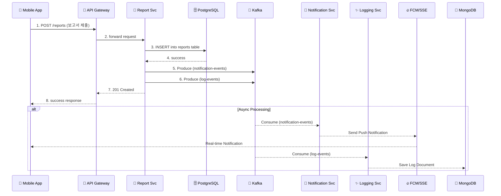

## 📝 Kafka 및 MongoDB 기반 비동기 로깅/알림 시스템 제안

**1. 제안 배경**

현재 시스템은 **마이크로서비스 아키텍처**와 **Kafka**를 도입하여 확장성의 기반을 갖추고 있습니다. 그러나 실시간 알림과 분산된 서비스들의 활동 기록(로깅)을 보다 체계적이고 안정적으로 처리하기 위한 아키텍처 확장이 필요합니다.

특히, 서비스의 핵심 비즈니스 로직과 **로깅/알림 처리**를 분리하여 시스템의 결합도를 낮추고 성능을 최적화하는 것이 중요합니다.

**2. 핵심 목표**

*   **비동기 처리 강화**: Kafka를 통해 모든 알림과 로그를 **비동기 이벤트**로 처리하여 서비스 응답 시간을 단축하고 시스템 부하를 분산합니다.
*   **역할과 책임 분리**: 신규 `Logging Service`를 도입하여 로그 데이터 처리를 전담시키고, 기존 `Notification Service`는 알림 발송에만 집중하도록 역할을 명확히 합니다.
*   **확장 가능한 데이터 저장소**: 비정형 데이터 처리에 용이한 **MongoDB**를 로그 저장소로 도입하여, 대용량 로그를 효율적으로 저장하고 분석할 기반을 마련합니다.

**3. 제안 아키텍처**

기존 아키텍처에 `Logging Service`와 `MongoDB`를 추가하고, 서비스 간 데이터 흐름을 Kafka 중심으로 재구성하여 아키텍처를 다각적으로 이해할 수 있도록 여러 다이어그램으로 표현합니다.

### 3.1. 전체 시스템 구성도

```mermaid
graph LR
    subgraph "Client Apps"
        A[📱 Mobile App]
        B[💻 Web App]
    end

    subgraph "Gateway"
        C[🔐 API Gateway]
    end

    subgraph "Business Services"
        E[🍃 Report Svc]
        F[🍃 User Svc]
        G[🍃 File Svc]
    end

    subgraph "Primary Data Stores"
        K[🗄️ PostgreSQL]
        L[📁 MinIO]
    end

    subgraph "Message Broker"
        H[📨 Kafka]
    end

    subgraph "Async Services"
        I[🍃 Notification Svc]
        J[✨ **Logging Svc (New)**]
    end

    subgraph "Downstream Systems"
        M[🔥 FCM/SSE]
        N[📜 **MongoDB (New)**]
    end

    %% Data Flow
    A & B --> C
    C --> E & F & G

    E & F & G -- "DB/File Access" --> K & L
    E & F & G -- "Produce Events" --> H

    H -- "notification-events" --> I
    H -- "log-events" --> J

    I -- "Send Notification" --> M
    J -- "Save Log" --> N

    M -- "Push/Real-time" --> A & B
```

### 3.2. C4 컴포넌트 다이어그램 (PlantUML)

시스템의 주요 구성 요소와 그 관계를 C4 모델의 컴포넌트 다이어그램으로 표현하여 구조적 관계를 명확히 합니다.

```plantuml
@startuml
!include https://raw.githubusercontent.com/plantuml-stdlib/C4-PlantUML/master/C4_Component.puml

title Component Diagram for Async Logging/Notification System

System_Boundary(c1, "Jeonbuk Project System") {
    Component(gateway, "API Gateway", "Spring Cloud Gateway", "Routes requests to internal services.")
    Component(reportSvc, "Report Service", "Spring Boot", "Handles business logic for reports.")
    Component(userSvc, "User Service", "Spring Boot", "Handles business logic for users.")
    Component(fileSvc, "File Service", "Spring Boot", "Handles file uploads and management.")
    Component(notifSvc, "Notification Service", "Spring Boot", "Consumes notification events and sends notifications.")
    Component(logSvc, "Logging Service", "Spring Boot", "Consumes log events and stores them.")

    ContainerDb(postgres, "PostgreSQL", "Relational Database", "Stores primary business data.")
    ContainerDb(minio, "MinIO", "Object Storage", "Stores files.")
    ContainerDb(mongo, "MongoDB", "NoSQL Database", "Stores log data.")
    ComponentQueue(kafka, "Kafka", "Message Broker", "Handles asynchronous events.")

    Rel(gateway, reportSvc, "Forwards requests")
    Rel(gateway, userSvc, "Forwards requests")
    Rel(gateway, fileSvc, "Forwards requests")

    Rel(reportSvc, postgres, "Reads/Writes", "JDBC")
    Rel(userSvc, postgres, "Reads/Writes", "JDBC")
    Rel(fileSvc, minio, "Reads/Writes", "S3 API")

    Rel(reportSvc, kafka, "Produces events")
    Rel(userSvc, kafka, "Produces events")
    Rel(fileSvc, kafka, "Produces events")

    Rel(kafka, notifSvc, "Delivers notification-events")
    Rel(kafka, logSvc, "Delivers log-events")

    Rel(notifSvc, fcm, "Sends push notifications")
    Rel(logSvc, mongo, "Writes logs")
}

System_Ext(fcm, "FCM/SSE", "External push/streaming service.")
System_Ext(client, "Client Apps", "Flutter Mobile/Web")
Rel(client, gateway, "Makes API calls", "HTTPS")
Rel(fcm, client, "Delivers notifications")

@enduml
```

**4. 데이터 흐름 예시 (보고서 생성)**

1.  **이벤트 발생**: 현장 직원이 모바일 앱(`A`)에서 보고서를 작성하고 제출합니다.
2.  **API 요청**: 요청은 API 게이트웨이(`C`)를 거쳐 `Report Service`(`E`)에 도달합니다.
3.  **비즈니스 로직 처리**: `Report Service`는 보고서 데이터를 PostgreSQL(`K`)에 저장합니다.
4.  **이벤트 발행 (Produce)**: `Report Service`는 작업 완료 후 **Kafka**(`H`)에 두 종류의 이벤트를 발행합니다.
    *   `notification-events` 토픽으로 알림 이벤트를 전송합니다.
      ```json
      {
        "type": "NEW_REPORT",
        "reportId": "...",
        "recipient": "admin"
      }
      ```
    *   `log-events` 토픽으로 로그 이벤트를 전송합니다.
      ```json
      {
        "timestamp": "...",
        "service": "ReportService",
        "level": "INFO",
        "message": "New report created",
        "details": { ... }
      }
      ```
5.  **이벤트 소비 (Consume)**:
    *   `Notification Service`(`I`)는 `notification-events`를 구독하여 이벤트를 수신하고, 관리자에게 FCM/SSE(`M`)로 실시간 알림을 보냅니다.
    *   `Logging Service`(`J`)는 `log-events`를 구독하여 이벤트를 수신하고, 해당 로그를 MongoDB(`N`)에 저장합니다.

### 4.1. 시퀀스 다이어그램

'보고서 생성' 시의 서비스 간 상호작용과 데이터 흐름을 시간 순서에 따라 표현합니다.



**5. 구현 계획**

1.  **인프라 구축**
    *   `docker-compose.yml`에 MongoDB 서비스 추가
    *   Kafka에 `log-events`, `notification-events` 토픽 생성

2.  **신규 `Logging Service` 개발 (Spring Boot)**
    *   의존성 추가: `spring-boot-starter-data-mongodb`, `spring-kafka`
    *   Kafka Consumer 구현: `log-events` 토픽 구독
    *   비즈니스 로직 구현: 수신 데이터를 MongoDB에 저장

3.  **기존 서비스 수정**
    *   전체 서비스: `spring-kafka` 의존성 추가 및 Kafka Producer 설정
    *   CUD 로직 및 API 호출 지점에 `log-events` 토픽으로 로그를 전송하는 코드 추가
    *   `Notification Service`: 이벤트 발행 로직을 `notification-events` 토픽에 맞게 수정

**6. 기대 효과**

*   **성능 향상**: 로깅 및 알림 발송을 비동기로 전환하여 **API 응답 속도를 개선**합니다.
*   **안정성 및 유연성**: Kafka의 버퍼 역할 덕분에 `Logging` 또는 `Notification` 서비스 장애 시에도 **데이터 유실을 방지**하고, 복구 후 순차 처리를 보장합니다.
*   **확장성**: `Logging Service`와 MongoDB를 기반으로 향후 **로그 분석, 통계, 모니터링 기능을 쉽게 추가**할 수 있습니다.
*   **개발 효율성**: 개발자는 핵심 비즈니스 로직에만 집중하고, 로깅/알림은 Kafka 이벤트 발행으로 단순화하여 **생산성을 향상**시킵니다.
