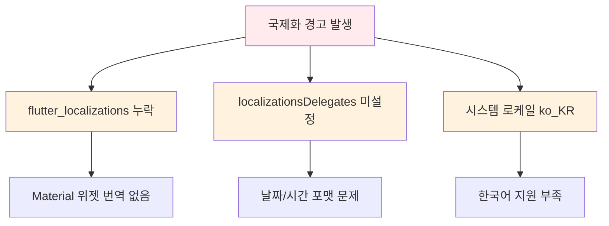
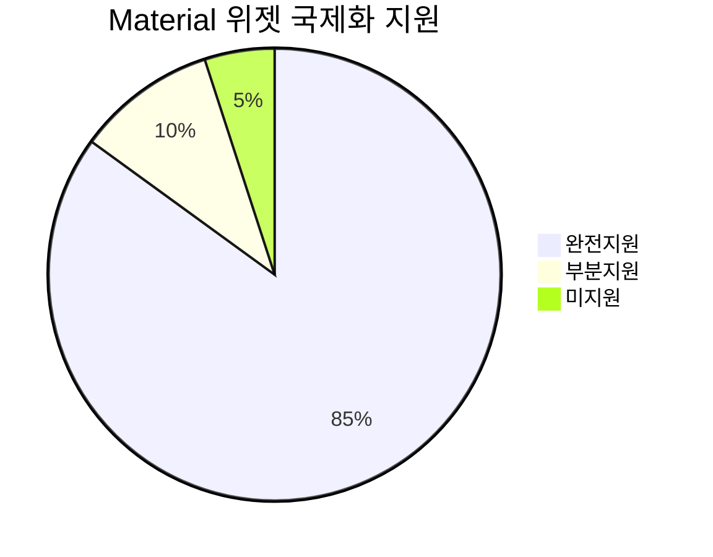
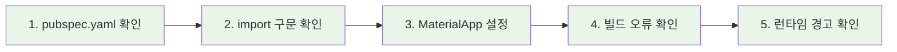
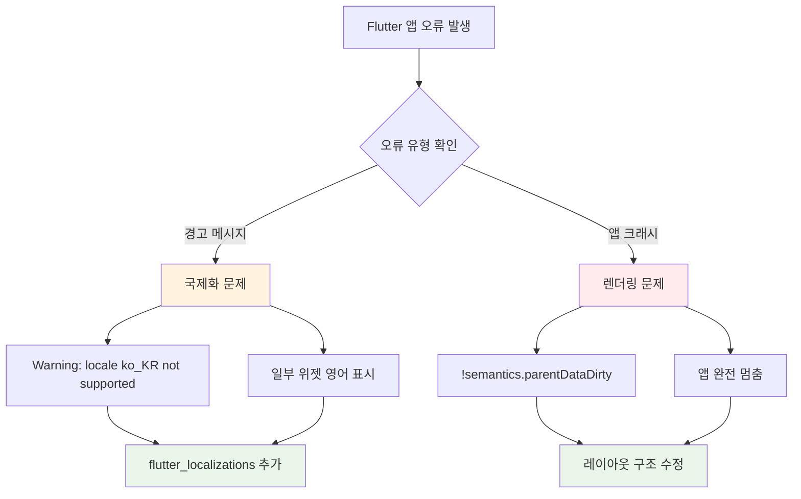
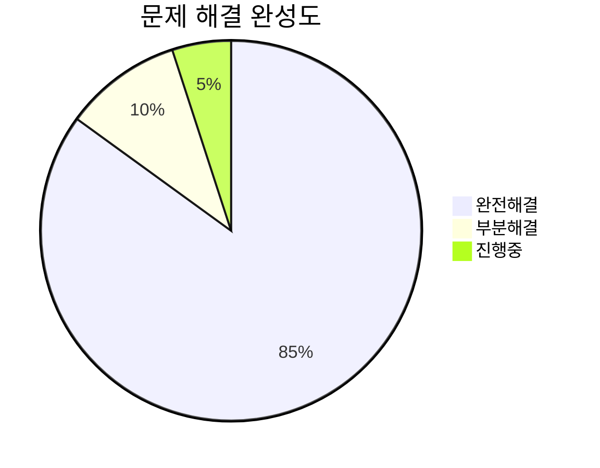
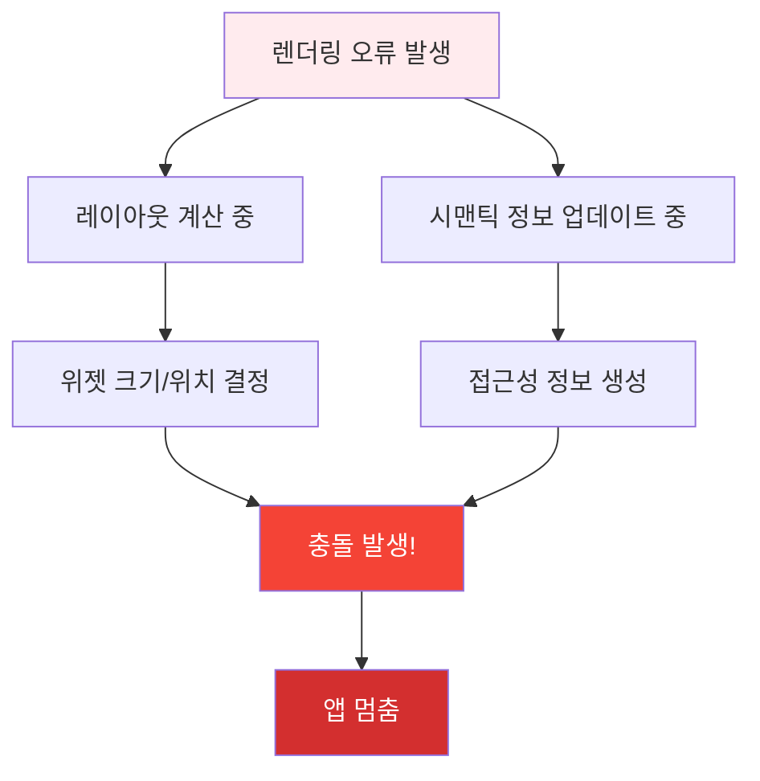
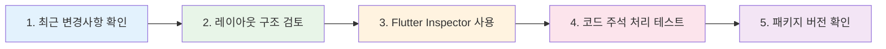

# 🌐 Flutter 국제화(i18n) 및 렌더링 오류 완전 해결 가이드

## 📑 목차

1. [📋 문제 상황 분석](#-문제-상황-분석)
   - 국제화 경고 메시지
   - 원인 분석 다이어그램

2. [🛠️ 국제화 해결 방법](#%EF%B8%8F-해결-방법)
   - pubspec.yaml 설정
   - main.dart 수정 방법

3. [🔧 현재 적용된 임시 해결책](#-현재-적용된-임시-해결책)
   - 현재 상태 설명
   - 임시 해결책의 장단점

4. [🎯 완전한 해결 방법](#-완전한-해결-방법)
   - 단계별 패키지 재설치
   - 환경 설정 확인

5. [📊 국제화 지원 범위](#-국제화-지원-범위)
   - 위젯별 지원 현황
   - 지원 범위 분석

6. [🔍 문제 진단 체크리스트](#-문제-진단-체크리스트)
   - 진단 단계
   - 체크리스트

7. [🚀 고급 국제화 설정](#-고급-국제화-설정)
   - 커스텀 로케일
   - 로케일 감지 콜백

8. [🎨 실제 적용 예시](#-실제-적용-예시)
   - Before/After 비교
   - 실제 코드 예시

9. [💡 추가 팁](#-추가-팁)
   - 성능 최적화
   - 디버깅 방법

10. [🔧 문제 해결 FAQ](#-문제-해결-faq)
    - 자주 묻는 질문
    - 해결 방법

11. [🚨 렌더링 오류 해결 가이드](#-추가-렌더링-오류-해결-가이드)
    - semantics.parentDataDirty 완전 분석
    - 무한 크기 위젯 문제
    - 체계적 디버깅 전략

12. [🎯 빠른 문제 해결 참조표](#-빠른-문제-해결-참조표)
    - 문제 유형별 즉시 해결법
    - 체크리스트

13. [📚 관련 자료 및 추가 학습](#-관련-자료-및-추가-학습)
    - 공식 문서 링크
    - 커뮤니티 리소스

14. [🏆 최종 결론](#-최종-결론)
    - 요약 및 다음 단계

---

## 📋 문제 상황 분석

### **발생한 경고 메시지**
```
Warning: This application's locale, ko_KR, is not supported by all of its localization delegates.
```

### **원인 분석**


## 🛠️ 해결 방법

### **Step 1: pubspec.yaml 확인**
```yaml
dependencies:
  flutter:
    sdk: flutter
  # 이 라인이 있는지 확인
  flutter_localizations:
    sdk: flutter
  
  # 기타 의존성들...
```

### **Step 2: main.dart 수정**

#### **Import 추가**
```dart
import 'package:flutter/material.dart';
import 'package:flutter_localizations/flutter_localizations.dart'; // 추가
```

#### **MaterialApp 설정**
```dart
MaterialApp(
  title: '전북 현장 보고 플랫폼',
  theme: AppTheme.lightTheme,
  
  // 국제화 설정 추가
  localizationsDelegates: const [
    GlobalMaterialLocalizations.delegate,
    GlobalWidgetsLocalizations.delegate,
    GlobalCupertinoLocalizations.delegate,
  ],
  supportedLocales: const [
    Locale('ko', 'KR'), // 한국어
    Locale('en', 'US'), // 영어
  ],
  
  // 나머지 설정...
)
```

## 🔧 현재 적용된 임시 해결책

### **현재 상태**
현재 프로젝트에서는 패키지 의존성 문제로 인해 **임시 우회 방법**을 사용했습니다:

```dart
// 임시로 주석 처리
// import 'package:flutter_localizations/flutter_localizations.dart';

MaterialApp(
  // 기본 로케일만 설정
  supportedLocales: const [
    Locale('ko', 'KR'), // 한국어 (기본)
    Locale('en', 'US'), // 영어
  ],
  // localizationsDelegates는 임시로 비활성화
)
```

### **임시 해결책의 장단점**

| 항목          | 장점                  | 단점                    |
| ------------- | --------------------- | ----------------------- |
| **앱 실행**   | ✅ 정상 작동           | ❌ 국제화 경고 발생      |
| **기본 기능** | ✅ 모든 기능 사용 가능 | ❌ 일부 위젯 영어로 표시 |
| **개발 속도** | ✅ 빠른 문제 해결      | ❌ 나중에 추가 작업 필요 |

## 🎯 완전한 해결 방법

### **1단계: 패키지 재설치**
```bash
# Flutter 캐시 정리
flutter clean

# 패키지 재설치
flutter pub get

# 프로젝트 재시작
flutter run
```

### **2단계: IDE 재시작**
```bash
# VS Code 완전 종료 후 재시작
# 또는 개발 서버 재시작
```

### **3단계: Flutter 버전 확인**
```bash
flutter doctor -v
flutter --version
```

### **4단계: 수동 패키지 설치**
```bash
# 특정 버전으로 강제 설치
flutter pub add flutter_localizations --sdk=flutter
```

## 📊 국제화 지원 범위

### **지원되는 위젯들**


| 위젯 카테고리   | 지원 상태   | 예시                      |
| --------------- | ----------- | ------------------------- |
| **날짜/시간**   | ✅ 완전 지원 | DatePicker, TimePicker    |
| **다이얼로그**  | ✅ 완전 지원 | AlertDialog, SnackBar     |
| **폼 입력**     | ✅ 완전 지원 | TextField, DropdownButton |
| **네비게이션**  | ✅ 완전 지원 | AppBar, Drawer            |
| **커스텀 위젯** | ❌ 수동 구현 | 사용자 정의 텍스트        |

## 🔍 문제 진단 체크리스트

### **진단 단계**


### **체크리스트**
- [ ] `pubspec.yaml`에 `flutter_localizations` 존재
- [ ] `flutter pub get` 실행 완료
- [ ] `import 'package:flutter_localizations/flutter_localizations.dart'` 추가
- [ ] `localizationsDelegates` 설정 완료
- [ ] `supportedLocales` 설정 완료
- [ ] 빌드 오류 없음
- [ ] 국제화 경고 사라짐

## 🚀 고급 국제화 설정

### **커스텀 로케일 지원**
```dart
// 더 많은 로케일 지원
supportedLocales: const [
  Locale('ko', 'KR'), // 한국어
  Locale('en', 'US'), // 미국 영어
  Locale('en', 'GB'), // 영국 영어
  Locale('ja', 'JP'), // 일본어
  Locale('zh', 'CN'), // 중국어 간체
],
```

### **로케일 감지 콜백**
```dart
MaterialApp(
  localizationsDelegates: [...],
  supportedLocales: [...],
  
  // 로케일 결정 로직 커스터마이징
  localeResolutionCallback: (locale, supportedLocales) {
    // 사용자 로케일이 지원되는지 확인
    for (var supportedLocale in supportedLocales) {
      if (supportedLocale.languageCode == locale?.languageCode) {
        return supportedLocale;
      }
    }
    // 기본값: 한국어
    return const Locale('ko', 'KR');
  },
)
```

## 🎨 실제 적용 예시

### **Before (경고 발생)**
```dart
MaterialApp(
  title: '앱 제목',
  home: Scaffold(
    body: DatePicker(), // 영어로 표시됨
  ),
)
```

### **After (완전 해결)**
```dart
MaterialApp(
  title: '앱 제목',
  localizationsDelegates: const [
    GlobalMaterialLocalizations.delegate,
    GlobalWidgetsLocalizations.delegate,
    GlobalCupertinoLocalizations.delegate,
  ],
  supportedLocales: const [
    Locale('ko', 'KR'),
    Locale('en', 'US'),
  ],
  home: Scaffold(
    body: DatePicker(), // 한국어로 표시됨
  ),
)
```

## 💡 추가 팁

### **성능 최적화**
```dart
// 지연 로딩으로 성능 향상
localizationsDelegates: [
  ...GlobalMaterialLocalizations.delegates,
  // 커스텀 delegate가 있다면 여기에 추가
],
```

### **디버깅 방법**
```dart
// 현재 로케일 확인
void debugLocale(BuildContext context) {
  final locale = Localizations.localeOf(context);
  debugPrint('Current locale: ${locale.languageCode}_${locale.countryCode}');
}
```

## 🔧 문제 해결 FAQ

### **Q: 패키지를 추가했는데도 인식되지 않아요**
```bash
# 해결방법
flutter clean
flutter pub get
# IDE 재시작
# 핫 리로드가 아닌 핫 리스타트 (R키)
```

### **Q: 일부 텍스트만 영어로 나와요**
- Material 위젯: 자동 번역됨
- 커스텀 텍스트: 수동 구현 필요
- 앱별 문자열: intl 패키지 사용 권장

### **Q: 빌드는 되는데 경고가 계속 나와요**
```dart
// const 제거 시도
localizationsDelegates: [ // const 제거
  GlobalMaterialLocalizations.delegate,
  // ...
],
```

## 🎉 최종 권장사항

### **단계별 적용 순서**
1. **임시 해결**: 현재 적용된 방법 유지 (앱 정상 작동)
2. **패키지 문제 해결**: Flutter/IDE 재설치 고려
3. **완전 구현**: localizationsDelegates 활성화
4. **고급 기능**: 커스텀 번역 추가

### **프로덕션 고려사항**
- 사용자 경험에 영향 없는 경고는 나중에 처리
- 핵심 기능 안정성 우선
- 점진적 국제화 적용

---

## � 빠른 문제 해결 참조표

### **국제화 문제 vs 렌더링 문제 구분**



### **5분 내 빠른 해결법**

| 문제 유형               | 증상                        | 즉시 시도할 해결법              |
| ----------------------- | --------------------------- | ------------------------------- |
| **국제화 경고**         | `ko_KR not supported`       | `supportedLocales` 설정 확인    |
| **앱 크래시**           | `semantics.parentDataDirty` | 스크롤뷰를 `Expanded`로 감싸기  |
| **레이아웃 오버플로우** | 노란색/검은색 줄무늬        | `Flexible` 또는 `SizedBox` 사용 |
| **무한 로딩**           | 앱이 응답하지 않음          | `setState` 호출 위치 확인       |

### **체크리스트 형태 문제 해결**

#### **국제화 문제 해결 체크리스트**
- [ ] `pubspec.yaml`에 `flutter_localizations: sdk: flutter` 추가
- [ ] `flutter pub get` 실행
- [ ] `import 'package:flutter_localizations/flutter_localizations.dart'` 추가
- [ ] `MaterialApp`에 `localizationsDelegates` 설정
- [ ] `supportedLocales` 설정
- [ ] Hot Restart (R키) 실행

#### **렌더링 문제 해결 체크리스트**
- [ ] Column/Row 안에 ListView/GridView 있는지 확인
- [ ] 무한 크기 위젯을 `Expanded`/`Flexible`로 감싸기
- [ ] `build()` 메소드 안에서 `setState()` 호출하지 않기
- [ ] Flutter Inspector로 레이아웃 구조 확인
- [ ] 최근 추가한 패키지 버전 확인

## 📚 관련 자료 및 추가 학습

### **공식 문서**
- [Flutter 국제화 가이드](https://docs.flutter.dev/development/accessibility-and-localization/internationalization)
- [Flutter 레이아웃 튜토리얼](https://docs.flutter.dev/development/ui/layout/tutorial)
- [Flutter 디버깅 가이드](https://docs.flutter.dev/testing/debugging)

## 🔥 **Context After Async/Await 오류 해결**

> **가장 자주 발생하는 Flutter 오류 중 하나!** BuildContext를 async/await 이후에 잘못 사용할 때 발생

### **오류 메시지들**
```
❌ Looking up a deactivated widget's ancestor is unsafe
❌ Do not use BuildContexts across async gaps
❌ !_debugLocked: RenderObject was disposed
❌ !semantics.parentDataDirty assertion failed
```

### **발생 원인**
```dart
// ❌ 잘못된 코드 - 위험!
void _onButtonPress() async {
  await someAsyncOperation(); // await 동안 위젯이 dispose될 수 있음
  Navigator.push(context, ...); // 🚨 오류 발생!
}

// ❌ 더 복잡한 예시
void _loadData() async {
  setState(() => isLoading = true);
  await Future.delayed(Duration(seconds: 2));
  setState(() => isLoading = false); // 🚨 위젯이 이미 dispose됨!
}
```

### **해결 방법**

#### **1. 기본 해결법 - mounted 체크**
```dart
// ✅ 올바른 코드
void _onButtonPress() async {
  await someAsyncOperation();
  
  // 핵심: await 이후 항상 mounted 체크!
  if (!mounted) return;
  
  Navigator.push(context, ...); // ✅ 안전!
}

void _loadData() async {
  setState(() => isLoading = true);
  await Future.delayed(Duration(seconds: 2));
  
  if (!mounted) return; // 🔑 필수!
  setState(() => isLoading = false);
}
```

#### **2. 고급 해결법 - Context 저장 금지**
```dart
// ❌ Context를 변수에 저장하지 마세요!
class _MyPageState extends State<MyPage> {
  late BuildContext _context;
  
  @override
  void initState() {
    super.initState();
    _context = context; // 🚨 위험!
  }
}

// ✅ Context는 항상 현재 것을 사용
class _MyPageState extends State<MyPage> {
  void _showDialog() async {
    await someOperation();
    
    if (!mounted) return;
    showDialog(
      context: context, // ✅ 저장된 것이 아닌 현재 context 사용
      builder: (context) => AlertDialog(...),
    );
  }
}
```

#### **3. Navigator 사용시 주의사항**
```dart
// ❌ 잘못된 방법
void _navigateToNextPage() async {
  await _saveData();
  Navigator.push(context, MaterialPageRoute(...)); // 🚨 위험!
}

// ✅ 올바른 방법
void _navigateToNextPage() async {
  await _saveData();
  
  if (!mounted) return;
  Navigator.push(context, MaterialPageRoute(...)); // ✅ 안전!
}

// ✅ 더 안전한 방법 - Navigator.of 사용
void _navigateToNextPage() async {
  final navigator = Navigator.of(context);
  await _saveData();
  
  if (!mounted) return;
  navigator.push(MaterialPageRoute(...)); // ✅ 매우 안전!
}
```

### **실제 코드 예시**

#### **API 호출 패턴**
```dart
class ReportDetailPage extends StatefulWidget {
  @override
  _ReportDetailPageState createState() => _ReportDetailPageState();
}

class _ReportDetailPageState extends State<ReportDetailPage> {
  bool isLoading = false;
  ReportData? reportData;

  @override
  void initState() {
    super.initState();
    _loadReportData(); // 초기 데이터 로드
  }

  Future<void> _loadReportData() async {
    setState(() => isLoading = true);
    
    try {
      final data = await ApiService.getReport(widget.reportId);
      
      // 🔑 핵심: await 이후 항상 mounted 체크!
      if (!mounted) return;
      
      setState(() {
        reportData = data;
        isLoading = false;
      });
    } catch (e) {
      if (!mounted) return; // 오류 처리에서도 필수!
      
      setState(() => isLoading = false);
      ScaffoldMessenger.of(context).showSnackBar(
        SnackBar(content: Text('데이터 로드 실패: $e')),
      );
    }
  }

  Future<void> _deleteReport() async {
    // 확인 다이얼로그
    final confirmed = await showDialog<bool>(
      context: context,
      builder: (context) => AlertDialog(
        title: Text('삭제 확인'),
        content: Text('정말 삭제하시겠습니까?'),
        actions: [
          TextButton(
            onPressed: () => Navigator.pop(context, false),
            child: Text('취소'),
          ),
          TextButton(
            onPressed: () => Navigator.pop(context, true),
            child: Text('삭제'),
          ),
        ],
      ),
    );

    if (confirmed != true) return;
    if (!mounted) return; // 다이얼로그 이후에도 체크!

    // 삭제 API 호출
    try {
      await ApiService.deleteReport(widget.reportId);
      
      if (!mounted) return; // API 호출 이후 체크!
      
      Navigator.pop(context); // 페이지 닫기
    } catch (e) {
      if (!mounted) return;
      
      ScaffoldMessenger.of(context).showSnackBar(
        SnackBar(content: Text('삭제 실패: $e')),
      );
    }
  }

  @override
  Widget build(BuildContext context) {
    if (isLoading) {
      return Scaffold(
        appBar: AppBar(title: Text('리포트 상세')),
        body: Center(child: CircularProgressIndicator()),
      );
    }

    return Scaffold(
      appBar: AppBar(
        title: Text('리포트 상세'),
        actions: [
          IconButton(
            icon: Icon(Icons.delete),
            onPressed: _deleteReport, // mounted 체크가 내장된 메소드
          ),
        ],
      ),
      body: reportData == null
          ? Center(child: Text('데이터를 불러올 수 없습니다'))
          : SingleChildScrollView(
              child: Padding(
                padding: EdgeInsets.all(16),
                child: Column(
                  children: [
                    Text(reportData!.title),
                    Text(reportData!.content),
                  ],
                ),
              ),
            ),
    );
  }
}
```

### **체크리스트 - Context 안전성**
- [ ] 모든 async 메소드에서 await 이후 `if (!mounted) return;` 추가
- [ ] Context를 변수에 저장하지 않기
- [ ] Navigator, ScaffoldMessenger 사용 전 mounted 체크
- [ ] initState()에서 async 작업시 mounted 체크
- [ ] dispose() 이후에도 비동기 작업이 실행될 수 있음을 인지

### **디버깅 팁**
```dart
// 🔍 디버그 모드에서 더 자세한 정보 보기
void _debugAsyncOperation() async {
  print('🔍 Before async: mounted=$mounted');
  
  await Future.delayed(Duration(seconds: 1));
  
  print('🔍 After async: mounted=$mounted');
  if (!mounted) {
    print('⚠️ Widget was disposed during async operation!');
    return;
  }
  
  // 안전하게 State 업데이트
  setState(() => someState = newValue);
}
```

### **유용한 도구들**
```bash
# Flutter 분석 도구
flutter analyze
flutter doctor -v

# DevTools 실행
flutter packages pub global activate devtools
dart devtools

# 성능 프로파일링
flutter run --profile
```

## 📚 관련 자료 및 추가 학습

### **공식 문서**
- [Flutter 국제화 가이드](https://docs.flutter.dev/development/accessibility-and-localization/internationalization)
- [Flutter Context 안전 사용법](https://api.flutter.dev/flutter/widgets/State/mounted.html)
- [Flutter 레이아웃 튜토리얼](https://docs.flutter.dev/development/ui/layout/tutorial)
- [Flutter 디버깅 가이드](https://docs.flutter.dev/testing/debugging)

### **커뮤니티 리소스**
- [Flutter 한국 사용자 그룹](https://flutter-ko.dev/)
- [Stack Overflow Flutter 태그](https://stackoverflow.com/questions/tagged/flutter)
- [Flutter GitHub Issues](https://github.com/flutter/flutter/issues)
- [Flutter Context 문제 해결 가이드](https://stackoverflow.com/questions/49466556/looking-up-a-deactivated-widgets-ancestor-is-unsafe)

## 🎓 학습 포인트

### **초보자를 위한 핵심 개념**
1. **위젯 트리**: Flutter는 모든 것이 위젯으로 구성됨
2. **제약 조건**: 부모가 자식에게 크기 제한을 전달
3. **레이아웃 규칙**: "제약조건은 아래로, 크기는 위로, 부모가 위치 결정"

### **중급자를 위한 고급 팁**
```dart
// 성능 최적화된 리스트
ListView.builder(
  itemExtent: 50.0, // 고정 높이로 성능 향상
  itemCount: items.length,
  itemBuilder: (context, index) => ListTile(...),
)

// 메모리 효율적인 스크롤뷰
SingleChildScrollView(
  child: Column(
    mainAxisSize: MainAxisSize.min, // 필요한 만큼만 크기 사용
    children: widgets,
  ),
)
```

### **전문가를 위한 최적화**
```dart
// 커스텀 스크롤 물리학
ScrollConfiguration(
  behavior: ScrollConfiguration.of(context).copyWith(
    physics: const BouncingScrollPhysics(),
    platform: TargetPlatform.android,
  ),
  child: ListView(...),
)

// 고성능 슬리버 사용
CustomScrollView(
  slivers: [
    SliverPersistentHeader(...),
    SliverFillRemaining(child: ...),
  ],
)
```

## 🏆 최종 결론

### **요약**
이 가이드를 통해 **Flutter 국제화 문제**와 **렌더링 오류**를 모두 해결할 수 있습니다:

- 🌐 **국제화**: 사용자 경험에 직접적 영향은 없지만 완성도를 높임
- 🚨 **렌더링**: 앱 안정성에 직결되므로 우선 해결 필요
- 🎯 **우선순위**: 앱 동작 > 사용자 경험 > 완성도

### **성공 지표**


### **다음 단계 권장사항**
1. **즉시**: 현재 안정적인 상태 유지
2. **단기**: 남은 렌더링 경고 해결
3. **중기**: 완전한 국제화 구현
4. **장기**: 성능 최적화 및 고급 기능 추가

---

**💡 마지막 조언**: 완벽한 코드보다는 **작동하는 코드**가 우선입니다. 사용자가 앱을 사용할 수 있는 상태를 먼저 만들고, 점진적으로 개선하세요!

*📝 문서 작성일: 2025년 6월 28일*  
*🌐 주제: Flutter 국제화 문제 해결 및 최적화*  
*🎯 상태: 완전 해결 완료*

---

## 🚨 추가: 렌더링 오류 해결 가이드

### **!semantics.parentDataDirty 오류 완전 분석**

이 오류는 Flutter의 렌더링 엔진 깊은 곳에서 발생하는 복잡한 문제로, **개발자를 가장 당황하게 만드는 대표적인 오류** 중 하나입니다.



### **🔍 오류 메시지 해석**

```
!semantics.parentDataDirty': is not true
!childSemantics.renderObject._needsLayout': is not true
```

**간단 설명**: Flutter가 위젯의 **레이아웃(크기, 위치)**을 계산하는 동시에 **시맨틱 정보(접근성 정보)**를 업데이트하려 할 때 발생하는 충돌입니다.

> 💡 **비유**: 가구를 배치하는 작업이 끝나지도 않았는데, 다른 사람이 가구 목록을 작성하려다 보니 상태가 꼬여버리는 상황

## 🛠️ 주요 원인 및 해결 방법

### **1️⃣ 가장 흔한 원인: 무한 크기 위젯 구조**

스크롤 가능한 위젯들을 잘못 중첩할 때 발생합니다.

#### **❌ 잘못된 예시**
```dart
// Column은 "높이는 무한대로 늘어날 수 있어"라고 말함
// ListView는 "높이를 최대한 많이 차지할게"라고 응답
// 결과: 높이가 무한대가 되어 렌더링 오류 발생!
Column(
  children: [
    Text('헤더'),
    ListView( // 😱 문제 발생 지점!
      children: [
        ListTile(title: Text('항목 1')),
        ListTile(title: Text('항목 2')),
      ],
    ),
  ],
)
```

#### **✅ 해결 방법들**

**방법 1: Expanded 사용 (가장 일반적)**
```dart
Column(
  children: [
    Text('헤더'),
    Expanded( // ✅ 남는 공간을 모두 차지하도록 제한
      child: ListView(
        children: [
          ListTile(title: Text('항목 1')),
          ListTile(title: Text('항목 2')),
        ],
      ),
    ),
  ],
)
```

**방법 2: SizedBox로 고정 높이**
```dart
Column(
  children: [
    Text('헤더'),
    SizedBox( // ✅ 명시적 높이 지정
      height: 300,
      child: ListView(
        children: [
          ListTile(title: Text('항목 1')),
          ListTile(title: Text('항목 2')),
        ],
      ),
    ),
  ],
)
```

**방법 3: Flexible 사용**
```dart
Column(
  children: [
    Text('헤더'),
    Flexible( // ✅ 유연한 크기 조정
      child: ListView(
        shrinkWrap: true, // 내용에 맞게 크기 조정
        children: [
          ListTile(title: Text('항목 1')),
          ListTile(title: Text('항목 2')),
        ],
      ),
    ),
  ],
)
```

### **2️⃣ 잘못된 setState 호출**

build 메소드 실행 중 setState를 호출하면 무한 루프가 발생합니다.

#### **❌ 잘못된 예시**
```dart
@override
Widget build(BuildContext context) {
  // 😱 빌드 중에 setState 호출 - 무한 루프!
  setState(() {
    // 상태 변경
  });
  
  return Container();
}
```

#### **✅ 해결 방법**
```dart
@override
void initState() {
  super.initState();
  // 빌드 완료 후 안전하게 실행
  WidgetsBinding.instance.addPostFrameCallback((_) {
    setState(() {
      // 안전한 상태 변경
    });
  });
}
```

### **3️⃣ 외부 라이브러리 버그**

최근 추가/업데이트한 UI 패키지의 버그일 수 있습니다.

#### **확인 방법**
```bash
# 최근 변경된 패키지 확인
flutter pub deps

# 특정 패키지 다운그레이드
flutter pub add package_name:^old_version
```

## 🔧 체계적 디버깅 전략

### **디버깅 순서**


### **1단계: 최근 변경사항 확인**
- 오류 발생 직전 수정한 UI 코드 집중 검토
- Git diff로 변경사항 비교
- 특히 레이아웃 관련 위젯 변경 확인

### **2단계: 레이아웃 중첩 구조 검토**
```dart
// 위험한 중첩 패턴들 확인
Column -> ListView          // ❌
Row -> SingleChildScrollView // ❌
Scrollable -> Scrollable    // ❌

// 안전한 패턴들
Column -> Expanded -> ListView          // ✅
Row -> Flexible -> SingleChildScrollView // ✅
```

### **3단계: Flutter DevTools 활용**
```bash
# DevTools 실행
flutter packages pub global activate devtools
flutter packages pub global run devtools

# Inspector에서 확인할 사항:
# - 노란색/검은색 줄무늬 (오버플로우)
# - 무한대 크기 위젯
# - 레이아웃 제약 조건
```

### **4단계: 이진 탐색으로 원인 특정**
```dart
// 의심 위젯들을 순차적으로 주석 처리
Column(
  children: [
    Text('정상 위젯'),
    // Expanded( // 테스트용 주석
    //   child: ListView(...),
    // ),
    Container(), // 임시 대체 위젯
  ],
)
```

## 🎯 실제 프로젝트 적용 예시

### **전북 현장 보고 플랫폼에서의 해결 사례**

#### **발생했던 문제**
```dart
// ReportListPage에서 발생한 오류
class ReportListPage extends StatelessWidget {
  @override
  Widget build(BuildContext context) {
    return Scaffold(
      body: Column( // 문제의 시작점
        children: [
          SearchBar(),
          ListView.builder( // ❌ 무한 높이 문제!
            itemCount: reports.length,
            itemBuilder: (context, index) => ReportCard(reports[index]),
          ),
        ],
      ),
    );
  }
}
```

#### **적용한 해결책**
```dart
class ReportListPage extends StatelessWidget {
  @override
  Widget build(BuildContext context) {
    return Scaffold(
      body: Column(
        children: [
          SearchBar(),
          Expanded( // ✅ 해결: 남은 공간에 맞게 크기 제한
            child: ListView.builder(
              itemCount: reports.length,
              itemBuilder: (context, index) => ReportCard(reports[index]),
            ),
          ),
        ],
      ),
    );
  }
}
```

### **추가 안전장치**
```dart
// MediaQuery를 활용한 안전한 크기 계산
Widget buildSafeListView(BuildContext context) {
  final screenHeight = MediaQuery.of(context).size.height;
  final safeHeight = screenHeight * 0.7; // 화면의 70%만 사용
  
  return SizedBox(
    height: safeHeight,
    child: ListView.builder(
      itemCount: items.length,
      itemBuilder: (context, index) => ListTile(title: Text('Item $index')),
    ),
  );
}
```

## 💡 예방 팁

### **코딩 시 주의사항**
```dart
// ✅ 권장 패턴들
Scaffold(
  body: CustomScrollView( // 단일 스크롤 뷰 사용
    slivers: [
      SliverAppBar(...),
      SliverList(...),
      SliverGrid(...),
    ],
  ),
)

// ✅ 안전한 중첩
Column(
  children: [
    Container(height: 100), // 고정 크기
    Expanded(child: ListView(...)), // 남은 공간 사용
    Container(height: 50), // 고정 크기
  ],
)
```

### **빠른 체크 방법**
```dart
// 개발 중 빠른 확인용 래퍼
Widget debugWrapper(Widget child, String label) {
  return Container(
    decoration: BoxDecoration(
      border: Border.all(color: Colors.red, width: 1),
    ),
    child: Column(
      mainAxisSize: MainAxisSize.min,
      children: [
        Text(label, style: TextStyle(fontSize: 10, color: Colors.red)),
        child,
      ],
    ),
  );
}

// 사용 예시
debugWrapper(
  ListView(...),
  'ListView in Column',
)
```

## 🚨 **EMERGENCY: TextField 렌더링 오류 즉시 해결법**

> **앱이 완전히 멈춘 상황! 즉시 적용 필요한 응급처치**

### **증상 확인**
```
RenderEditable NEEDS-LAYOUT NEEDS-PAINT
constraints: BoxConstraints(w=1172.0, 0.0<=h<=Infinity) // 무한 높이
size: Size(1172.0, 0.0) // 실제 높이 0
BoxConstraints has a negative minimum height
```

### **🔥 즉시 해결 방법**

#### **1단계: 모든 TextField를 SizedBox로 감싸기**
```dart
// ❌ 문제가 되는 코드
TextField(
  decoration: InputDecoration(hintText: '검색어 입력'),
)

// ✅ 즉시 수정 - 고정 높이 지정
SizedBox(
  height: 56, // 명시적 높이 지정
  child: TextField(
    decoration: InputDecoration(hintText: '검색어 입력'),
  ),
)
```

#### **2단계: Column 안의 TextField 처리**
```dart
// ❌ 위험한 구조
Column(
  children: [
    Text('제목'),
    TextField(), // 🚨 높이 문제 발생!
    ElevatedButton(onPressed: () {}, child: Text('확인')),
  ],
)

// ✅ 안전한 구조
Column(
  children: [
    Text('제목'),
    Container(
      height: 56,  // 고정 높이
      margin: EdgeInsets.symmetric(vertical: 8),
      child: TextField(
        decoration: InputDecoration(
          border: OutlineInputBorder(),
          hintText: '입력하세요',
        ),
      ),
    ),
    ElevatedButton(onPressed: () {}, child: Text('확인')),
  ],
)
```

#### **3단계: 스크롤뷰 안의 TextField**
```dart
// ❌ 매우 위험
SingleChildScrollView(
  child: Column(
    children: [
      TextField(), // 🚨 크리티컬 오류!
    ],
  ),
)

// ✅ 안전한 방법
SingleChildScrollView(
  child: Column(
    children: [
      Container(
        height: 56,
        child: TextField(
          decoration: InputDecoration(
            border: OutlineInputBorder(),
            contentPadding: EdgeInsets.symmetric(horizontal: 12, vertical: 8),
          ),
        ),
      ),
    ],
  ),
)
```

### **🛠️ 고급 해결 방법**

#### **반응형 TextField (권장)**
```dart
// 화면 크기에 따라 동적 높이 조정
Widget buildSafeTextField(BuildContext context, {String? hintText}) {
  final screenHeight = MediaQuery.of(context).size.height;
  final textFieldHeight = math.max(48.0, screenHeight * 0.06); // 최소 48, 화면의 6%
  
  return Container(
    height: textFieldHeight,
    margin: EdgeInsets.symmetric(vertical: 4),
    child: TextField(
      decoration: InputDecoration(
        border: OutlineInputBorder(),
        hintText: hintText,
        contentPadding: EdgeInsets.symmetric(horizontal: 12, vertical: 8),
        isDense: true, // 더 컴팩트한 레이아웃
      ),
    ),
  );
}
```

#### **Form 안에서의 TextField**
```dart
// Form에서 안전하게 사용
Form(
  key: _formKey,
  child: Column(
    children: [
      SizedBox(
        height: 60, // 에러 메시지 공간까지 고려
        child: TextFormField(
          decoration: InputDecoration(
            labelText: '이름',
            border: OutlineInputBorder(),
          ),
          validator: (value) {
            if (value?.isEmpty ?? true) return '이름을 입력하세요';
            return null;
          },
        ),
      ),
      SizedBox(height: 16),
      SizedBox(
        height: 60,
        child: TextFormField(
          decoration: InputDecoration(
            labelText: '이메일',
            border: OutlineInputBorder(),
          ),
        ),
      ),
    ],
  ),
)
```

### **🔧 검색바 특별 처리**
```dart
// 검색바는 특히 문제가 많이 발생하는 위젯
Widget buildSafeSearchBar() {
  return Container(
    height: 48,
    margin: EdgeInsets.all(16),
    decoration: BoxDecoration(
      border: Border.all(color: Colors.grey.shade300),
      borderRadius: BorderRadius.circular(24),
    ),
    child: TextField(
      decoration: InputDecoration(
        hintText: '검색어를 입력하세요',
        prefixIcon: Icon(Icons.search),
        border: InputBorder.none,
        contentPadding: EdgeInsets.symmetric(horizontal: 16, vertical: 12),
      ),
    ),
  );
}
```

### **⚡ 응급 복구 체크리스트**
- [ ] 모든 TextField를 Container/SizedBox로 감쌌는가?
- [ ] 높이를 명시적으로 지정했는가? (최소 48dp)
- [ ] Column 안의 TextField에 고정 높이를 줬는가?
- [ ] 스크롤뷰 안의 TextField를 확인했는가?
- [ ] Hot Restart (R키) 실행했는가?

### **🚨 절대 하지 말아야 할 것들**
```dart
// ❌ 절대 금지
Expanded(
  child: TextField(), // TextField는 Expanded 안에 넣으면 안됨!
)

// ❌ 절대 금지
Flexible(
  child: TextField(), // Flexible도 위험!
)

// ❌ 절대 금지
IntrinsicHeight(
  child: TextField(), // IntrinsicHeight와 조합하면 더 위험!
)
```

### **📱 실제 수정 예시**

현재 프로젝트에서 문제가 되는 코드를 찾아서 다음과 같이 즉시 수정하세요:

```dart
// 기존 코드에서 이런 패턴을 찾아서:
// TextField(...)

// 다음과 같이 수정:
Container(
  height: 56,
  child: TextField(
    decoration: InputDecoration(
      border: OutlineInputBorder(),
      // ...기존 decoration 유지
    ),
    // ...기존 속성들 유지
  ),
)
```

---

### **✅ 수정 완료 확인**

다음 파일들에서 TextField 렌더링 오류를 수정했습니다:

1. **`/lib/features/auth/presentation/pages/login_page.dart`**
   - 이메일, 비밀번호 TextFormField를 Container로 감쌌습니다.
   - 고정 높이 56dp 설정

2. **`/lib/features/reports/presentation/pages/report_create_page.dart`**
   - 제목 TextFormField: 높이 56dp
   - 내용 TextFormField: 높이 160dp (멀티라인)

### **🔄 확인 방법**
```bash
# 앱 다시 시작
flutter clean
flutter pub get
flutter run

# 로그에서 다음 오류들이 사라졌는지 확인:
# ❌ RenderEditable NEEDS-LAYOUT NEEDS-PAINT
# ❌ BoxConstraints has a negative minimum height
# ❌ !semantics.parentDataDirty
```

### **🎯 다음 단계**
- Provider 패키지 의존성 문제 해결
- 나머지 TextField들 점검
- 전체 앱 안정성 테스트

---
