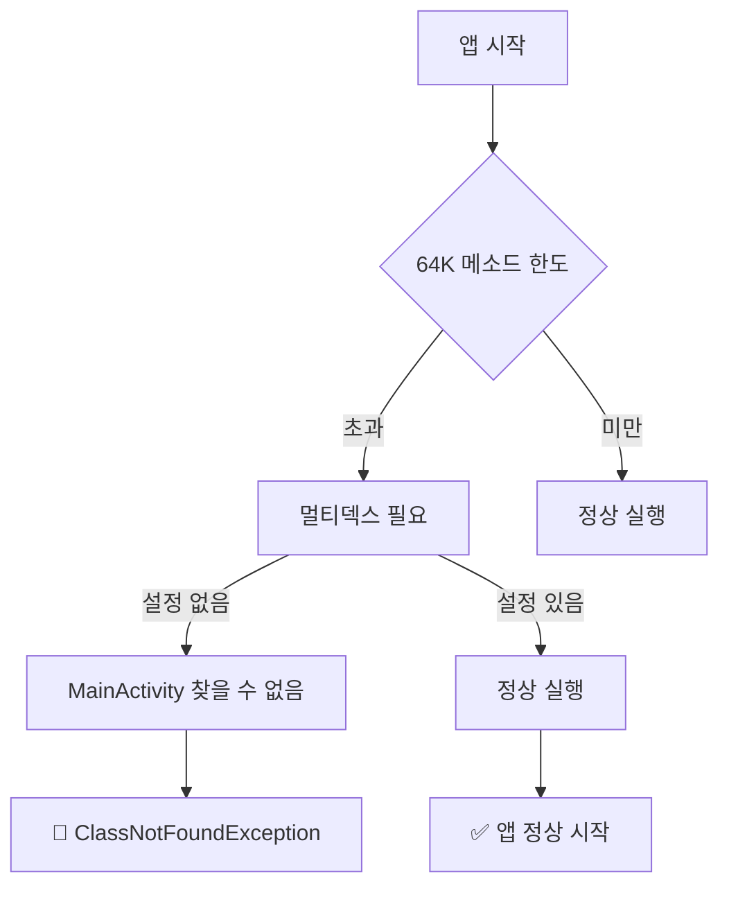
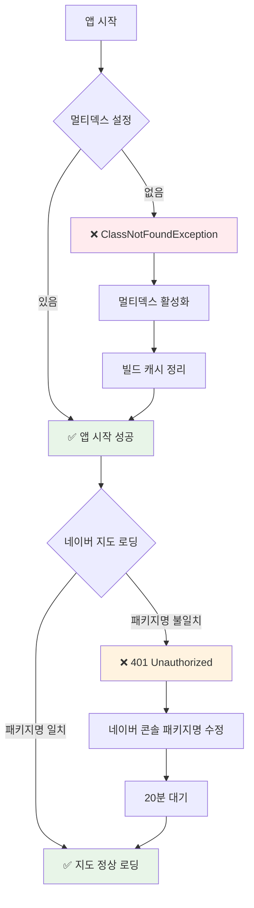

# 네이버 지도 앱 실행 오류 해결 가이드

## 🚨 **긴급: 앱 실행 실패 오류 (우선 해결 필요)**

### **런타임 오류**: `ClassNotFoundException: MainActivity`
앱이 시작되지 않고 즉시 크래시되는 문제가 발견되었습니다.

**오류 원인**: 멀티덱스(Multidex) 설정 누락
- 프로젝트에 포함된 라이브러리들(Naver Maps, Kakao SDK, Google ML Kit 등)로 인해 메소드 수가 64K 한도 초과
- `MainActivity` 클래스가 두 번째 DEX 파일에 포함되어 앱 시작 시 찾을 수 없음



### **즉시 해결 방법**:

1. **`android/app/build.gradle.kts` 파일 수정**:
```gradle-kotlin-dsl
defaultConfig {
    applicationId = "com.example.flutter.report.app"
    minSdk = 23
    targetSdk = flutter.targetSdkVersion
    versionCode = flutter.versionCode
    versionName = flutter.versionName
    
    // 🔥 이 줄 추가 - 멀티덱스 활성화
    multiDexEnabled = true
}
```

2. **빌드 캐시 정리**:
```bash
flutter clean
flutter pub get
```

---

## 🔍 현재 상황 (네이버 지도 401 오류)
- **앱 패키지명**: `com.example.flutter.report.app` ✅
- **네이버 등록**: `com.example.flutter_report_app` ❌ (언더바 문제)
- **API 서비스**: Dynamic Map 활성화됨 ✅

## ✅ 해결 단계 (우선순위 순)

### **1단계: 멀티덱스 활성화 (필수 - 이미 완료됨)**
- ✅ `android/app/build.gradle.kts`에 `multiDexEnabled = true` 추가 완료
- ✅ `flutter clean` 및 `flutter pub get` 실행 완료

### **2단계: 앱 실행 테스트**
```bash
cd /home/nodove/workspace/fix_jeonbuk/flutter-app
flutter run --debug
```

**예상 결과**:
- ✅ **성공**: 앱이 정상적으로 시작되고 로그인 화면 표시
- ❌ **실패**: 여전히 `ClassNotFoundException` 발생 시 → 추가 디버깅 필요

### **3단계: 네이버 클라우드 플랫폼 설정 (앱 실행 성공 후)**
1. [네이버 클라우드 플랫폼](https://console.ncloud.com/) 접속
2. AI·NAVER API → Application → oss-project-4w
3. **[변경]** 버튼 클릭
4. **Android 등록된 패키지** 섹션에서:
   - ❌ `com.example.flutter_report_app` **삭제**
   - ✅ `com.example.flutter.report.app` **유지** (이미 있다면)
   - ✅ `com.example.flutter.report.app.debug` **추가**

### **4단계: iOS Bundle ID 확인**
- `com.example.flutter.report.app` 등록되어 있는지 확인

### **5단계: 설정 저장 후 20분 대기**

### **6단계: 네이버 지도 인증 테스트**
```bash
flutter run --debug
```

## 🎯 문제 해결 플로우



## 🚨 주의사항
- **우선순위**: 멀티덱스 문제 → 네이버 지도 인증 문제 순서로 해결
- Dynamic Map = Mobile Dynamic Map (동일한 서비스)
- 디버그 모드 시 `.debug`가 자동으로 패키지명에 추가됨
- 설정 변경 후 반드시 20분 대기 필요

## 📋 체크리스트

### **앱 실행 관련**:
- [x] ✅ 멀티덱스 활성화됨 (`multiDexEnabled = true`)
- [x] ✅ 빌드 캐시 정리됨 (`flutter clean`)
- [ ] 🧪 앱 정상 실행 테스트 필요

### **네이버 지도 관련**:
- [x] ✅ Client ID 설정됨 (`6gmofoay96`)
- [x] ✅ Dynamic Map 서비스 활성화됨
- [ ] ❌ 올바른 패키지명 등록 필요
- [ ] 🧪 지도 인증 테스트 필요

## 📱 예상 결과
### **1단계 성공 시**:
- ✅ `앱이 정상적으로 시작됩니다`
- ✅ `로그인 화면이 표시됩니다`

### **2단계 성공 시**:
- ✅ `네이버 지도 SDK 초기화 성공`
- ✅ `지도가 정상적으로 로딩됩니다`

### **실패 시 추가 조치**:
- ❌ `ClassNotFoundException` 지속 → 추가 멀티덱스 설정 필요
- ❌ `401 Unauthorized` → 네이버 콘솔 패키지명 재확인

## 🧪 단계별 테스트 가이드

### **1차 테스트: 앱 실행 확인**
```bash
cd /home/nodove/workspace/fix_jeonbuk/flutter-app
flutter run --debug
```

**확인사항**:
- ✅ 앱이 크래시 없이 시작됨
- ✅ 로그인 화면이 정상적으로 표시됨
- ❌ 여전히 `ClassNotFoundException` 발생 시 → 추가 멀티덱스 설정 필요

### **2차 테스트: 네이버 지도 인증 확인** (1차 성공 후)
앱에서 지도 관련 페이지로 이동 후 콘솔 로그 확인:

**성공 시**:
```
✅ 네이버 지도 SDK 초기화 성공
```

**실패 시**:
```
🚨 네이버 맵 인증 실패: NUnauthorizedClientException(code: 401, message: [401] Unauthorized client)
📱 현재 패키지명: com.example.flutter.report.app
🔧 확인사항:
  1. 네이버 콘솔에 다음 패키지명들이 등록되었는지 확인:
     - com.example.flutter.report.app (릴리즈)
     - com.example.flutter.report.app.debug (디버그)
```

## 📱 예상 결과
- ✅ `네이버 지도 SDK 초기화 성공`
- ❌ `🚨 네이버 맵 인증 실패` (패키지명 불일치 시)

## 🔄 대안 방법 (최후 수단)
만약 계속 실패한다면 앱 패키지명을 임시로 네이버에 등록된 것과 맞춰보기:
```gradle-kotlin-dsl
applicationId = "com.example.flutter_report_app"  // 임시로 언더바 사용
```
하지만 이는 권장하지 않음 (iOS 호환성 문제)
