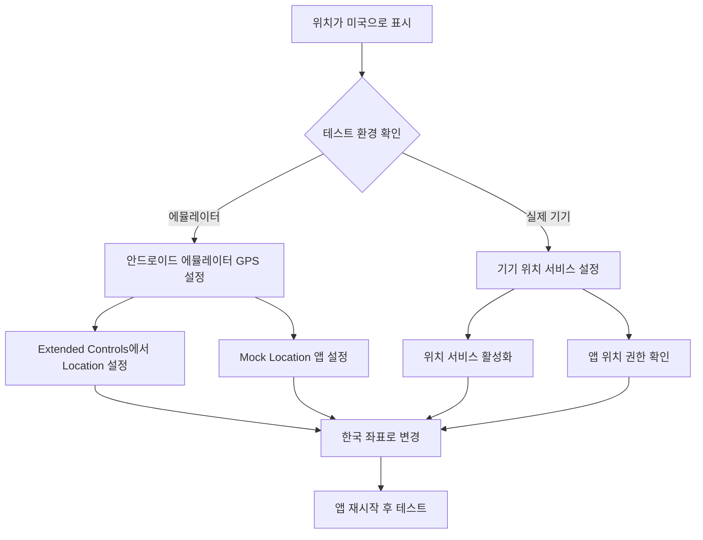

# 네이버 지도 401 오류 및 위치 문제 해결 가이드

## 🔑 현재 앱 설정 정보

### 패키지명 정보
```
- 릴리즈 버전: com.example.flutter.report.app
- 디버그 버전: com.example.flutter.report.app.debug
- 클라이언트 ID: 6gmofoay96
```

## 🌍 위치가 미국으로 표시되는 문제

### 원인 분석


### 해결 방법

#### 🎮 안드로이드 에뮬레이터 사용 시

**Step 1: 에뮬레이터 Extended Controls 접속**
1. 에뮬레이터 실행 중 `...` (더보기) 버튼 클릭
2. `Extended controls` 선택
3. `Location` 메뉴 선택

**Step 2: 한국 위치로 설정**
```
📍 권장 좌표 (서울):
- Latitude: 37.5665
- Longitude: 126.9780
- Altitude: 38.0
```

**Step 3: GPS 모의 위치 설정**
1. 에뮬레이터 설정 > 개발자 옵션
2. "모의 위치 앱 선택" 활성화
3. 앱에 위치 권한 부여

#### 📱 실제 기기 사용 시

**Step 1: 위치 서비스 확인**
1. 설정 > 위치 > 위치 서비스 켜기
2. 정확도를 "높음" 또는 "배터리 절약 안 함"으로 설정

**Step 2: 앱 권한 확인**
1. 설정 > 앱 > 해당 앱 > 권한
2. 위치 권한을 "항상 허용" 또는 "앱 사용 중에만 허용"으로 설정

### 💡 즉시 해결 팁

**에뮬레이터에서 빠른 해결:**
```bash
# 에뮬레이터 콘솔 접속
telnet localhost 5554

# 위치 설정 (서울)
geo fix 126.9780 37.5665

# 연결 종료
quit
```

## 📋 해결 체크리스트

### Step 1: 네이버 클라우드 플랫폼 콘솔 접속
1. https://console.ncloud.com/ 접속
2. 로그인 후 Maps > Application 메뉴 선택

### Step 2: 패키지명 등록 확인
**반드시 두 개의 패키지명을 모두 등록해야 합니다:**

```
✅ 확인해야 할 패키지명:
📱 com.example.flutter.report.app           (릴리즈용)
🔧 com.example.flutter.report.app.debug     (디버그용)
```

### Step 3: 서비스 활성화 확인
다음 서비스들이 모두 활성화되어 있는지 확인:
- ✅ Mobile Dynamic Map
- ✅ Geocoding
- ✅ Reverse Geocoding

### Step 4: 클라이언트 ID 재확인
현재 사용 중인 클라이언트 ID: `6gmofoay96`
- 이 ID가 올바른 앱에 연결되어 있는지 확인
- 필요시 새로운 클라이언트 ID 발급

## ⚠️ 중요 사항

### 설정 변경 후 대기 시간
- **20분 대기**: 네이버 콘솔 설정 변경 후 반영까지 최대 20분 소요
- 즉시 반영되지 않으므로 인내심 필요

### 디버그/릴리즈 구분
- **디버그 빌드**: `com.example.flutter.report.app.debug` 사용
- **릴리즈 빌드**: `com.example.flutter.report.app` 사용
- 두 패키지명 모두 등록 필수

## 🔍 확인 방법

### 1. 앱 로그 확인
```bash
flutter run --debug
```

성공 시 다음 로그가 표시되어야 함:
```
✅ 네이버 지도 SDK 초기화 성공
🗺️ 네이버 맵 컨트롤러 준비 완료
```

### 2. 네이버 콘솔에서 API 호출 통계 확인
- 정상 등록되면 API 호출 통계에서 요청 기록 확인 가능

## 🚀 즉시 시도할 수 있는 방법

1. **네이버 콘솔 재확인**: 패키지명 등록 상태 점검
2. **20분 대기**: 설정 변경 후 충분한 시간 대기
3. **앱 재설치**: 완전히 제거 후 재설치
4. **실제 기기 테스트**: 에뮬레이터 대신 실제 안드로이드 기기에서 테스트

## 📍 위치 문제 해결 (미국 위치 표시 문제)

### 에뮬레이터 위치 설정
```bash
# 자동 스크립트 실행 (권장)
./set_emulator_location.sh

# 또는 수동 명령어
adb emu geo fix 126.9780 37.5665  # 서울 좌표
```

### Extended Controls 사용
1. 에뮬레이터 "..." 버튼 클릭
2. "Extended controls" → "Location" 선택
3. 서울 좌표 입력: 위도 37.5665, 경도 126.9780
4. "Send" 버튼 클릭

### 위치 테스트 방법
```bash
# Flutter 앱에서 개발자 도구 사용
# 프로필 → 위치 서비스 테스트 (디버그 모드에서만 표시)
```

## 📚 추가 문서
- `LOCATION_GPS_TROUBLESHOOTING.md` - 상세한 위치 문제 해결 가이드
- `EMULATOR_LOCATION_SETUP_GUIDE.md` - 에뮬레이터 위치 설정 완전 가이드

## 🔧 코드 레벨 위치 확인 및 디버깅

### LocationService 디버깅 코드 추가

현재 앱에서 위치를 어떻게 가져오는지 확인해보겠습니다:

```dart
// lib/core/services/location_service.dart에 디버깅 코드 추가
Future<Position> getCurrentPosition() async {
  try {
    // 권한 확인
    LocationPermission permission = await Geolocator.checkPermission();
    print('🔍 위치 권한 상태: $permission');
    
    if (permission == LocationPermission.denied) {
      permission = await Geolocator.requestPermission();
      print('📍 권한 요청 결과: $permission');
    }
    
    // 현재 위치 가져오기
    Position position = await Geolocator.getCurrentPosition(
      desiredAccuracy: LocationAccuracy.high,
      timeLimit: Duration(seconds: 10),
    );
    
    print('🌍 현재 위치: ${position.latitude}, ${position.longitude}');
    print('🏠 국가 확인: ${position.latitude > 33 && position.latitude < 43 && position.longitude > 124 && position.longitude < 132 ? "한국" : "해외"}');
    
    return position;
  } catch (e) {
    print('❌ 위치 가져오기 실패: $e');
    rethrow;
  }
}
```

### 위치 서비스 상태 확인 코드

```dart
// 앱 초기화 시 위치 서비스 상태 확인
Future<void> checkLocationServiceStatus() async {
  bool serviceEnabled = await Geolocator.isLocationServiceEnabled();
  print('📡 위치 서비스 활성화: $serviceEnabled');
  
  LocationPermission permission = await Geolocator.checkPermission();
  print('🔐 위치 권한: $permission');
  
  if (!serviceEnabled) {
    print('⚠️ 위치 서비스가 비활성화되어 있습니다.');
    return;
  }
}
```

## 🗺️ 네이버 맵 기본 위치 설정

에뮬레이터에서 위치를 가져올 수 없을 때 한국을 기본 위치로 설정:

```dart
// MapSelector 위젯에서 기본 위치를 한국으로 설정
class _MapSelectorState extends State<MapSelector> {
  // 기본 위치를 서울로 설정 (이미 되어 있음)
  static const NLatLng _defaultPosition = NLatLng(37.5665, 126.9780);
  
  @override
  void initState() {
    super.initState();
    if (widget.initialPosition != null) {
      _selectedPosition = widget.initialPosition;
    } else {
      // 위치 권한이 없거나 가져올 수 없을 때 서울로 설정
      _setCurrentLocationOnInit();
    }
  }
}
```
