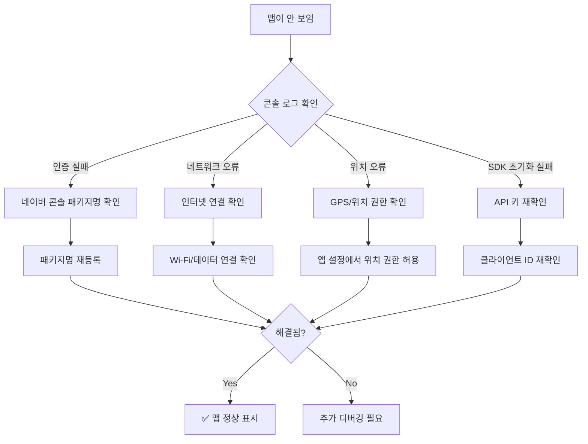

# 네이버 맵 표시 문제 분석 및 해결 가이드

## 🔍 문제 현상 분석

사용자가 제공한 스크린샷을 바탕으로 분석한 결과:
- 맵 컨테이너는 정상적으로 렌더링됨 (회색 영역 표시)
- 맵 타일이 로드되지 않아 빈 화면 표시
- 현재 위치 버튼과 UI 요소들은 정상 표시

## 🚨 가능한 원인들

### 1. 네이버 맵 API 키 인증 문제
```kotlin
// 현재 설정된 패키지명
applicationId = "com.example.flutter.report.app"
debug {
    applicationIdSuffix = ".debug"  // 실제: com.example.flutter.report.app.debug
}
```

**문제점**: 네이버 개발자 콘솔에 다음 패키지명들이 모두 등록되어 있는지 확인 필요:
- `com.example.flutter.report.app` (릴리즈 버전)
- `com.example.flutter.report.app.debug` (디버그 버전)

### 2. 네트워크 연결 문제
```xml
<uses-permission android:name="android.permission.INTERNET" />
```
인터넷 권한은 설정되어 있으나, 실제 네트워크 연결 상태 확인 필요

### 3. 위치 권한 문제
```xml
<uses-permission android:name="android.permission.ACCESS_FINE_LOCATION" />
<uses-permission android:name="android.permission.ACCESS_COARSE_LOCATION" />
```
권한은 설정되어 있으나, 런타임에서 사용자 승인 확인 필요

## 🔧 해결 방법

### Step 1: 네이버 개발자 콘솔 설정 확인

1. **네이버 클라우드 플랫폼 콘솔 접속**
   - https://console.ncloud.com/
   - Maps > Application 메뉴

2. **등록된 패키지명 확인**
   ```
   ✅ 확인해야 할 패키지명들:
   - com.example.flutter.report.app
   - com.example.flutter.report.app.debug
   ```

3. **서비스 활성화 확인**
   - Mobile Dynamic Map ✅
   - Geocoding ✅ 
   - Reverse Geocoding ✅

### Step 2: 앱 로그 확인

디버그 모드에서 실행하여 콘솔 로그 확인:
```bash
flutter run --debug
```

**확인해야 할 로그들:**
```
✅ 네이버 지도 SDK 초기화 성공
🚨 네이버 맵 인증 실패: [에러 메시지]
```

### Step 3: 코드 레벨 디버깅

#### 맵 초기화 상태 확인
```dart
// main.dart의 초기화 부분
await NaverMapSdk.instance.initialize(
  clientId: '6gmofoay96',
  onAuthFailed: (exception) {
    print('🚨 네이버 맵 인증 실패: $exception');
    // 자세한 에러 정보 출력
  },
);
```

#### 맵 위젯 상태 확인
```dart
// map_selector.dart에서 맵 생성 부분
NaverMap(
  options: NaverMapViewOptions(
    initialCameraPosition: NCameraPosition(
      target: _selectedPosition!,
      zoom: 15.0,
    ),
    locationButtonEnable: false,
    consumeSymbolTapEvents: false,
  ),
  onMapReady: _onMapReady,  // 이 콜백이 호출되는지 확인
  onMapTapped: widget.allowLocationSelection ? _onMapTapped : null,
)
```

### Step 4: 네트워크 연결 테스트

```dart
// 네트워크 연결 상태 확인 코드 추가
import 'package:connectivity_plus/connectivity_plus.dart';

Future<void> _checkNetworkConnection() async {
  final connectivityResult = await Connectivity().checkConnectivity();
  if (connectivityResult == ConnectivityResult.none) {
    print('🚨 네트워크 연결 없음');
  } else {
    print('✅ 네트워크 연결됨: $connectivityResult');
  }
}
```

### Step 5: 위치 권한 상태 확인

```dart
// 위치 권한 확인 코드
import 'package:permission_handler/permission_handler.dart';

Future<void> _checkLocationPermission() async {
  final status = await Permission.location.status;
  print('📍 위치 권한 상태: $status');
  
  if (status.isDenied) {
    final result = await Permission.location.request();
    print('📍 위치 권한 요청 결과: $result');
  }
}
```

## 🛠 즉시 시도해볼 수 있는 해결책

### 1. 네이버 콘솔에서 패키지명 재등록
```
기존: com.example.flutter.report.app
추가: com.example.flutter.report.app.debug
```

### 2. 앱 재설치 및 권한 재설정
```bash
flutter clean
flutter pub get
flutter run --debug
```

### 3. 에뮬레이터/실제 기기에서 테스트
- 에뮬레이터의 GPS 설정 확인
- 실제 기기에서 위치 서비스 활성화

### 4. 네이버 맵 SDK 버전 확인
```yaml
# pubspec.yaml
flutter_naver_map: ^1.2.3  # 최신 버전 확인
```

## 📊 문제 해결 체크리스트



## 🔍 추가 디버깅 정보

### 로그에서 확인해야 할 키워드들:
- `AUTH_FAILED`: API 키 인증 실패
- `NETWORK_ERROR`: 네트워크 연결 문제  
- `LOCATION_DENIED`: 위치 권한 거부
- `SSL_ERROR`: HTTPS 인증서 문제

### 자주 발생하는 에러 코드들:
- `401 Unauthorized`: API 키 또는 패키지명 불일치
- `403 Forbidden`: 서비스 비활성화 또는 할당량 초과
- `500 Internal Server Error`: 네이버 서버 문제

## 💡 권장 사항

1. **개발 단계에서는 실제 기기 테스트 우선**
   - 에뮬레이터보다 실제 기기에서 GPS 정확도가 높음

2. **네이버 콘솔 설정 변경 후 20분 대기**
   - 설정 변경사항이 반영되는데 시간이 소요될 수 있음

3. **로그 레벨을 verbose로 설정**
   ```bash
   flutter run --debug --verbose
   ```

4. **네트워크 상태 모니터링 추가**
   - 개발 중에는 네트워크 연결 상태를 실시간으로 확인

이 가이드를 따라 단계별로 확인하시면 맵 표시 문제를 해결할 수 있을 것입니다.
