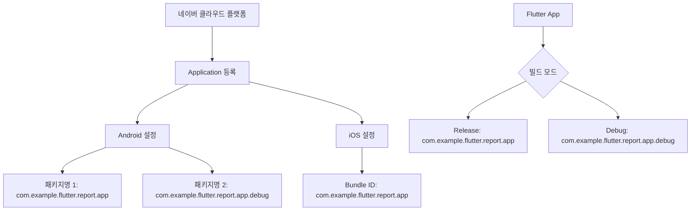

# 네이버 지도 API 설정 가이드

## 📱 현재 패키지 정보 (수정됨)
- **Android Package**: `com.example.flutter.report.app`
- **iOS Bundle ID**: `com.example.flutter.report.app`
- **Client ID**: `6gmofoay96`

## 🚨 중요: 디버그/릴리즈 모드 패키지명
Flutter는 디버그 빌드 시 자동으로 패키지명에 `.debug`를 추가합니다:

### 네이버 클라우드 플랫폼에 등록해야 할 패키지명:
1. **릴리즈 모드**: `com.example.flutter.report.app`
2. **디버그 모드**: `com.example.flutter.report.app.debug`



## 🔑 네이버 클라우드 플랫폼 설정 방법

### 1. 콘솔 접속 및 애플리케이션 선택
1. [네이버 클라우드 플랫폼 콘솔](https://console.ncloud.com/) 접속
2. **AI·NAVER API** → **Application** 메뉴 선택
3. `oss-project-4w` 애플리케이션 선택
4. **[변경]** 버튼 클릭

### 2. Android 설정
**서비스 환경 등록** 섹션에서:
- ✅ `com.example.flutter.report.app` (릴리즈용)
- ✅ `com.example.flutter.report.app.debug` (디버그용)

### 3. iOS 설정
**서비스 환경 등록** 섹션에서:
- ✅ `com.example.flutter.report.app`

### 4. API 서비스 활성화 확인
**API 설정** 탭에서 다음 서비스가 **ON** 상태인지 확인:
- ✅ **Mobile Dynamic Map**
- ✅ **Geocoding**
- ⚠️ 기타 필요한 Maps 서비스들

## ⏰ 설정 적용 시간
⚠️ **중요**: 설정 변경 후 **최대 20분** 대기 후 테스트하세요.

## 🧪 테스트 방법

### 1. 디버그 모드 테스트
```bash
cd /home/nodove/workspace/fix_jeonbuk/flutter-app
flutter run --debug
```

### 2. 릴리즈 모드 테스트
```bash
flutter run --release
```

### 3. 인증 실패 로그 확인
```dart
await NaverMapSdk.instance.initialize(
  clientId: '6gmofoay96',
  onAuthFailed: (exception) {
    print('🚨 네이버 맵 인증 실패: $exception');
    print('📱 현재 패키지명 확인 필요');
  },
);
```

## 📋 체크리스트

### 필수 확인사항:
- [ ] 네이버 콘솔에 두 패키지명 모두 등록됨
- [ ] Mobile Dynamic Map 서비스 활성화됨
- [ ] Client ID가 올바르게 설정됨
- [ ] 설정 변경 후 20분 대기함
- [ ] 언더바(_) 사용하지 않음

### 일반적인 오류 원인:
1. **패키지명 불일치** (가장 흔함)
2. **디버그 패키지명 미등록**
3. **언더바 사용으로 인한 iOS 인증 실패**
4. **API 서비스 비활성화**
5. **Client ID 오타**

## 🔗 참고 링크
- [네이버 지도 Android SDK](https://navermaps.github.io/android-map-sdk/guide-ko/)
- [네이버 클라우드 플랫폼 Maps API](https://guide.ncloud-docs.com/docs/naveropenapi-maps-overview)
- [Flutter 패키지명 설정 가이드](https://docs.flutter.dev/deployment/android#reviewing-the-gradle-build-configuration)
