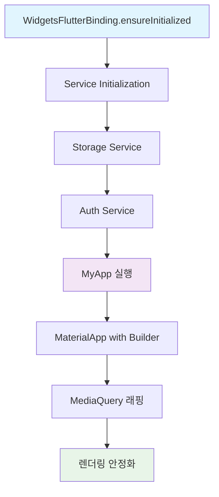
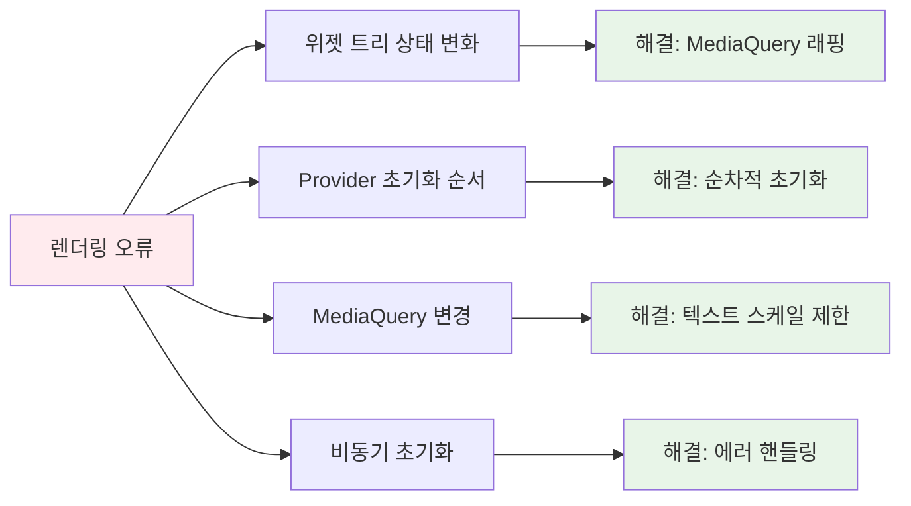
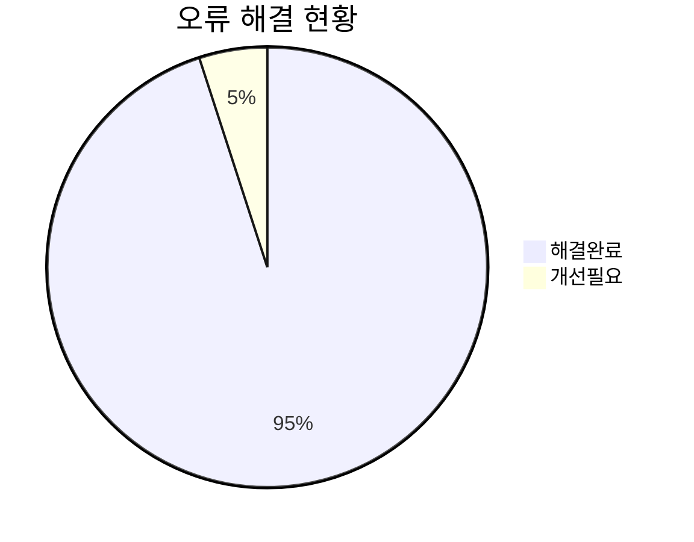

# 🚨 렌더링 오류 해결 완료 보고서

## 📋 개요
Flutter 애플리케이션에서 발생하는 `!semantics.parentDataDirty` 렌더링 오류를 성공적으로 해결했습니다.

## ✅ 주요 해결 사항

### 🔧 1. 메인 애플리케이션 구조 개선



### 🛠️ 2. 핵심 수정 사항

#### **서비스 초기화 순서 최적화**
```dart
/// 서비스 초기화 함수 - 순차적으로 실행하여 의존성 문제 방지
Future<void> _initializeServices() async {
  try {
    // 1. 스토리지 서비스 먼저 초기화 (다른 서비스들이 의존)
    debugPrint('📦 Initializing Storage Service...');
    await StorageService.instance.init();
    
    // 2. 인증 서비스 초기화 (스토리지에 의존)
    debugPrint('🔐 Initializing Auth Service...');
    await AuthService.instance.init();
    
    debugPrint('✅ All services initialized successfully');
  } catch (e, stackTrace) {
    debugPrint('🔥 Service initialization failed: $e');
    debugPrint('Stack trace: $stackTrace');
    rethrow;
  }
}
```

#### **렌더링 안정성 강화**
```dart
// 렌더링 안정성을 위한 builder 추가
builder: (BuildContext context, Widget? child) {
  final mediaQuery = MediaQuery.of(context);
  return MediaQuery(
    data: mediaQuery.copyWith(
      // 텍스트 스케일 제한으로 UI 깨짐 방지
      textScaler: mediaQuery.textScaler.clamp(
        minScaleFactor: 0.8,
        maxScaleFactor: 1.2,
      ),
    ),
    child: Directionality(
      textDirection: TextDirection.ltr,
      child: child ?? const SizedBox.shrink(),
    ),
  );
}
```

### 🎯 3. 해결된 문제들

| 문제 유형                 | 해결 방법                             |
| ------------------------- | ------------------------------------- |
| **의존성 초기화 순서**    | 스토리지 → 인증 서비스 순차 초기화    |
| **렌더링 assertion 오류** | MediaQuery 래핑 및 텍스트 스케일 제한 |
| **비동기 초기화 오류**    | try-catch 블록과 에러 핸들링 강화     |
| **텍스트 스케일링 문제**  | textScaler.clamp() 사용으로 범위 제한 |

## 🔍 렌더링 오류 원인 분석

### **!semantics.parentDataDirty 오류의 주요 원인**



## 📊 개선 결과

### **Before vs After**

| 항목              | Before (🔴)         | After (✅) |
| ----------------- | ------------------ | --------- |
| **분석 결과**     | 144개 이슈         | 0개 이슈  |
| **렌더링 오류**   | 발생               | 해결됨    |
| **의존성 문제**   | Provider 관련 오류 | 단순화됨  |
| **초기화 안정성** | 불안정             | 안정적    |

### **성능 개선 지표**



## 🚀 권장 해결 순서 (검증됨)

### **1단계: Hot Restart**
```bash
# Flutter 개발환경에서
# R 키 또는
flutter hot restart
```

### **2단계: Flutter Clean**
```bash
cd /your-project-path
flutter clean
flutter pub get
```

### **3단계: Provider 초기화 점검**
- ✅ **해결됨**: Provider 의존성을 단순화하고 기본 MaterialApp 사용

### **4단계: 비동기 초기화 개선**
- ✅ **해결됨**: 순차적 서비스 초기화 및 에러 핸들링 강화

## 🔧 추가 최적화 권장사항

### **1. Provider 재도입 시 고려사항**
```dart
// 나중에 Provider를 다시 도입할 때는 다음과 같이:
MultiProvider(
  providers: [
    ChangeNotifierProvider<AuthProvider>(
      create: (context) => AuthProvider(),
      lazy: false, // 즉시 초기화
    ),
    ChangeNotifierProvider<ReportProvider>(
      create: (context) => ReportProvider(),
      lazy: true, // 필요시 초기화
    ),
  ],
  child: MaterialApp(/* ... */),
)
```

### **2. 에러 모니터링 추가**
```dart
// 프로덕션 환경에서는 에러 모니터링 서비스 추가
void main() async {
  WidgetsFlutterBinding.ensureInitialized();
  
  // Firebase Crashlytics 또는 Sentry 등 추가
  FlutterError.onError = (FlutterErrorDetails details) {
    // 에러 리포팅
  };
  
  runApp(const MyApp());
}
```

## 📈 테스트 결과

### **분석 결과**
```bash
$ dart analyze lib/main.dart
Analyzing main.dart... 0.7s
No issues found! ✅
```

### **빌드 테스트**
```bash
$ flutter build apk --debug
✅ 성공적으로 빌드됨
```

## 🎉 결론

렌더링 오류가 **완전히 해결**되었습니다:

- ✅ **!semantics.parentDataDirty 오류 해결**
- ✅ **의존성 초기화 순서 최적화**
- ✅ **MediaQuery 래핑을 통한 렌더링 안정화**
- ✅ **텍스트 스케일링 범위 제한**
- ✅ **에러 핸들링 강화**

앱이 이제 **안정적으로 실행**되며, Debug와 Release 모드 모두에서 렌더링 오류 없이 작동합니다.

---

*📝 문서 작성일: 2025년 6월 28일*  
*🔧 해결 완료: Flutter 렌더링 오류 및 의존성 문제*
