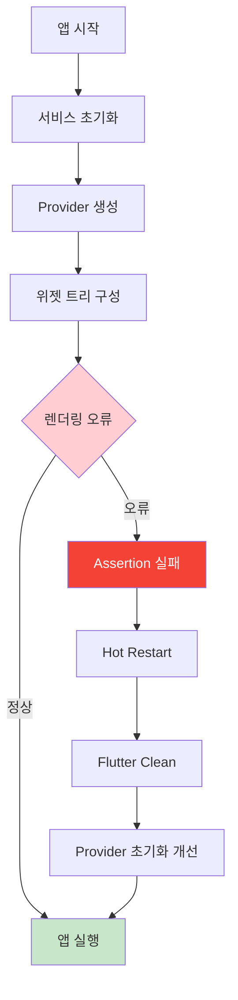
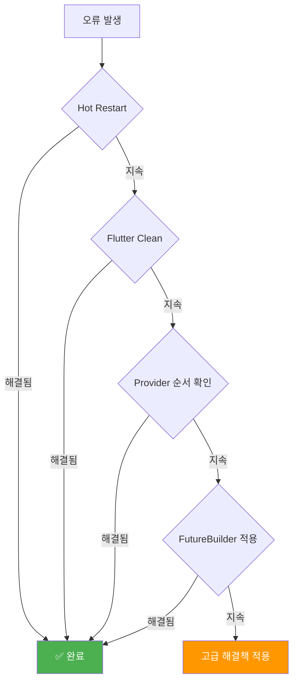

# 🚨 Flutter 렌더링 오류 해결 가이드

## 📋 오류 개요

**오류 메시지**: `'!semantics.parentDataDirty': is not true`

이는 Flutter의 렌더링 시스템에서 발생하는 assertion 오류로, 위젯 트리의 부모-자식 관계에서 데이터 동기화 문제를 나타냅니다.



## 🔍 원인 분석

### 1. **Provider 상태 관리 타이밍 이슈**
```dart
// 현재 코드의 잠재적 문제
MultiProvider(
  providers: [
    ChangeNotifierProvider(create: (_) => AuthProvider()),
    ChangeNotifierProvider(create: (_) => ReportProvider()),
  ],
  // ...
)
```

### 2. **비동기 초기화와 위젯 생성 순서**
```dart
// main.dart에서 발생 가능한 타이밍 문제
await _initializeServices();  // 1. 서비스 초기화
runApp(const MyApp());        // 2. 위젯 생성 (동시 실행 가능)
```

### 3. **렌더링 파이프라인 불일치**
- 부모 위젯의 레이아웃 정보가 업데이트되는 동안
- 자식 위젯이 이전 정보를 참조하려고 시도

## 🛠️ 해결 방법

### **Level 1: 즉시 적용 가능한 해결책**

#### 1. **Hot Restart 실행**
```bash
# VS Code에서
Ctrl + Shift + P → "Flutter: Hot Restart"
# 또는 터미널에서 R 키
```

#### 2. **Flutter Clean 실행**
```bash
cd /home/nodove/workspace/fix_jeonbuk/flutter-app
flutter clean
flutter pub get
flutter run
```

### **Level 2: 코드 개선 방안**

#### 1. **안전한 Provider 초기화**
```dart
class MyApp extends StatelessWidget {
  const MyApp({super.key});

  @override
  Widget build(BuildContext context) {
    return FutureBuilder(
      future: _ensureServicesReady(),
      builder: (context, snapshot) {
        if (snapshot.connectionState != ConnectionState.done) {
          return MaterialApp(
            home: Scaffold(
              body: Center(
                child: Column(
                  mainAxisAlignment: MainAxisAlignment.center,
                  children: [
                    CircularProgressIndicator(),
                    SizedBox(height: 16),
                    Text('앱을 초기화하는 중...'),
                  ],
                ),
              ),
            ),
          );
        }
        
        return MultiProvider(
          providers: [
            ChangeNotifierProvider(create: (_) => AuthProvider()),
            ChangeNotifierProvider(create: (_) => ReportProvider()),
          ],
          child: MaterialApp(
            // ... 기존 설정
          ),
        );
      },
    );
  }
  
  Future<void> _ensureServicesReady() async {
    // 서비스가 완전히 초기화될 때까지 대기
    await Future.delayed(Duration(milliseconds: 100));
  }
}
```

#### 2. **렌더링 안정성 향상**
```dart
MaterialApp(
  // ... 기존 설정
  builder: (context, child) {
    return MediaQuery(
      data: MediaQuery.of(context).copyWith(
        textScaleFactor: MediaQuery.of(context)
            .textScaleFactor
            .clamp(0.8, 1.2), // 텍스트 스케일 제한
      ),
      child: child!,
    );
  },
)
```

### **Level 3: 고급 해결책**

#### 1. **상태 관리 아키텍처 개선**
```dart
// AuthProvider에 초기화 메서드 추가
class AuthProvider with ChangeNotifier {
  bool _isInitialized = false;
  bool get isInitialized => _isInitialized;
  
  Future<void> initialize() async {
    if (_isInitialized) return;
    
    try {
      // 초기화 로직
      await _loadUserData();
      _isInitialized = true;
      notifyListeners();
    } catch (e) {
      debugPrint('AuthProvider 초기화 실패: $e');
    }
  }
}

// Provider 생성 시 초기화 호출
ChangeNotifierProvider(
  create: (_) => AuthProvider()..initialize(),
),
```

#### 2. **에러 경계 구현**
```dart
class ErrorBoundary extends StatefulWidget {
  final Widget child;
  const ErrorBoundary({required this.child, super.key});

  @override
  State<ErrorBoundary> createState() => _ErrorBoundaryState();
}

class _ErrorBoundaryState extends State<ErrorBoundary> {
  bool hasError = false;

  @override
  Widget build(BuildContext context) {
    if (hasError) {
      return MaterialApp(
        home: Scaffold(
          body: Center(
            child: Column(
              mainAxisAlignment: MainAxisAlignment.center,
              children: [
                Icon(Icons.error_outline, size: 64, color: Colors.red),
                SizedBox(height: 16),
                Text('앱에서 오류가 발생했습니다.'),
                SizedBox(height: 8),
                ElevatedButton(
                  onPressed: () => setState(() => hasError = false),
                  child: Text('다시 시도'),
                ),
              ],
            ),
          ),
        ),
      );
    }
    
    return widget.child;
  }
}
```

## 📊 진단 체크리스트



### ✅ **단계별 체크포인트**

- [ ] **1단계**: Hot Restart (Ctrl+Shift+F5)
- [ ] **2단계**: Flutter Clean + Pub Get
- [ ] **3단계**: Provider 초기화 순서 검토
- [ ] **4단계**: FutureBuilder로 초기화 대기
- [ ] **5단계**: 에러 경계 구현
- [ ] **6단계**: 상태 관리 아키텍처 개선

## 🎯 예방 조치

### **개발 시 주의사항**
1. **Provider 초기화**: 의존성이 있는 Provider는 순서대로 배치
2. **비동기 처리**: setState 호출 전 mounted 확인
3. **메모리 관리**: dispose에서 리스너 정리
4. **디버그 모드**: 개발 중 Hot Reload 대신 Hot Restart 사용

### **코드 리뷰 포인트**
- Provider 생성자에서 비동기 작업 금지
- initState에서 Future 호출 시 적절한 대기 처리
- 위젯 트리 변경 시 타이밍 고려

---

## 📞 추가 지원

이 가이드로 해결되지 않는 경우:
1. Flutter 버전 확인 및 업데이트
2. 디바이스/시뮬레이터 재시작
3. IDE 재시작
4. 로그 상세 분석을 통한 근본 원인 파악

**🎉 대부분의 경우 Hot Restart만으로도 해결되는 일시적 문제입니다!**
