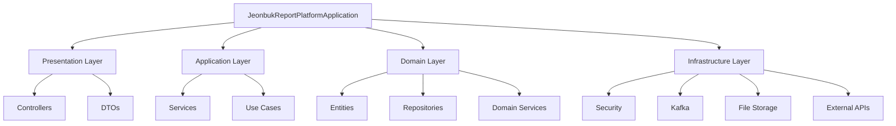

# Spring Boot 프로젝트 구조 및 구현 가이드

## 📋 프로젝트 개요

전북 신고 플랫폼의 PostgreSQL 데이터베이스 스키마를 기반으로 한 Spring Boot 백엔드 프로젝트가 설계되고 구현되었습니다.

## 🏗️ 프로젝트 구조



## 📦 패키지 구조

```
src/main/java/com/jeonbuk/report/
├── JeonbukReportPlatformApplication.java
├── domain/
│   ├── entity/
│   │   ├── User.java               # 사용자 엔티티
│   │   ├── Report.java             # 신고서 엔티티
│   │   ├── Category.java           # 카테고리 엔티티
│   │   ├── Status.java             # 상태 엔티티
│   │   ├── ReportFile.java         # 파일 엔티티
│   │   ├── Comment.java            # 댓글 엔티티
│   │   ├── UserSession.java        # 세션 엔티티
│   │   ├── Notification.java       # 알림 엔티티
│   │   └── ReportStatusHistory.java # 상태 이력 엔티티
│   └── repository/
│       ├── UserRepository.java     # 사용자 리포지토리
│       ├── ReportRepository.java   # 신고서 리포지토리
│       ├── CategoryRepository.java # 카테고리 리포지토리
│       └── ...
├── application/
│   └── service/
│       ├── UserService.java        # 사용자 서비스
│       ├── ReportService.java      # 신고서 서비스
│       ├── AuthService.java        # 인증 서비스
│       └── ...
├── presentation/
│   ├── controller/
│   │   ├── UserController.java     # 사용자 컨트롤러
│   │   ├── ReportController.java   # 신고서 컨트롤러
│   │   ├── AuthController.java     # 인증 컨트롤러
│   │   └── ...
│   └── dto/
│       ├── request/               # 요청 DTO
│       └── response/              # 응답 DTO
└── infrastructure/
    ├── config/                    # 설정 클래스들
    ├── security/                  # 보안 관련
    ├── kafka/                     # Kafka 설정
    └── external/                  # 외부 API 연동
```

## 🔧 주요 기술 스택

### Core Framework
- **Spring Boot 3.2.0** - 메인 프레임워크
- **Spring Data JPA** - 데이터 액세스
- **Spring Security** - 보안 및 인증
- **Spring Kafka** - 메시지 큐

### Database
- **PostgreSQL** - 메인 데이터베이스
- **PostGIS** - 공간 데이터 처리
- **Redis** - 캐시 및 세션 저장소

### Authentication & Security
- **JWT (Json Web Token)** - 토큰 기반 인증
- **OAuth2** - 소셜 로그인 (Google, Kakao)
- **BCrypt** - 패스워드 암호화

### Documentation & Testing
- **SpringDoc OpenAPI** - API 문서화
- **JUnit 5** - 단위 테스트
- **Testcontainers** - 통합 테스트

## 🛠️ 구현된 주요 기능

### 1. 엔티티 및 도메인 모델

#### User 엔티티
```java
@Entity
@Table(name = "users")
public class User {
    @Id
    private UUID id;
    private String email;
    private String passwordHash;
    private UserRole role;
    // OAuth 지원
    private String oauthProvider;
    private String oauthId;
    // ... 기타 필드들
}
```

#### Report 엔티티
```java
@Entity 
@Table(name = "reports")
public class Report {
    @Id
    private UUID id;
    private String title;
    private String description;
    private Priority priority;
    
    // 위치 정보 (PostGIS)
    private Point locationPoint;
    
    // AI 분석 결과
    @JdbcTypeCode(SqlTypes.JSON)
    private Map<String, Object> aiAnalysisResults;
    
    // 연관 관계
    @ManyToOne
    private User user;
    @ManyToOne 
    private Category category;
    // ...
}
```

### 2. 리포지토리 레이어

#### 사용자 리포지토리
```java
@Repository
public interface UserRepository extends JpaRepository<User, UUID> {
    Optional<User> findByEmail(String email);
    Optional<User> findByOauthProviderAndOauthId(String provider, String oauthId);
    List<User> findByRoleAndIsActiveTrue(UserRole role);
    
    @Query("SELECT u FROM User u WHERE ...")
    Page<User> searchActiveUsers(@Param("keyword") String keyword, Pageable pageable);
}
```

#### 신고서 리포지토리 (위치 기반 검색 포함)
```java
@Repository
public interface ReportRepository extends JpaRepository<Report, UUID> {
    @Query(value = "SELECT * FROM reports r WHERE " +
                   "ST_DWithin(r.location_point, ST_MakePoint(?2, ?1)::geography, ?3)",
           nativeQuery = true)
    List<Report> findByLocationWithinRadius(BigDecimal lat, BigDecimal lng, double radius);
}
```

### 3. 서비스 레이어

#### 사용자 서비스
```java
@Service
@RequiredArgsConstructor
@Transactional(readOnly = true)
public class UserService {
    
    @Transactional
    public User registerUser(String email, String password, String name, ...) {
        // 중복 확인
        if (userRepository.existsByEmail(email)) {
            throw new IllegalArgumentException("이미 존재하는 이메일입니다");
        }
        
        // 패스워드 암호화 및 사용자 생성
        String hashedPassword = passwordEncoder.encode(password);
        User user = User.builder()
            .email(email)
            .passwordHash(hashedPassword)
            .name(name)
            .build();
            
        return userRepository.save(user);
    }
    
    @Transactional
    public User processOAuthUser(String provider, String oauthId, ...) {
        // OAuth 사용자 처리 로직
    }
}
```

### 4. 컨트롤러 레이어

#### 사용자 컨트롤러
```java
@RestController
@RequestMapping("/users")
@RequiredArgsConstructor
@Tag(name = "User Management")
public class UserController {
    
    @PostMapping("/register")
    public ResponseEntity<ApiResponse<UserResponse>> registerUser(
            @Valid @RequestBody UserRegistrationRequest request) {
        // 사용자 등록 로직
    }
    
    @GetMapping
    @PreAuthorize("hasRole('MANAGER')")
    public ResponseEntity<ApiResponse<Page<UserResponse>>> getUsers(...) {
        // 사용자 목록 조회
    }
}
```

## 🔐 보안 구성

### JWT 토큰 기반 인증
- Access Token (24시간)
- Refresh Token (7일)
- Redis 기반 토큰 저장소

### OAuth2 통합
- Google OAuth
- Kakao OAuth
- 자동 사용자 생성 및 연동

### 권한 기반 접근 제어
```java
@PreAuthorize("hasRole('ADMIN')")
@PreAuthorize("isAuthenticated() and #userId == authentication.principal.id")
```

## 📊 데이터베이스 매핑

### 스키마 → 엔티티 매핑

| Database Table | Java Entity  | 주요 특징                         |
| -------------- | ------------ | --------------------------------- |
| `users`        | `User`       | OAuth 지원, 역할 관리             |
| `reports`      | `Report`     | PostGIS 위치 데이터, JSON AI 결과 |
| `categories`   | `Category`   | 색상/아이콘 지원                  |
| `statuses`     | `Status`     | 워크플로우 순서 관리              |
| `report_files` | `ReportFile` | 파일 메타데이터, EXIF 정보        |
| `comments`     | `Comment`    | 대댓글 지원, 내부 댓글 구분       |

### 인덱스 최적화
```sql
-- 자주 사용되는 조회 패턴에 대한 인덱스
CREATE INDEX idx_reports_user_status ON reports(user_id, status_id);
CREATE INDEX idx_reports_location ON reports USING GIST(location_point);
CREATE INDEX idx_reports_created_at ON reports(created_at);
```

## 🚀 API 엔드포인트

### 인증 API
```
POST /auth/login           # 로그인
POST /auth/register        # 회원가입
POST /auth/refresh         # 토큰 갱신
POST /auth/logout          # 로그아웃
GET  /auth/oauth2/{provider} # OAuth 로그인
```

### 사용자 API
```
GET    /users              # 사용자 목록 (관리자)
GET    /users/{id}         # 사용자 상세
PUT    /users/{id}         # 사용자 정보 수정
DELETE /users/{id}         # 사용자 삭제
GET    /users/profile      # 내 프로필
PUT    /users/{id}/role    # 역할 변경 (관리자)
```

### 신고서 API
```
GET    /reports            # 신고서 목록
POST   /reports            # 신고서 생성
GET    /reports/{id}       # 신고서 상세
PUT    /reports/{id}       # 신고서 수정
DELETE /reports/{id}       # 신고서 삭제
POST   /reports/{id}/files # 파일 업로드
GET    /reports/search     # 검색 (키워드, 위치, 카테고리 등)
```

## 🔧 다음 구현 단계

### 1. 즉시 구현 필요
- [ ] Security Configuration 클래스
- [ ] JWT Token Provider
- [ ] Exception Handler
- [ ] Kafka Configuration
- [ ] File Upload Service

### 2. 추가 엔티티 구현
- [ ] UserSession
- [ ] Notification  
- [ ] ReportStatusHistory
- [ ] SystemSettings

### 3. 서비스 레이어 확장
- [ ] ReportService
- [ ] FileService
- [ ] NotificationService
- [ ] KafkaProducerService

### 4. 테스트 코드 작성
- [ ] 단위 테스트
- [ ] 통합 테스트
- [ ] API 테스트

## 📝 설정 파일

### application.yml
```yaml
spring:
  datasource:
    url: jdbc:postgresql://localhost:5432/jeonbuk_report_db
    username: ${DB_USERNAME:postgres}
    password: ${DB_PASSWORD:password}
  
  jpa:
    hibernate:
      ddl-auto: validate
    properties:
      hibernate:
        dialect: org.hibernate.spatial.dialect.postgis.PostgisPG95Dialect

app:
  jwt:
    secret: ${JWT_SECRET:mySecretKey}
    expiration: 86400000
  file:
    upload-dir: ${FILE_UPLOAD_DIR:./uploads}
    max-size: 50MB
```

## 🏃‍♂️ 실행 방법

### 1. 데이터베이스 준비
```bash
# PostgreSQL 시작
docker-compose up -d postgres

# 스키마 적용
psql -h localhost -U postgres -d jeonbuk_report_db -f database/schema.sql
```

### 2. 애플리케이션 실행
```bash
cd spring-backend
mvn clean install
mvn spring-boot:run
```

### 3. API 문서 확인
```
http://localhost:8080/api/v1/swagger-ui.html
```

이제 Spring Boot 프로젝트의 기반이 완성되었습니다. 다음 단계로 보안 설정, Kafka 통합, 파일 업로드 등의 세부 구현을 진행하면 됩니다.
